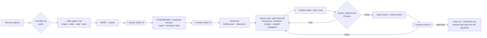

<div align="center">

# OpenVideoHarness

**A code-to-video harness that turns Claude Code / Codex into a multi-genre video studio**

one-line request → routed to a video type → storyboard with gates → frame-by-frame code → self-review on contact sheets → final cut

**English** · [中文](README.zh-CN.md)


<a href="showcase/00-promo-launch-film/"></a>

</div>

---

## What is this

In September 2026 the timeline filled with videos that coding agents made from a single sentence: hand-painted music videos, black-hole explainers, product launch films, math animations. They share one paradigm, **video-as-code**. The model does not generate pixels. It writes a program in which **every frame is a pure function of time t**. A headless browser or Manim renders the frames, and ffmpeg muxes in the audio. Show Lab's [Code2Video](https://github.com/showlab/Code2Video) made the research case for this approach on educational video.

The catch: a one-liner can produce something stunning, but it cannot produce something *reliable*. Switch the genre or the topic and the pacing collapses, AI-slop tells creep in, and facts drift.

**OpenVideoHarness is not another renderer. It is a harness for the agent.** It turns scattered know-how from papers, open-source skills and community experiments into a structure an agent can execute:

- **Routing.** `CLAUDE.md` / `AGENTS.md` sends each request to one of 8 video types. Each type has one workflow doc covering the engine, steps, aesthetics, banned patterns, a prompt block, review focus and reference cases.
- **Human in the loop.** **Three human review gates**: outline, storyboard with a keyframe preview sheet, and first draft. At each one the agent stops and waits for your call, and your notes are logged in `REVIEW.md`. Changes happen while they are still cheap.
- **Pipeline.** Ten stages (0–9), audio first. For long pieces, the director agent builds a reference chapter before subagents paint the rest in parallel.
- **Taste as numbers.** Easing curves, durations, minimum type sizes, safe zones, transition laws, caption density, and a 20-item taste checklist.
- **Self-review loop.** Agents can't watch video, so they read frames: contact sheets for structure, frame strips for timing, crops for detail. They score their own work and fix what fails.
- **Cases and references.** 10 dissected case studies, plus one command that fetches 20+ reference repos: framework docs, case source code and curated community skills.
- **Ready to run.** `bin/vh` checks your toolchain, installs dependencies and scaffolds a project for any type. A hand-painted engine ships in the repo and works out of the box.

## Showcase

Each of these was made by an agent inside this repo, **following only `CLAUDE.md` and the docs**. Every folder contains the full BRIEF, STORYBOARD, self-review log and source.

<table>
<tr>
<td rowspan="2" width="30%" valign="top"><a href="showcase/02-short-leo-doppler/"></a><br><b>02 · Vertical science short</b><br><sub>HyperFrames · 24.8s · 1080×1920 · reads on mute · 46s render</sub><br><sub>“Why do LEO satellite signals change pitch? (Doppler shift, in Chinese)”</sub></td>
<td width="35%" valign="top"><a href="showcase/00-promo-launch-film/"></a><br><b>00 · Launch film</b><br><sub>HyperFrames · 20s · 1920×1080 · silent · ~30s render</sub><br><sub>“A 15–20 s launch film for this repo, using only its real terminal and file tree”</sub></td>
<td width="35%" valign="top"><a href="showcase/01-handdrawn-clawd-leaf/"></a><br><b>01 · Hand-drawn character short</b><br><sub>p5.brush · 12s · 1080p24 · 57s render · 3 review rounds</sub><br><sub>“Clawd tries to film a falling leaf; the wind keeps stealing it”</sub></td>
</tr>
<tr>
<td width="35%" valign="top"><a href="showcase/03-math-fourier/"></a><br><b>03 · 3b1b-style math explainer</b><br><sub>Manim CE 0.21 · 25s · 1080p30 · 24s render · revised after independent review</sub><br><sub>“Build a square wave out of sine waves (Fourier series and the Gibbs overshoot)”</sub></td>
<td width="35%" valign="middle" align="center"><b>Yours next</b><br><br><code>bin/vh new &lt;type&gt; &lt;slug&gt;</code><br><br><sub>Pick any of 8 types: explainer · short · launch · MV · data · paper · hand-drawn · meme</sub><br><sub>PRs to <code>showcase/</code> welcome</sub></td>
</tr>
</table>

Each folder holds `BRIEF.md` (the request), `STORYBOARD.md` (shots and reads), `NOTES.md` (self-review and fixes), `LESSONS.md` and the source, so any of them can be the starting point for a video of the same type. GIFs are compressed previews; the originals are `media/final.mp4`.

<details>
<summary><b>Community work dissected in the case library</b></summary>

| Work | Type | How | Case study |
|---|---|---|---|
| [I'm Upping My P(doom)](https://x.com/other__reality/status/2102514581684052169) | Hand-painted MV · 156s | p5.brush, 9 chapters painted by parallel subagents | [cases/mv-pdoom.md](cases/mv-pdoom.md) |
| [Functional Emotions](https://x.com/eudaemonea/status/2102610626321490404) | Painted MV · 372s | Custom WebGL brushstroke renderer, 7 subagents | [cases/mv-functional-emotions.md](cases/mv-functional-emotions.md) |
| [Claude Pop](https://x.com/donaldjewkes/status/2102801274173587569) | Hybrid MV | Seedance base plates + JS rotoscoping, 12-hour run | [cases/mv-claude-pop.md](cases/mv-claude-pop.md) |
| [The Real Physics of Interstellar: Black Holes](https://x.com/AndyL5cc/status/2104519528873103773) | Science explainer · 143s | One sentence; one hero shader carries the whole film | [cases/explainer-interstellar-blackhole.md](cases/explainer-interstellar-blackhole.md) |
| [Applore promo](https://x.com/decohack/status/2104502625055949242) | Product film · 15s | One-line "showreel" prompt + real assets | [cases/promo-applore.md](cases/promo-applore.md) |
| [HyperFrames launch films](https://github.com/heygen-com/hyperframes-launches) | Product films ×20 | HTML + GSAP, production grade | [cases/promo-hyperframes-launches.md](cases/promo-hyperframes-launches.md) |

</details>

## Quick start

Requirements: macOS or Linux, Node ≥ 22, ffmpeg, Google Chrome, git. Math explainers also need Python (uv recommended) and LaTeX.

```bash
git clone https://github.com/ZLHad/OpenVideoHarness.git
cd OpenVideoHarness
bin/vh doctor     # check the toolchain
bin/vh setup      # install the bundled engine, fetch reference repos, smoke-test a render
```

Then open Claude Code (or Codex) in the repo root and say what you want:

```text
Make a 30-second vertical explainer: why do LEO satellite signals change pitch?
```

The agent reads `CLAUDE.md`, routes to `video-types/02-knowledge-short.md`, creates a project under `projects/`, and stops for your review three times:

1. **Outline**: a one-line pitch, a 3–7 part outline, style references, engine and cost.
2. **Storyboard**: the shot table plus a preview sheet with one keyframe per shot, so you can judge it at a glance.
3. **First draft**: the draft render and a contact sheet, with the agent's own 2–3 weakest spots called out first.

At each gate you approve, send notes, or start over. The agent builds scene by scene, checks its own contact sheets against the checklist, and delivers `out/final.mp4`.

Or scaffold from the command line first:

```bash
bin/vh types                          # list the 8 video types
bin/vh new short leo-doppler          # scaffold a project; the type's prompt block is pre-filled into BRIEF
bin/vh new handdrawn clawd-leaf       # hand-drawn types also copy the bundled engine and install deps
```

### One-line examples by type

| Type | `bin/vh new` | Example request |
|---|---|---|
| Math / science explainer | `math` | "3b1b-style, 20 seconds: how sine waves add up to a square wave" |
| Knowledge short | `short` | "45-second vertical: why GPS needs relativity" |
| Product promo | `promo` | "A 20-second launch film for this repo, using its real terminal and file tree" |
| Lyric video / MV | `mv` | "A hand-painted MV for assets/song.mp3; no lyrics on screen, the pictures tell the story" |
| Data story | `data` | "Turn data/sales.csv into a 60-second data short, one takeaway per chart" |
| Paper explainer | `paper` | "A 3-minute explainer of the key mechanism in papers/main.tex, with narration" |
| Hand-drawn short | `handdrawn` | "Clawd tries to catch a butterfly, 15 seconds" |
| Meme / fast cut | `meme` | "30-second tech-Twitter cut: what happened in AI this week" |

## How it works

<p align="center"></p>



**Hard rules** (full list in [CLAUDE.md](CLAUDE.md)):

1. **Every frame is a pure function of t.** No `Math.random`, no `Date.now`, no CSS transitions, no state carried between frames. This is what makes parallel rendering, resumable renders and "jump to any frame to review" possible.
2. **Audio sets the timing.** Voiceover or song first, turned into word timestamps and a beat grid. The picture follows the audio.
3. **Storyboard before code.** Each shot lists the *reads* the viewer must get, in order, each with start and end times. Pacing is where models fail most.
4. **Review every scene.** Contact sheet, strip and crop, checked against the checklist, then fixed.
5. **Fact discipline.** Numbers and citations are copied verbatim from the source. Anything uncertain goes into NOTES, never into the video.

## Video types

| # | Type | Default engine | Core taste | Doc |
|---|---|---|---|---|
| 01 | Math / science explainer | Manim CE | One colour per entity, geometry before algebra, equations lit term by term | [video-types/01](video-types/01-math-science-explainer.md) |
| 02 | Knowledge short (incl. vertical) | HyperFrames | Hook in the first second, a payoff every 3–5s, captions inside the safe box | [video-types/02](video-types/02-knowledge-short.md) |
| 03 | Product promo / launch film | HyperFrames | Real UI only, one register (Apple or Linear), cursor clicks drive each beat | [video-types/03](video-types/03-product-promo.md) |
| 04 | Lyric video / MV | ClaudeAnimationBase · HyperFrames | Cuts on the beat ±1 frame, choruses escalate, "not a lyric slideshow" | [video-types/04](video-types/04-lyric-music-video.md) |
| 05 | Data story | HyperFrames + SVG | One takeaway per chart, staged transitions, every number traceable | [video-types/05](video-types/05-data-story.md) |
| 06 | Paper explainer / conference video | Manim + HyperFrames | Three gates, metadata copied verbatim, figures redrawn as vectors | [video-types/06](video-types/06-paper-explainer.md) |
| 07 | Hand-drawn / watercolour / whiteboard / paper-cut | ClaudeAnimationBase (p5.brush) | Handmade, alive, one piece; no text | [video-types/07](video-types/07-hand-drawn.md) |
| 08 | Brutalist / meme / fast cut | HyperFrames | Break a grid on purpose; every joke reads in under a second | [video-types/08](video-types/08-brutalist-meme.md) |

For photoreal people or real physics, bring in a generative video model and let code paint the final layer ([playbook/05](playbook/05-hybrid-genvideo.md)). To learn from a video you admire, have the agent reverse-engineer it with [playbook/07](playbook/07-reverse-engineer.md).

> The workflow docs are written in Chinese, with technical terms in English. Agents read them fine in either language. English translations are welcome.

## Repository layout

```
OpenVideoHarness/
├── CLAUDE.md · AGENTS.md     agent entry: router, hard rules, map
├── bin/vh                    CLI: doctor · setup · types · new · sheet · check · gif
├── video-types/              8 workflow docs (each with a prompt block)
├── playbook/                 cross-cutting knowledge
│   ├── 00-paradigm.md          paradigm and engine choice
│   ├── 01-pipeline.md          ten stages, reads, human gates, parallel subagents
│   ├── 02-verification.md      seven-layer review loop, frame commands per engine
│   ├── 03-motion-design.md     easing, timing, type, safe zones, transitions
│   ├── 04-audio.md             TTS, timestamps, beats, mixing
│   ├── 05-hybrid-genvideo.md   generative video + code
│   ├── 06-research-mechanisms.md  mechanisms from Code2Video and related papers
│   └── 07-reverse-engineer.md  dissecting a reference video
├── templates/                BRIEF · STORYBOARD · STYLE · REVIEW · NOTES · LESSONS · TASTE_CHECKLIST
├── cases/                    10 case studies
├── engines/                  ClaudeAnimationBase (bundled) + setup notes for HyperFrames / Remotion / Manim / Blender
├── references/               fetch.sh · open-source.md · community-skills.md (repos/ is git-ignored)
├── showcase/                 videos made with this harness (source + renders)
└── projects/                 your video projects (git-ignored)
```

## CLI: `bin/vh`

| Command | What it does |
|---|---|
| `bin/vh doctor` | Check node, ffmpeg, Chrome, Python/uv, LaTeX, engine deps and reference repos |
| `bin/vh setup` | Install the bundled engine, fetch reference repos, run a smoke render |
| `bin/vh types` | List the 8 video types and their docs |
| `bin/vh new <type> <slug>` | Create `projects/<date>-<slug>`, copy the templates, pre-fill BRIEF with the type's prompt block |
| `bin/vh sheet <mp4> [cols] [fps]` | Contact sheet from a render |
| `bin/vh check <mp4>` | ffprobe plus black, freeze and silence detection |
| `bin/vh gif <mp4> [width] [fps]` | Palette-optimised GIF preview |

## Engines

| Engine | You write | Best for | Status |
|---|---|---|---|
| [HyperFrames](https://github.com/heygen-com/hyperframes) | HTML + GSAP | Promos, explainers, captions, data, memes | `npx hyperframes init` on first use |
| [Remotion](https://www.remotion.dev) | React | Same, when you prefer React or cloud rendering | `npx create-video` |
| [Manim CE](https://www.manim.community) | Python | Math, physics, algorithms, paper mechanisms | `uv add manim` |
| [ClaudeAnimationBase](https://github.com/JohnHeibel/ClaudeAnimationBase) | p5.js + p5.brush | Hand-painted, watercolour, characters, MVs | **Bundled**; ready after `bin/vh setup` |
| Blender | bpy | Real 3D | On demand |
| Generative video (fal, etc.) | API + code overlay | Photoreal people, physics | Paid, on demand |

## How it relates to other projects

| Project | What it is | How OpenVideoHarness differs |
|---|---|---|
| [Code2Video](https://github.com/showlab/Code2Video) | Planner–Coder–Critic research pipeline for educational video (Manim) | Generalises its ideas (code as the medium, anchor grids, ScopeRefine, parallel sections) to 8 genres, run by a general-purpose coding agent |
| [HyperFrames skills](https://github.com/heygen-com/hyperframes) / [Remotion skills](https://github.com/remotion-dev/skills) | Official skills for one engine | Sits one level up: picks the engine, sets the pipeline, taste and review, and calls those skills when useful |
| [OpenMontage](https://github.com/calesthio/OpenMontage) | Full agentic production system (12 pipelines) | Lighter: markdown, templates and one bash script that any coding agent can read and change |
| [awesome-claude-video-skills](https://github.com/zhuyansen/awesome-claude-video-skills) | Catalogue of 183 community video skills | Curates and maps them onto each video type ([community-skills.md](references/community-skills.md)) |

## FAQ

**Do I need Claude?** No. `AGENTS.md` points to the same `CLAUDE.md`, so Codex and other agents that read markdown can use it. The showcase was made with Claude Opus 5.5.

**Does it cost money or need a GPU?** Not on the pure-code route. Rendering runs locally in Chrome or Manim, and voiceover can use local TTS (mlx-audio on Apple Silicon). Only the generative-video route needs paid APIs.

**What about the reference repos' licenses?** `references/repos/` is not part of this repository. `fetch.sh` pulls each repo from its authors for reading only. Licenses are listed in [ACKNOWLEDGMENTS.md](ACKNOWLEDGMENTS.md). Some have no license or forbid commercial use, so check before reusing anything.

## Roadmap

- [ ] Type 09: editing and talking-head (cutting, captions and B-roll for existing footage)
- [ ] English translations of the workflow docs
- [ ] Automatic video QA (rubric scoring on contact sheets, timing-alignment checks)
- [ ] Package as a Claude Code plugin so it can be used from any directory
- [ ] More showcase pieces: data story, paper explainer, MV

## Contributing

PRs welcome for:

- new video types in `video-types/`;
- case studies in `cases/` (register them in `cases/README.md`);
- general lessons distilled from your projects' `LESSONS.md` into `playbook/`;
- videos you made with the harness, added to `showcase/` with their BRIEF, STORYBOARD, NOTES and source.

## Acknowledgments

This project stands on many shoulders:

- **Frameworks:** HyperFrames, Remotion, Manim, p5.brush.
- **Research:** Code2Video, Paper2Video, TheoremExplainAgent and others.
- **Open-source skills and case studies:** ClaudeAnimationBase, PDoomVideo, functional-emotions-video, lemo-opuscar, OpenMontage, awesome-claude-video-skills and others.
- **Community creators** who shared their experiments and prompts publicly.

The full list, with licenses and how each work is used, is in **[ACKNOWLEDGMENTS.md](ACKNOWLEDGMENTS.md)**.

This is an independent project. It is not affiliated with Anthropic, HeyGen, Remotion or Show Lab.

## License

Original content in this repository is released under the [MIT License](LICENSE). The bundled ClaudeAnimationBase is also MIT (© John Heibel). Fetched references keep their own licenses.

## Citation

```bibtex
@misc{openvideoharness2026,
  title        = {OpenVideoHarness: A Code-to-Video Harness for Coding Agents},
  author       = {ZLHad and contributors},
  year         = {2026},
  howpublished = {\url{https://github.com/ZLHad/OpenVideoHarness}}
}
```
