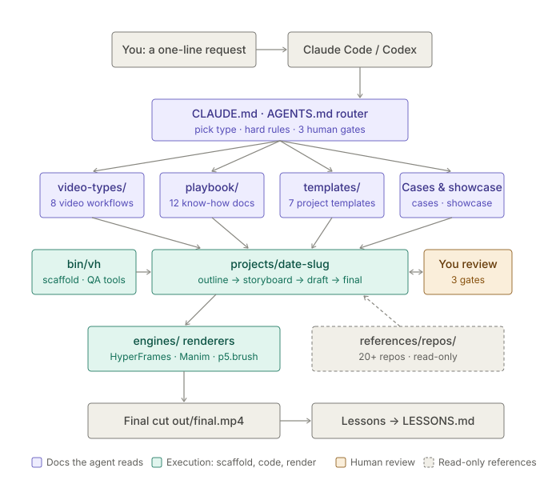
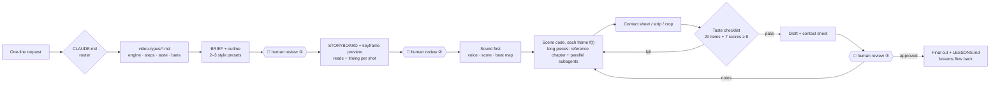

<div align="center">

# OpenVideoHarness

**Hand Claude Code or Codex a one-line request and get a real video back, reliably.**

An open-source video-as-code workbench with one pipeline for 8 kinds of video: explainers, science shorts, launch films, music videos, data stories, paper talks, hand-drawn shorts and memes.

**English** · [中文](README.zh-CN.md)


<a href="showcase/00-promo-launch-film/"></a>

</div>

---

## What is this

In September 2026 the timeline filled up with videos that Claude Opus 5.5 made from a single sentence: black-hole explainers, hand-painted music videos, launch films, math animations. They all work the same way. The model doesn't generate pixels. It **writes a program where every frame is a function of time t**, a browser or Manim renders it frame by frame, and ffmpeg adds the sound. Show Lab's [Code2Video](https://github.com/showlab/Code2Video) made the research case for this on educational video.

One sentence can produce something stunning, but not something **dependable**. Change the genre and the pacing falls apart, the AI-slop tells come back, and facts start drifting.

OpenVideoHarness is not another renderer. It is a **harness for the agent**. It turns scattered know-how from papers, open-source skills and community experiments into a structure an agent can follow:

- **Routing by video type.** Ask for "a science short" or "a launch film" and the agent opens the matching workflow: which engine to use, the steps, what good looks like, what to avoid, a prompt block and reference cases.
- **You stay in the loop.** There are three review gates: outline, storyboard and first draft. At each one the agent stops and waits for you, so changes happen while they are still cheap. Films where pacing matters can add a gray-box animatic at the storyboard gate, and if all you can say is "it feels off", the agent renders 2–3 variants of one segment for you to pick from.
- **26 looks, not one.** A style library learned from famous work, from Saul Bass title sequences to 水墨 ink wash. Each preset comes with a real swatch rendered by the harness, and at the outline gate the agent offers two or three that pull in different directions.
- **Taste written down as numbers.** Easing curves, shot lengths, minimum type sizes, vertical-video safe zones, caption density, and a 20-item self-review checklist. On top of it, a harsh-director reviewer scores the full draft on 7 dimensions over at least three rounds, and every score has to reach 8.
- **It checks its own work.** An agent can't watch video, so it reads rendered frames: contact sheets for structure, frame strips for timing, crops for detail, and a 360 px phone-size sheet for readability. It also catches failures that never raise an error, such as frozen or blank frames and a render that hangs. It fixes what fails.
- **Sound, end to end.** `bin/vh` covers Chinese and English voiceover (local open-source Qwen3-TTS by default), bilingual captions, code-composed music, stereo sound effects, the final mix, and a QA pass on that mix.
- **Ready to run.** One command installs it, one command scaffolds a project, and a hand-painted engine is bundled so you can render right away.

## 30-second start

```bash
curl -fsSL https://raw.githubusercontent.com/ZLHad/OpenVideoHarness/main/install.sh | bash
```

This clones the repo to `~/OpenVideoHarness`, installs the bundled engine, fetches the reference material, and registers the `open-video-harness` skill for Claude Code and Codex, so asking for a video from any folder leads the agent here. Requirements are listed below.

Then open Claude Code (or Codex) in the repo and say what you want:

```bash
cd ~/OpenVideoHarness && claude
```

```text
Make a 30-second vertical explainer: why do LEO satellite signals change pitch? English voiceover, Chinese and English captions.
```

The agent first shows you a one-screen outline, then a storyboard with a keyframe preview sheet, then a first draft, and it points out its own two or three weakest spots. It renders the final only after you approve.

## Ask for it like this

You don't need a long brief. Say **what it's about, who it's for, and where it will play**.

> **Science short:** 45 seconds, vertical, on why GPS needs relativity. For TikTok and Shorts, English voiceover, end on one concrete number.

> **Math explainer:** 3Blue1Brown style, 20 seconds, how sine waves add up to a square wave. It should read with the sound off.

> **Launch film:** a 20-second film for this repo. Use only its real terminal and file tree, give it a rhythmic score, and put a sound effect on every key action.

> **Paper explainer:** explain the key mechanism in `papers/main.tex` in 3 minutes. Copy the metadata verbatim, walk through the equation term by term, English voiceover with Chinese captions.

> **Music video:** a hand-painted MV for `audio/song.mp3`. No lyrics on screen, the pictures tell the story, and each chorus escalates.

> **Reverse-engineer a video:** this video is great. Break down how it was made, then make one in a similar style with this harness.

## Showcase

Every film below was made by an agent inside this repo, **following only `CLAUDE.md` and the docs**. Each folder holds the brief, storyboard, self-review log and full source, so any of them can be the starting point for a video of the same type.

<table>
<tr>
<td rowspan="2" width="30%" valign="top"><a href="showcase/02-short-leo-doppler/"></a><br><b>02 · Vertical science short</b><br><sub>HyperFrames · 24.8s · 1080×1920 · reads on mute · 46s render</sub><br><sub>“Why do LEO satellite signals change pitch? (Doppler shift, in Chinese)”</sub></td>
<td width="35%" valign="top"><a href="showcase/00-promo-launch-film/"></a><br><b>00 · Launch film</b><br><sub>HyperFrames · 20s · 1920×1080 · silent · ~30s render</sub><br><sub>“A 15–20 s launch film for this repo, using only its real terminal and file tree”</sub></td>
<td width="35%" valign="top"><a href="showcase/01-handdrawn-clawd-leaf/"></a><br><b>01 · Hand-drawn character short</b><br><sub>p5.brush · 12s · 1080p24 · 57s render · 3 review rounds</sub><br><sub>“Clawd tries to film a falling leaf; the wind keeps stealing it”</sub></td>
</tr>
<tr>
<td width="35%" valign="top"><a href="showcase/03-math-fourier/"></a><br><b>03 · 3b1b-style math explainer</b><br><sub>Manim CE 0.21 · 25s · 1080p30 · 24s render · revised after independent review</sub><br><sub>“Build a square wave out of sine waves (Fourier series and the Gibbs overshoot)”</sub></td>
<td width="35%" valign="middle" align="center"><b>Yours next</b><br><br><code>bin/vh new &lt;type&gt; &lt;slug&gt;</code><br><br><sub>Pick any of 8 types: explainer · short · launch · MV · data · paper · hand-drawn · meme</sub><br><sub>PRs to <code>showcase/</code> welcome</sub></td>
</tr>
</table>

The GIFs are compressed previews; each original is at `media/final.mp4`.

<details>
<summary><b>Community work dissected in the case library</b></summary>

| Work | Type | How | Case study |
|---|---|---|---|
| [I'm Upping My P(doom)](https://x.com/other__reality/status/2102514581684052169) | Hand-painted MV · 156s | p5.brush, 9 chapters painted by parallel subagents | [cases/mv-pdoom.md](cases/mv-pdoom.md) |
| [Functional Emotions](https://x.com/eudaemonea/status/2102610626321490404) | Painted MV · 372s | Custom WebGL brushstroke renderer, 7 subagents | [cases/mv-functional-emotions.md](cases/mv-functional-emotions.md) |
| [Claude Pop](https://x.com/donaldjewkes/status/2102801274173587569) | Hybrid MV | Seedance base plates plus JS rotoscoping, 12-hour run | [cases/mv-claude-pop.md](cases/mv-claude-pop.md) |
| [The Real Physics of Interstellar: Black Holes](https://x.com/AndyL5cc/status/2104519528873103773) | Science explainer · 143s | One-line request; one hero shader carries the film | [cases/explainer-interstellar-blackhole.md](cases/explainer-interstellar-blackhole.md) |
| [Applore promo](https://x.com/decohack/status/2104502625055949242) | Product film · 15s | One-line "showreel" prompt plus real assets | [cases/promo-applore.md](cases/promo-applore.md) |
| [Austerlitz, 2 December 1805](https://x.com/WinterArc2125/status/2103116235009347650) | 3D history film · 301s | WebGL2 on real terrain; measured narration times every shot, and sound pan and distance come from the picture | [cases/opus55-gallery.md](cases/opus55-gallery.md) §6 |
| [389 community videos](https://github.com/yihui-dev/awesome-opus5-5-videos) + a [962-work catalog](https://github.com/zhuyansen/awesome-opus-5.5-video) | Mixed | Prompt statistics, archetypes and curated picks | [cases/opus55-gallery.md](cases/opus55-gallery.md) |

</details>

## Style library

Most community Opus 5.5 videos look alike: dark background, glow, glass cards, animated UI. Left alone, an agent drifts toward that look. [`styles/`](styles/) gives it 26 others, in 6 families: film and title sequences, brand and launch, data and explainers, illustration and print, Chinese aesthetics, and retro tech. Each preset distils the grammar of famous work (palette, type, composition, motion, transitions and sound): Saul Bass titles, *Se7en*, *Blade Runner 2049*, Wes Anderson's symmetry, Wong Kar-wai's step-printing, the Ken Burns pan, the Swiss grid, film FUI, 3Blue1Brown, NYT and The Pudding, Gapminder, blueprints, *Spider-Verse* halftone, risograph, CRT terminals, silhouette paper-cut, watercolor pastoral, synthwave, and Chinese 水墨 ink wash, 敦煌 murals, 皮影 shadow puppets and 国潮.

<a href="styles/"></a>

Every preset ships a real 5-second swatch rendered by the harness, with its own code-composed score. All 26 show the same content (the line "Every frame is code." and three beats: outline, storyboard, draft), so the style is the only difference. Watch them back to back in [`styles/gallery.mp4`](styles/gallery.mp4).

```bash
bin/vh style list                                  # the 26 presets and their families
bin/vh new promo launch-film --style cutout-jazz   # the project starts from the preset: STYLE_PRESET.md, tokens, and its prompt block in BRIEF
bin/vh style cutout-jazz --draft                   # re-render a preset's swatch after editing it (drop --draft for the final)
bin/vh style gallery --mp4                         # rebuild styles/gallery.jpg and gallery.mp4
```

At gate ① the agent proposes two or three contrasting presets with their swatches, and you pick one or mix them. The rule is to **learn the grammar, not copy the work**: no original characters, logos or shots, and prompt blocks describe the grammar instead of naming a living artist. Details in [styles/README.md](styles/README.md).

## How it works

<p align="center"></p>



Hard rules (full list in [CLAUDE.md](CLAUDE.md)):

1. **Every frame is a pure function of t.** No randomness, wall clock or CSS animation, and no state carried between frames. This is what makes parallel and resumable rendering possible, and lets you pull out any frame for review. The check compares lossless PNG frames rendered out of order, not the encoded mp4.
2. **When there is sound, sound sets the timing.** Voiceover or score comes first and is turned into a timeline. The picture follows it.
3. **Storyboard before code.** Each shot lists the *reads* the viewer must take in, in order, each with start and end times. Pacing is where models fail most.
4. **Review every scene** against the checklist, and fix it until it passes. The full draft also goes to a fresh reviewer that scores 7 dimensions; each must reach 8.
5. **Facts are copied verbatim.** Anything uncertain goes into NOTES, never into the video.

## Eight video types

| # | Type | Default engine | Core taste | Doc |
|---|---|---|---|---|
| 01 | Math / science explainer | Manim CE | One colour per concept, geometry before algebra, equations lit term by term | [01](video-types/01-math-science-explainer.md) |
| 02 | Knowledge short (vertical or horizontal) | HyperFrames | Hook in the first second, a payoff every 3–5 s, captions inside the safe box | [02](video-types/02-knowledge-short.md) |
| 03 | Product promo / launch film | HyperFrames | Real UI only, one register (Apple or Linear), cursor clicks drive each beat | [03](video-types/03-product-promo.md) |
| 04 | Lyric video / MV | p5.brush or HyperFrames | Cuts land within 1 frame of the beat, each chorus escalates, never a lyric slideshow | [04](video-types/04-lyric-music-video.md) |
| 05 | Data story | HyperFrames + SVG | One takeaway per chart, staged transitions, every number traceable | [05](video-types/05-data-story.md) |
| 06 | Paper explainer / conference video | Manim + HyperFrames | Three gates, metadata copied verbatim, figures redrawn as vectors | [06](video-types/06-paper-explainer.md) |
| 07 | Hand-drawn / watercolour / whiteboard / paper-cut | ClaudeAnimationBase (p5.brush) | Handmade, always moving, one continuous piece; no text on screen | [07](video-types/07-hand-drawn.md) |
| 08 | Brutalist / meme / fast cut | HyperFrames | Build a grid, then break it on purpose; every joke reads in under a second | [08](video-types/08-brutalist-meme.md) |

There are also focused guides:
- **photoreal people and real physics:** bring in a generative video model and let code draw the final layer ([playbook/05](playbook/05-hybrid-genvideo.md));
- **VFX and motion sources:** an FX preset stack, true sub-frame motion blur, SFX panned from screen position, and one-take 3D worlds ([playbook/08](playbook/08-vfx-and-motion-sources.md)); for a long 3D film, the *Austerlitz* deep-dive in [cases/opus55-gallery.md](cases/opus55-gallery.md) §6;
- **Chinese characters written in true stroke order**, for ink-wash and calligraphy pieces: [video-types/07](video-types/07-hand-drawn.md);
- **reverse-engineering a video:** [playbook/07](playbook/07-reverse-engineer.md).

> The workflow docs are written in Chinese, with technical terms in English. Agents follow them fine either way. English translations are on the roadmap.

## Sound: voice, captions, music, SFX, songs

| Need | Command | Notes |
|---|---|---|
| **Voiceover (zh / en)** | `bin/vh tts <project> qwen Ryan en` | Defaults to local open-source **Qwen3-TTS**: offline and free, about a 2 GB download on first use. Five Chinese voices (Serena, Vivian, Uncle_Fu, Dylan with a Beijing accent, Eric with a Sichuan accent) and two English voices (Ryan, Aiden). Interfaces for cloud Qwen3-TTS (Alibaba Cloud) and ElevenLabs are ready |
| **Bilingual captions** | `bin/vh captions <project>` | Write each script line as `中文 \|\| English` and get zh, en and two-line bilingual SRT, plus `captions.json` for the engine to draw. `bin/vh mux` can add them as switchable soft subtitle tracks |
| **Music** | `bin/vh music score.json out.wav` | A code-composed score. Sections follow the shots, the same score always renders the same music, and it outputs an exact beat, section and hit map. Chinese instrument layers (`bell` 编钟, `zheng` 古筝, `dizi` 竹笛, `taiko` 大鼓) play in pentatonic modes, `meters` changes the beat count of any single bar, and `bin/vh music --example zh` prints a starter score. Your own track works too: `bin/vh beats` returns its beats, hits and kick/snare accents |
| **Sound effects** | `bin/vh sfx place events.json …` | 15 original synthesized effects (click, pop, whoosh, riser, impact, ding and more), each placed so it lands exactly on its action. Output is stereo: an event can carry `pan` and `dist`, so a sound comes from where its object is on screen |
| **Mix** | `bin/vh mix out.wav voice=… music=… sfx=…` | A stereo mix. The music ducks under voice and effects, and loudness is set to −14 LUFS in two linear passes, so a cinematic score keeps its dynamics |
| **Mix QA** | `bin/vh qa mix.wav beats.json events.json` | The agent can't listen, so it checks the final mix by numbers: digital silence, dropouts, pumping, clicks (as warnings to re-listen), and whether every cue lands within one frame. Exits with 1 on failure, so it works as a gate |
| **Songs** | — | Import from Suno or similar web tools. Interfaces for ElevenLabs Music and local song models are ready |

Details in [playbook/04-audio.md](playbook/04-audio.md).

## What you get

- A **publish-ready MP4**, optionally with switchable zh/en subtitle tracks.
- A **re-renderable project**: change one line to get a new version, or fork it into another language or style.
- The paper trail: brief, storyboard, review log, self-review fixes and asset ledger.
- Contact sheets and keyframes, for post-mortems and ready-made covers.

## CLI cheat sheet: `bin/vh`

| Command | Does |
|---|---|
| `doctor` / `setup` | Check the toolchain / install deps and fetch references |
| `types` / `new <type> <slug> [--style <preset>]` | List the 8 types / scaffold a project with templates, prompt block, engine and, optionally, a style preset |
| `style list` / `style <preset> [--draft]` / `style gallery [--mp4]` / `style check <preset>` | List the 26 presets / render a 5 s swatch / rebuild the gallery / check a swatch's determinism |
| `tts` / `captions` | Voiceover (zh/en) / captions (zh, en, bilingual) |
| `music` / `sfx` / `beats` | Code-composed score, Chinese instruments included / stereo SFX placement with pan and distance / beats, hits and kick/snare accents of external music |
| `mix` / `qa` / `mux` | Stereo three-bus mix / final-mix QA with a cue check / add audio and subtitles to a render |
| `sheet` / `check` / `gif` | Timestamped contact sheet / black, freeze and silence detection / README GIF |
| `hf-init` / `install-skill` / `sync-agents` | Safe HyperFrames scaffold with GSAP vendored locally, so offline renders don't hang / register the skill / regenerate AGENTS.md |

## Requirements

| Dependency | Used for | Required? |
|---|---|---|
| macOS or Linux, git | Basics | ✅ |
| Node.js ≥ 22, Google Chrome | Browser-engine rendering (HyperFrames, p5) | ✅ |
| FFmpeg | Encoding, mixing, QA | ✅ |
| Python 3 + [uv](https://github.com/astral-sh/uv) | Sound tools, Manim, contact sheets (dependencies install temporarily, never globally) | Recommended |
| Apple Silicon | Local Qwen3-TTS (mlx-audio) | For local voiceover |
| LaTeX | Manim equations | For math explainers |

Rendering costs nothing extra. Only external services, such as cloud voices or generative video, bill under their own terms, and their API keys are read from environment variables only.

## Install and update

**One line:** see *30-second start*. Options:

```bash
bash install.sh --dir ~/code/OpenVideoHarness   # install somewhere else
bash install.sh --no-refs                        # skip reference repos for now (run references/fetch.sh later)
bash install.sh --no-skill                       # don't register the global skill
```

**Manual:**

```bash
git clone https://github.com/ZLHad/OpenVideoHarness.git && cd OpenVideoHarness
bin/vh setup            # bundled engine + reference repos + style swatch renderer
bin/vh install-skill    # optional: ~/.claude/skills and ~/.agents/skills
```

**Skill only**, for example with the [skills CLI](https://github.com/vercel-labs/skills):

```bash
npx skills add https://github.com/ZLHad/OpenVideoHarness --skill open-video-harness
```

The skill is a thin pointer. On first use it asks for permission, then installs the full workbench.

**Update:** run `git pull` in the repo, then `references/fetch.sh` (or `references/fetch.sh <dir>` to update a single reference repo).

## Repository layout

```
OpenVideoHarness/
├── CLAUDE.md · AGENTS.md     agent entry: router, hard rules, map (identical content)
├── install.sh                one-line installer
├── bin/vh · tools/           CLI and the scripts behind it (sound, mix QA, contact sheets)
├── skills/                   the open-video-harness skill
├── video-types/              8 workflow docs
├── playbook/                 know-how 00–08: paradigm, pipeline, review, motion, sound, hybrid, research, reverse-engineering, VFX
├── templates/                BRIEF · STORYBOARD · STYLE · REVIEW · NOTES · LESSONS · TASTE_CHECKLIST
├── styles/                   26 style presets with rendered swatches · gallery.jpg · _swatch/ renderer
├── cases/                    11 case studies + curated picks from 389 community videos + a 3D film deep-dive
├── showcase/                 films made with this harness (source + renders + logs)
├── engines/                  bundled hand-drawn engine + setup notes for the others
├── references/               fetch.sh (30 read-only repos) · open-source list · community skill picks
└── projects/                 your video projects (git-ignored)
```

## How it relates to other projects

| Project | What it is | How this differs |
|---|---|---|
| [Code2Video](https://github.com/showlab/Code2Video) | Planner–Coder–Critic research pipeline for educational video (Manim) | Generalises its ideas (code as the medium, anchor grids, scoped repair, parallel sections) to 8 genres, run by a general-purpose coding agent |
| [HyperFrames](https://github.com/heygen-com/hyperframes) / [Remotion](https://github.com/remotion-dev/skills) skills | Official guides for one engine | Sits one level up: picks the engine, sets pipeline, taste and review, and calls those skills when useful |
| [OpenMontage](https://github.com/calesthio/OpenMontage) | Full agentic production system | Lighter: mostly markdown, templates and one CLI that any coding agent can read and change |
| [guizang product-video skill](https://github.com/op7418/guizang-product-video-skill) | Specialist for software update films | Covers 8 genres, adds three human gates and bilingual sound; its music and SFX method inspired ours (our code is independent) |

## FAQ

**Do I need Claude?** No. `AGENTS.md` and `CLAUDE.md` are identical, so Codex and other agents that read markdown work too. The showcase was made with Claude Opus 5.5.

**Does it cost money or need a GPU?** Not on the pure-code route. Rendering runs locally in Chrome or Manim, voiceover uses local Qwen3-TTS, and music and effects are generated by code. Only cloud voices or generative video cost money.

**Can I get something other than the dark, glowing look?** Yes. Name a preset such as `ink-wash`, or a film whose look you like, in your request. Even if you don't, the agent offers two or three contrasting presets from `styles/` at the outline gate.

**What about the reference repos' licenses?** `references/repos/` is not part of this repository. `fetch.sh` pulls each repo from its authors, for reading only, and renames their agent files (`CLAUDE.md`, `AGENTS.md`, `.claude/`, `.agents/` and the like) to `_upstream_*` at every depth, so agents never load them as instructions. `fetch.sh --neutralize` redoes this offline. Licenses are listed in [ACKNOWLEDGMENTS.md](ACKNOWLEDGMENTS.md). Some repos have no license or forbid commercial use, so check before reusing anything.

## Roadmap

- [ ] An intro film for the project, going through the three review gates now
- [ ] Type 09: editing and talking-head (cuts, captions and B-roll for existing footage)
- [ ] Type 10: 3D scenes (Three.js and shaders)
- [ ] Word-level forced alignment (Qwen3-ForcedAligner) for word-by-word caption highlights
- [ ] English translations of the workflow docs

## Contributing

PRs welcome for:
- new video types in `video-types/`;
- new style presets in `styles/`, each with a swatch rendered by the harness (see [styles/README.md](styles/README.md));
- case studies in `cases/`;
- general lessons distilled from your projects' `LESSONS.md` into `playbook/`;
- films you made with the harness, added to `showcase/` with their brief, storyboard, notes and source.

## Acknowledgments

Thanks to these projects, researchers and creators:
- **Frameworks and tools:** HyperFrames, Remotion, Manim, p5.brush, Qwen3-TTS, mlx-audio, FFmpeg.
- **Research:** Code2Video, Paper2Video, TheoremExplainAgent and others.
- **Open-source skills and case studies:** ClaudeAnimationBase, PDoomVideo, functional-emotions-video, Battle-of-Austerlitz-Film, the guizang product-video skill, lemo-opuscar, product-film-skill, claude-animation-skill, OpenMontage, awesome-claude-video-skills, awesome-opus5-5-videos and others.
- **Community creators** who shared their experiments, courses and prompts publicly, including Movez and Eian.

The full list, with licenses and how each work is used, is in **[ACKNOWLEDGMENTS.md](ACKNOWLEDGMENTS.md)**.

This is an independent project, not affiliated with Anthropic, HeyGen, Remotion, Show Lab or Alibaba Cloud.

## License

Original content is released under the [MIT License](LICENSE). The bundled ClaudeAnimationBase is also MIT (© John Heibel). Fetched references keep their own licenses.

## Citation

```bibtex
@misc{openvideoharness2026,
  title        = {OpenVideoHarness: A Code-to-Video Harness for Coding Agents},
  author       = {ZLHad and contributors},
  year         = {2026},
  howpublished = {\url{https://github.com/ZLHad/OpenVideoHarness}}
}
```
