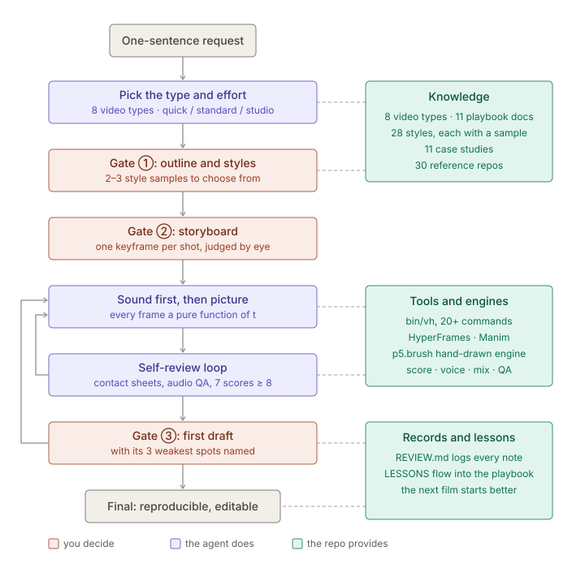

<div align="center">

# OpenVideoHarness

**A video workbench for Claude Code and Codex: the agent writes the code that renders the film, and you sign off at three checkpoints.**

Explainers, science shorts, product films, music videos, data stories, paper talks, hand-drawn shorts, meme edits, and (experimental) edits of footage you shot yourself.

**English** · [中文](README.zh-CN.md) · [Wiki](https://github.com/ZLHad/OpenVideoHarness/wiki)


https://github.com/user-attachments/assets/48923404-eff1-41cd-b303-82c9ede51c1f


<sub>▶ The opening of the intro film (25 s, with sound). An agent made the film from this repo's docs alone; the opening is rendered in Blender, driven by code, and the soundtrack is code too. The full 103 s is in <a href="showcase/04-intro-film/">showcase/04</a>.</sub>

</div>

---

## What this is

Coding agents can already make a video from one sentence: they write a program that computes every frame, a browser (or Manim) renders the frames, and a soundtrack goes on top. Getting a good one every time is the hard part. The same model can be brilliant once and then lose the pacing, glow everything and invent numbers the next time, because it has no production process to follow and no way to check its own work.

This repo is that process and those checks, written as docs an agent can follow and a CLI, `bin/vh`:

- **A workflow for each kind of video.** Ask for a science short or a launch film and the agent reads the workflow for that type: which engine, which steps, what looks good, what is off limits.
- **Three stops for your sign-off.** Direction and outline, storyboard, first draft. Direction gets settled before any code is written, when changing it costs least. For a quick try, say so and it renders straight away.
- **It checks its own work.** An agent can't watch video or hear sound, so it reads rendered frames and audio measurements against a 20-point checklist, and a second agent that didn't make the film scores it.
- **Sound included.** Chinese and English voiceover, bilingual subtitles, a score and sound effects written as code, mixing and an audio check.
- **A style library, and Blender.** 31 styles distilled from well-known films and design, each with a rendered sample, to borrow from rather than copy; and when a shot needs real glass, volumetric light or a million particles, the agent drives Blender with Python.

It isn't a new rendering engine. It sits on top of HyperFrames, Manim, Remotion, p5.brush and Blender and tells the agent how to use them well.

## What it makes

An agent made each of these from this repo's docs alone. Click a title for its folder: the request, the storyboard, the review notes and all the source, a ready starting point for a similar film. Each request is a short quote; "Request" links to the full text.

<table>
<tr>
<td width="40%" valign="top">

https://github.com/user-attachments/assets/1f5873bd-a83f-4d5e-96fe-08aff0c3a96c

<sub><a href="https://github.com/ZLHad/OpenVideoHarness/releases/download/media/02-vertical-science-short.mp4">Download</a></sub>
</td>
<td valign="top"><b><a href="showcase/02-short-leo-doppler/">02 · Vertical science short</a></b> (HyperFrames · 24.8 s · 1080×1920)<br>A low-orbit satellite's Doppler shift, readable with the sound off. Chinese voiceover, Chinese and English subtitles.<br><b><a href="showcase/02-short-leo-doppler/README.md#the-request-this-was-built-from">Request</a>:</b> "为什么低轨卫星的信号会'变调'？——多普勒频移" (why does a low-orbit satellite's signal change pitch? The Doppler shift)</td>
</tr>
<tr>
<td width="40%" valign="top">

https://github.com/user-attachments/assets/c2368f76-b157-4a48-9945-8048a515efd4

<sub><a href="https://github.com/ZLHad/OpenVideoHarness/releases/download/media/03-math-explainer.mp4">Download</a></sub>
</td>
<td valign="top"><b><a href="showcase/03-math-fourier/">03 · Math explainer in the 3Blue1Brown style</a></b> (Manim · 25 s · 1920×1080)<br>Sine waves stack into a square wave and land on the Gibbs overshoot. English narration; each harmonic sounds its own note.<br><b><a href="showcase/03-math-fourier/README.md#the-request-this-was-built-from">Request</a>:</b> "Building a square wave from sine waves"</td>
</tr>
<tr>
<td width="40%" valign="top">

https://github.com/user-attachments/assets/da028240-fcff-4e02-95a0-a0abd3238d07

<sub><a href="https://github.com/ZLHad/OpenVideoHarness/releases/download/media/01-handdrawn-short.mp4">Download</a></sub>
</td>
<td valign="top"><b><a href="showcase/01-handdrawn-clawd-leaf/">01 · Hand-drawn character short</a></b> (p5.brush · 12 s · 1920×1080)<br>A three-shot pantomime with no words and no voice; the score and foley follow every move.<br><b><a href="showcase/01-handdrawn-clawd-leaf/README.md#the-request-this-was-built-from">Request</a>:</b> "Clawd tries to film a falling autumn leaf with a tiny hand-cranked movie camera; the wind keeps snatching the leaf just as Clawd frames it …"</td>
</tr>
<tr>
<td width="40%" valign="top">

https://github.com/user-attachments/assets/7b5e2d6a-1683-4a01-8cf8-2b27b5bf0c97

<sub><a href="https://github.com/ZLHad/OpenVideoHarness/releases/download/media/00-launch-short.mp4">Download</a></sub>
</td>
<td valign="top"><b><a href="showcase/00-promo-launch-film/">00 · Launch short</a></b> (HyperFrames · 20 s · 1920×1080)<br>Built from the repo's own terminal, folders and contact sheets, with a sound for every move on screen.<br><b><a href="showcase/00-promo-launch-film/README.md#the-request">Request</a>:</b> "Produce the README hero video — a short launch film for OpenVideoHarness itself …"</td>
</tr>
<tr>
<td width="40%" valign="top">

https://github.com/user-attachments/assets/dfa4a89e-ab81-4d2a-abab-5ba3eec57fbe

<sub>Chapter 3 of 6; <a href="showcase/04-intro-film/">all six</a> · <a href="https://github.com/ZLHad/OpenVideoHarness/releases/download/media/intro-film-1080p.mp4">Download (297 MB)</a></sub>
</td>
<td valign="top"><b><a href="showcase/04-intro-film/">04 · Intro film</a></b> (Blender + HyperFrames + Three.js · 103 s · 1920×1080)<br>The repo's own product film. The concept: every star is a film. The opening galaxy is path-traced in Blender, collapses, bursts and is flattened; then one continuous 3D take follows a single request through the whole repo. This chapter shows the three checkpoints and the self-review loop.<br><b><a href="showcase/04-intro-film/README.md#what-was-asked">Request</a>, at the checkpoints:</b> "玻璃、宇宙、星穹……令人瘫坐眩晕的感觉" (glass, cosmos, a starry sky… dizzying), then "或者使用blender？好莱坞大片质感" (or use Blender? Hollywood blockbuster quality)</td>
</tr>
<tr>
<td width="40%" valign="top">

https://github.com/user-attachments/assets/7fee4f5a-f081-4b7e-82a6-9be8be9f5b7e

<sub><a href="https://github.com/ZLHad/OpenVideoHarness/releases/download/media/styles-gallery.mp4">Download</a></sub>
</td>
<td valign="top"><b><a href="styles/">The 31 styles in one reel</a></b> (about 1.5 s each)<br>The same content in 31 styles, each with its own music.<br><code>bin/vh style list</code> lists them; <code>bin/vh new promo launch-film --style cutout-jazz</code> attaches one as a reference.</td>
</tr>
</table>

The players show clips under 10 MB each (GitHub's limit; 1080p, the style reel 720p), with the repo's name in a corner; the full files are in the [`media` release](https://github.com/ZLHad/OpenVideoHarness/releases/tag/media), outside git, so a clone doesn't download them. Community films in the same vein, and how they were made, are in [cases/](cases/README.md). Films you make with this repo are welcome in `showcase/`.

## Quick start

You need macOS or Linux, Node.js 22 or later, Google Chrome, FFmpeg, Python 3 with [uv](https://github.com/astral-sh/uv), and Claude Code or Codex ([full requirements](#requirements-cost-and-limits)).

```bash
curl -fsSL https://raw.githubusercontent.com/ZLHad/OpenVideoHarness/main/install.sh | bash
```

It installs the repo into `~/OpenVideoHarness` with its dependencies, fetches 30 read-only reference repos, and registers the `open-video-harness` skill for Claude Code and Codex, so asking for a video from any folder finds it. About 590 MB on disk in all. Then:

```bash
cd ~/OpenVideoHarness && claude
```

```text
Make a 30-second vertical science short: why does a low-orbit satellite's signal change pitch? English voiceover, English and Chinese subtitles.
```

What happens next:
1. It proposes two or three directions, each with one frame, and an outline, and waits for you to pick.
2. Then a storyboard with a keyframe for every shot.
3. Then a first draft, with the two or three things it likes least about it.

Only when you say yes does it render the final. The wiki's [Getting Started](https://github.com/ZLHad/OpenVideoHarness/wiki/Getting-Started) walks from nothing to a first video.

## Asking for a video

Say what it's about, who it's for and where it will be shown. You don't need a long brief.

> **Science short:** 45 seconds, vertical, why GPS has to account for relativity. For YouTube Shorts, with English narration, ending on one concrete number.

> **Math explainer:** in the 3Blue1Brown style, how a Fourier series builds a square wave, 20 seconds, readable with the sound off.

> **Product film:** a 30-second launch film for my app in the ink-wash style, real screenshots only, sound effects on the key moves.

> **Paper talk:** turn the core method of `papers/main.tex` into a 3-minute explainer; copy the paper's details exactly, English narration with Chinese subtitles.

> **Quick try:** a quick 15-second draft to see whether a cyber-glitch look suits my game trailer; don't ask me anything.

> **Hands-on:** a 90-second explainer on how satellites avoid collisions, at the studio level. I'll choose the hook, the main character, the theme tune, the title and the cover; you decide the rest.

## How it works

<p align="center"></p>

1. **Route.** The agent looks the request up in the routing table in [CLAUDE.md](CLAUDE.md) and reads that type's workflow.
2. **Directions and outline (first stop).** Two or three one-sentence ideas, such as "slow the three seconds after Enter down to two minutes", each with one frame. Once you pick, the look follows from that idea, or borrows from the style library.
3. **Storyboard (second stop).** Every shot lists what the viewer must take in, in order, and for how long, with one keyframe per shot.
4. **Sound first.** Voiceover or music comes first; every line and beat is measured, and the picture follows the sound.
5. **Code, then check.** After each scene the agent tiles rendered frames into a contact sheet and fixes it against the checklist; it measures the sound for gaps, clipping and missed cues; then a second agent scores the whole film on eight points.
6. **First draft (third stop).** You see the draft and what the agent likes least. If you can't say what's wrong, it makes two or three versions of one passage for you to pick from.
7. **Wrap up.** The final render, and the lessons go back into the docs.

A few rules never relax ([CLAUDE.md](CLAUDE.md) has them all): every frame depends only on its time, so any frame can be rendered alone, in parallel, at any point; when there is sound, the sound sets the length; storyboard before code; numbers, quotes and paper details are copied from the source, and anything uncertain stays out.

**How is this different from just asking an agent?** We ran one small comparison ([docs/research/06](docs/research/06-concept-first-ab.md), in Chinese): two one-line requests, each made once with the workflow (at the quick level) and once with only a few floor rules, silent, judged blind. The workflow's films had the fresher ideas, but the reviewer found the floors-only films better made and would have posted those both times; time and tokens were about the same. What it flagged (type too small for phones, slow openings) went into the checks. The process aims to save rework, by settling direction before code and catching problems before the render; that saving hasn't been measured yet.

## Types and styles

| Type | Good for | Main engine | Docs |
|---|---|---|---|
| 01 Math and science explainers | 3Blue1Brown-style animations of how something works | Manim | [01](video-types/01-math-science-explainer.md) |
| 02 Science shorts | TikTok/Douyin, Bilibili, Xiaohongshu, YouTube Shorts | HyperFrames | [02](video-types/02-knowledge-short.md) |
| 03 Product and launch films | Apps, SaaS, open-source projects, feature demos | HyperFrames | [03](video-types/03-product-promo.md) |
| 04 Lyric and music videos | Animation cut to a song | p5.brush or HyperFrames | [04](video-types/04-lyric-music-video.md) |
| 05 Data stories | Animated charts and numbers | HyperFrames + SVG | [05](video-types/05-data-story.md) |
| 06 Paper explainers | Conference videos, research talks | Manim + HyperFrames | [06](video-types/06-paper-explainer.md) |
| 07 Hand-drawn shorts | Watercolor, whiteboard, paper cut-out, character shorts; Chinese characters written stroke by stroke | p5.brush (bundled) | [07](video-types/07-hand-drawn.md) |
| 08 Meme edits | Brutalist, tech-Twitter quick cuts | HyperFrames | [08](video-types/08-brutalist-meme.md) |
| 09 Edits of your own footage (experimental) | Talking heads and interviews: cut filler, add captions and graphics, make a vertical version | HyperFrames | [09](video-types/09-editing-talking-head.md) |

For realistic people or physics, combine generated video with code on top ([playbook/05](playbook/05-hybrid-genvideo.md)); for a story with an arc or anything over three minutes, [playbook/09](playbook/09-narrative.md); for opening hooks, titles and covers, [playbook/10](playbook/10-hooks-and-packaging.md).

**Styles.** Left alone, AI video drifts toward one look: dark background, glow, glass cards. [`styles/`](styles/) holds 31 styles distilled from well-known work, among them Saul Bass title sequences, the Swiss grid, 3Blue1Brown, New York Times graphics, the halftone of *Spider-Verse*, Wes Anderson's symmetry, ink wash, Dunhuang murals, shadow puppetry and guochao. Each describes its colors, type, composition, motion, transitions and sound, and each was rendered as a 5-second sample of the same content:

<a href="styles/"></a>

A style is a reference, not a template: borrow one, mix several, or ignore them all. What's borrowed is the visual grammar, never the original's characters, logos or shots. More in [styles/README.md](styles/README.md) (in Chinese).

## 3D and film-grade effects: Blender, driven by code

Some shots are beyond a web engine: refracting glass, volumetric light, real depth of field, motion blur on a million particles. For those the agent writes Python that drives Blender: numpy places every star and card for each frame, Cycles path-traces it, and the result joins HyperFrames' type and interface in one film.

<p align="center"></p>

The intro film's opening was made this way: a galaxy of 1.18 million stars, 15.8 s and 475 frames, 1 h 28 min at 1080p on an M3 Max. The scripts run sandboxed, with no network and no access to your API keys, and long renders go in resumable chunks. When Blender is worth it, how to join it to a film and what went wrong along the way: [engines/blender.md](engines/blender.md) (in Chinese).

## Sound

An agent can't hear, so the sound is built to be computed and measured:

- **Voiceover** (`bin/vh tts`): local, open-source Qwen3-TTS by default (offline and free; five Chinese voices, two English), with Alibaba Cloud Model Studio, ElevenLabs and Gemini TTS as cloud options (showcases 02 and 03 use Gemini). Every line can get its own delivery and stress, and lines can land on the music's beats.
- **Subtitles** (`bin/vh captions`): write the script as `中文 || English` to get Chinese, English or two-line subtitles, burned in or as switchable tracks.
- **Music** (`bin/vh music`): composed as code, so the same score always renders the same audio, with the time of every beat for the picture to hit; it has Chinese instruments such as bianzhong, guzheng and dizi. For your own track, `bin/vh beats` finds the beats.
- **Sound effects** (`bin/vh sfx`): 21 original, code-synthesized effects placed on the frame where the action happens; most vary slightly from use to use, so repeats don't sound identical.
- **Mixing and checks** (`bin/vh mix`, `bin/vh qa`): the music ducks under narration and the mix lands at −14 LUFS; `qa` checks for silence, dropouts, pumping and clipping, and that every cue lands within one frame.

More in [playbook/04-audio.md](playbook/04-audio.md) (in Chinese).

## Effort, and who decides

Not every film deserves the full process. Say "quick draft" or "studio quality" in the request, or pass `--effort` when you create a project:

| | `quick` | `standard` (default) | `studio` |
|---|---|---|---|
| For | trying a direction, drafts | most real videos | launches, flagship pieces |
| Stops for you | none | three | three, plus a short sample of each direction and a full-length animatic |
| Second-agent review | none | one round | at least three, all eight scores at 8 or above |
| A 30-second film takes about | 10–30 min | 1–2 h | 3 h or more |

At every level: no invented facts, no sudden silence in a film with sound, no rapid flashing, and type no smaller than the floor for the target screen.

Apart from the level, you can name what you want to decide yourself: the hook, the look, the main character, the theme tune, the voice, the script, the storyboard, the title and the cover. For those it offers options and waits; the rest it decides, writes down why in the project's `DECISIONS.md`, and you can overrule it at any time. At each stop it builds a local review page (`bin/vh review`) that opens with only the decisions it needs from you, with the frames, animatic and music playable in the browser. At `studio` the stop is the review desk (`bin/vh desk`): the outline, captions, storyboard, sound, facts and the draft each get a page; you mark any item ok, change or question, add a line and submit, and the agent, waiting in the background, carries on with your words copied into `REVIEW.md`. Both pages come in English or Chinese, set from the language of your first request.

## Requirements, cost and limits

| Needs | For |
|---|---|
| macOS or Linux, git | everything (Windows is untested) |
| Node.js 22+, Google Chrome | rendering in the browser |
| FFmpeg | encoding, mixing, checks |
| Python 3 + [uv](https://github.com/astral-sh/uv) | the sound tools, contact sheets, Manim; their packages install into uv's cache on first use |
| Apple Silicon | local Qwen3-TTS voiceover (not needed with a cloud voice) |
| LaTeX | formulas in Manim |
| Blender 5.2 | only for 3D shots; the sandboxed render scripts run on macOS for now |

- **Cost.** Rendering, music and sound effects run locally and cost nothing. What costs money is the agent itself (a Claude Code or Codex subscription, or API usage), plus any cloud voice or generated video you choose, billed by that provider; keys are always read from environment variables.
- **Time.** A 30-second film at the standard level takes about 1–2 hours, most of it checking and fixing.
- **Limits.** The agent can't watch or listen, only read frames and audio measurements, so the last look and listen are yours. The full workflow has only been run on macOS (Apple Silicon). Realistic people need generated video. Type 09 (editing your own footage) is experimental and hasn't been tried on real footage yet.

## Install options and updates

```bash
bash install.sh --dir ~/code/OpenVideoHarness   # install somewhere else
bash install.sh --no-refs                        # skip the reference repos for now (references/fetch.sh later)
bash install.sh --no-skill                       # don't register the global skill
```

- The installer fetches only the latest commit (about 80 MB to download). To contribute or browse the history, `git clone` normally and run `bin/vh setup`.
- To update, run the installer again with the same options; `LOCAL.md` and `projects/` are left alone, and it stops before overwriting files you changed.
- The showcase videos aren't in git; to rebuild a showcase locally, `tools/fetch_media.sh` downloads them from the release to where the scripts expect them.
- The first render and the first use of the sound tools download Chrome, Python packages and the voice model; the sizes and locations are on the wiki's [Getting Started](https://github.com/ZLHad/OpenVideoHarness/wiki/Getting-Started) page. If npm, PyPI, Hugging Face or Google Fonts are blocked or slow where you are, [China network](https://github.com/ZLHad/OpenVideoHarness/wiki/China-Network) has the mirror settings.

Skill only: `npx skills add https://github.com/ZLHad/OpenVideoHarness --skill open-video-harness`. It's a pointer: on first use it asks before installing the full workbench.

## Where things are

| Looking for | Go to |
|---|---|
| The agent's entry point: routing, effort levels, who decides, hard rules | [CLAUDE.md](CLAUDE.md) (`AGENTS.md` is the same) |
| The workflow for each type of video | [video-types/](video-types/) |
| General know-how: process, checks, motion, sound, effects, story, hooks, composition, ideas | [playbook/](playbook/) |
| The style library, shot recipes, case studies | [styles/](styles/README.md), [recipes/](recipes/README.md), [cases/](cases/README.md) |
| The repo's own films, with every step on record | [showcase/](showcase/) |
| What we measured, and what changed because of it | [docs/research/](docs/research/en/README.md) |
| The CLI | `bin/vh help`; any subcommand with `-h` |
| Tutorials, troubleshooting, FAQ | the [wiki](https://github.com/ZLHad/OpenVideoHarness/wiki) |

Most of the workflow docs are in Chinese; the READMEs, the wiki and the research notes have English versions, and agents read either language.

## Related projects

| Project | What it is | How this differs |
|---|---|---|
| [Code2Video](https://github.com/showlab/Code2Video) | A research pipeline for teaching videos in Manim | Takes "code as video" to many kinds of video, run by general-purpose coding agents |
| The official [HyperFrames](https://github.com/heygen-com/hyperframes) and [Remotion](https://github.com/remotion-dev/skills) skills | How to use one engine | Sits above the engines: choosing one, the process, the look, the checks; it calls them when needed |
| [OpenMontage](https://github.com/calesthio/OpenMontage) | A full agent video production system | Lighter: mostly markdown, templates and one CLI that any coding agent can read and change |
| [Guizang's product-video skill](https://github.com/op7418/guizang-product-video-skill) | Release films for software products | More types, three human sign-offs, a style library, sound in Chinese and English; its music and SFX approach inspired ours, the code is separate |

## Contributing

Pull requests are welcome: new video types (`video-types/`), new styles with their samples (`styles/`), case studies (`cases/`), lessons from your projects (`playbook/`), and films you made with this repo, with everything that went into them (`showcase/`). Branches, checks and where video files go: [CONTRIBUTING.md](CONTRIBUTING.md).

## Thanks

To HyperFrames, Remotion, Manim, p5.brush, Three.js, Blender, Qwen3-TTS, mlx-audio and FFmpeg; to research such as Code2Video, Paper2Video and TheoremExplainAgent; to open projects including ClaudeAnimationBase, PDoomVideo, functional-emotions-video, Battle-of-Austerlitz-Film, Guizang's product-video skill, lemo-opuscar, OpenMontage and awesome-opus5-5-videos; and to the creators who share experiments and prompts in public, including Movez and Eian. The full list, licenses and what each was used for: [ACKNOWLEDGMENTS.md](ACKNOWLEDGMENTS.md).

This is an independent project, not affiliated with Anthropic, HeyGen, Remotion, Show Lab or Alibaba Cloud.

## License

Original content is [MIT](LICENSE). The bundled ClaudeAnimationBase is MIT too (© John Heibel). Parts of `recipes/` adapted from Apache-2.0 projects stay Apache-2.0 ([`recipes/NOTICE.md`](recipes/NOTICE.md)). Files that call Blender's Python API (`import bpy`) are GPL-3.0-or-later, each with an SPDX header ([`engines/blender.md`](engines/blender.md)). The reference repos keep their own licenses and aren't part of this repo.

## Citation

```bibtex
@misc{openvideoharness2026,
  title        = {OpenVideoHarness: A Code-to-Video Harness for Coding Agents},
  author       = {ZLHad and contributors},
  year         = {2026},
  howpublished = {\url{https://github.com/ZLHad/OpenVideoHarness}}
}
```

## Support

If this project helped you make a film or saved you some time, you're welcome to buy the author a coffee ☕

<p align="center"></p>
