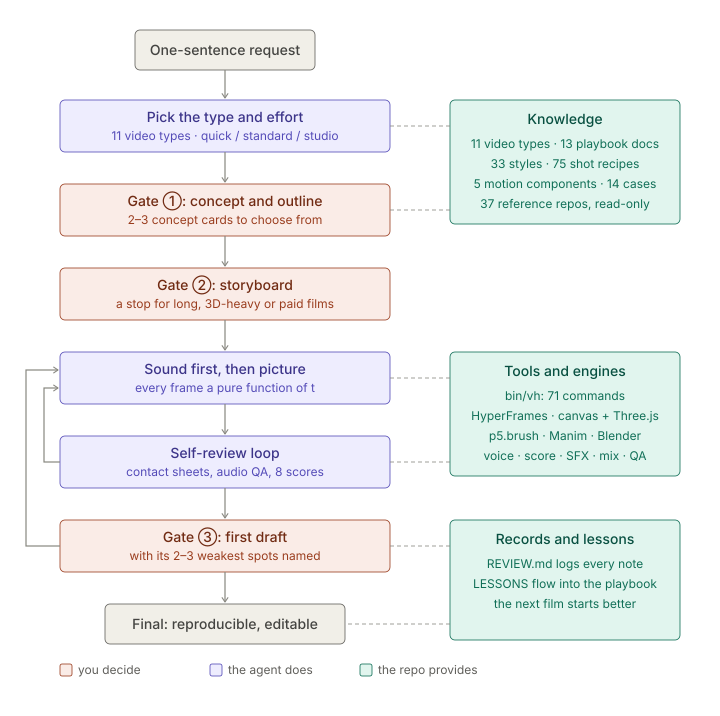
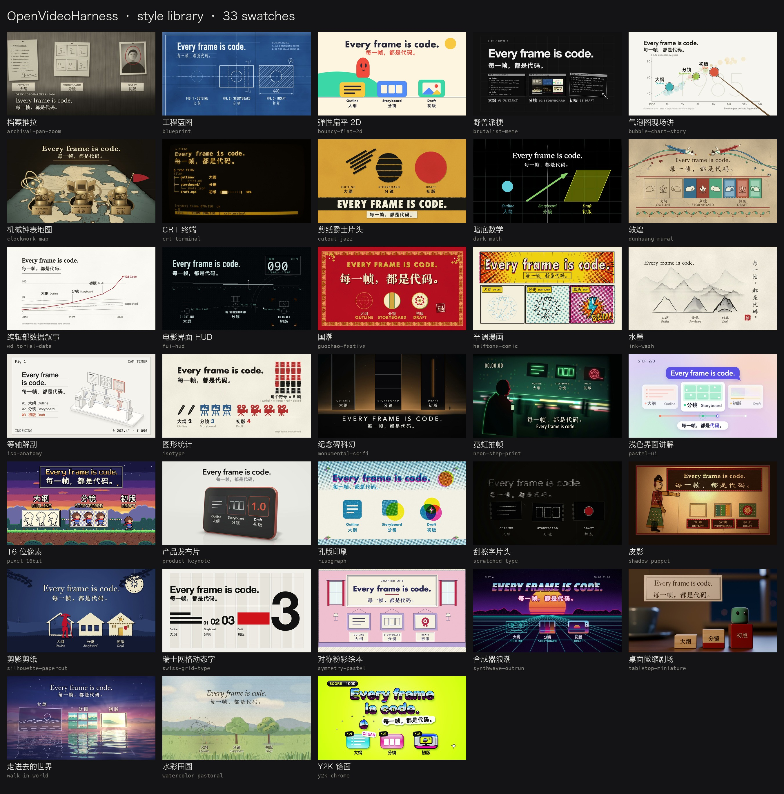
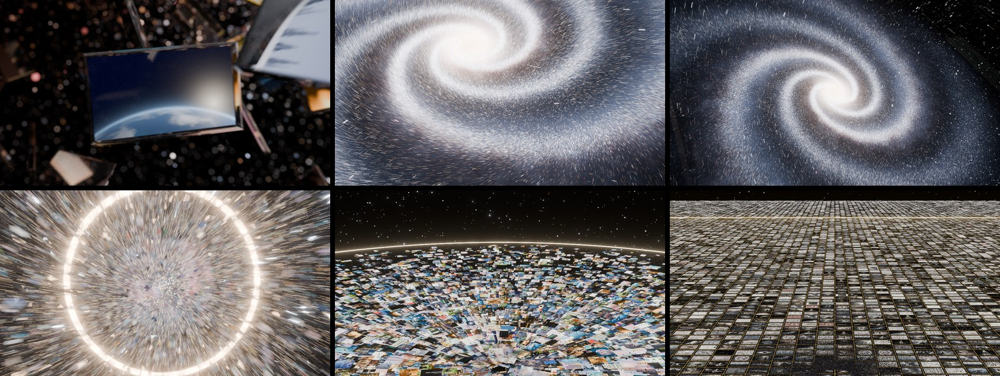

<div align="center">

# OpenVideoHarness

### Making one good film is easy. Making a good one every time is the hard part.

A video workbench for Claude Code and Codex. You say what you want in one sentence. The agent finds the idea, writes the film as code, checks its own work, and stops three times for your call.

**English** · [中文](README.zh-CN.md) · [Website](https://zlhad.top/OpenVideoHarness/docs/site/) · [Wiki](https://github.com/ZLHad/OpenVideoHarness/wiki)


<sub>Twelve moments from real films made with it. More below, some with sound.</sub>

</div>

```bash
curl -fsSL https://raw.githubusercontent.com/ZLHad/OpenVideoHarness/main/install.sh | bash
cd ~/OpenVideoHarness && claude        # or: codex
```

---

## Why this exists

Coding agents can already write a video. Give one a sentence and what comes back can startle you: real motion, real type, real rhythm. There are hundreds of films like that out there now.

Ask again, and the same model loses the pacing, makes everything glow and invents a number. That isn't a rendering problem. HyperFrames, Manim and Blender turn code into pictures. None of them decides what the film is about, whether a line of text stays up long enough to read, or whether the number on screen is true.

**What's missing isn't tools. It's craft.**

This repo is that craft, written down where an agent can use it: how to find an idea that isn't the first one everybody has, why the sound comes before the picture, how to check a film you can't watch. A few rules never bend, and everything else is a default that a good idea can overrule.

It grew out of real films. Each time one went wrong, the lesson became a doc or a check, and the next film started from there.

## What makes it different

<table>
<tr>
<td width="44%" valign="top"><br><sub>A stock chart that is also a mountain range.</sub></td>
<td valign="top"><b>It has an idea before it has code.</b><br>Two or three concept cards come first, each with a frame and a hook. It says what every other film on your topic looks like, then goes somewhere else.</td>
</tr>
<tr>
<td valign="top"><br><sub>Said at the first stop: "glass, cosmos, a starry sky… dizzying".</sub></td>
<td valign="top"><b>You direct. It does the work.</b><br>Three stops: the concept, the storyboard, the first draft. Want to decide the hook, the voice or the cover too? Name them. Want none of it? Say "just make it".</td>
</tr>
<tr>
<td valign="top"><br><sub>Time is the only input. This flash is counted in microseconds.</sub></td>
<td valign="top"><b>Every frame is a function of time.</b><br>So any frame can be drawn alone, in any order, in parallel. A render that stops picks up where it stopped. A few seconds of a finished 4K film can be redrawn and put back without touching the rest.</td>
</tr>
<tr>
<td valign="top"><br><sub>The agent going through its own frames.</sub></td>
<td valign="top"><b>It can't watch, so it measures everything it can.</b><br>An agent can't see video or hear sound. So it reads contact sheets against a 20-point checklist, measures the sound, and hands the draft to a reviewer with a fresh context, who scores it on 8 points. <code>bin/vh check</code> catches frozen frames, flashes, subtitles too short to read and wrong colour tags, and names a way out of each.</td>
</tr>
<tr>
<td valign="top"><video src="https://github.com/user-attachments/assets/84cee687-619c-4d5a-ad49-e9b79412d419" controls width="100%"></video><br><sub>▶ Press play and turn the sound on: each harmonic sounds its own note.</sub></td>
<td valign="top"><b>Sound comes first, and it's code too.</b><br>The narration or the music goes down first. Every word and beat gets a time, and the picture hangs on those times. The score is written as code, and sound effects land on the frame where things happen.</td>
</tr>
<tr>
<td valign="top"><br><sub>A generated plate, with code on top, both on record.</sub></td>
<td valign="top"><b>Real material, on the record.</b><br>Archive footage, generated pictures, recorded sound: one ledger keeps where each file came from, its licence and what it cost. No budget, no paid call.</td>
</tr>
<tr>
<td valign="top"><br><sub>From a film of 33 minutes.</sub></td>
<td valign="top"><b>Long films hold up.</b><br>Shots, captions and chapters hang on the narration's words, so adding a pause moves the picture with it. Edit lists join pages and footage, renders resume, and the upload copy fits the platform's limit. The longest so far runs 33 minutes in 4K.</td>
</tr>
</table>

**And not one AI look.** Left alone, AI video drifts toward one face: dark background, glow, glass cards. Here are 32 of its 33 styles, all rendering the same sentence:

<a href="styles/"></a>

## What it makes

Moments from a dozen films the author made with it in about a month, about 100 minutes in all. Physics, chemistry, engineering, money, folklore, literature, essays: each in a world of its own. They're in Chinese, and silent here.

<table>
<tr>
<td width="33%" valign="top"><br><sub>A black hole's jet, all in Canvas 2D<br>7½-min physics explainer</sub></td>
<td width="33%" valign="top"><br><sub>Mirror-image molecules in Three.js<br>2-min chemistry explainer</sub></td>
<td width="33%" valign="top"><br><sub>A fluid winding itself up<br>3-min maths story</sub></td>
</tr>
<tr>
<td valign="top"><br><sub>A brake cylinder cut open, the camera following the fluid<br>14-min teardown in Three.js</sub></td>
<td valign="top"><br><sub>A disc under braking, in false colour</sub></td>
<td valign="top"><br><sub>A drum brake swelling with heat</sub></td>
</tr>
<tr>
<td valign="top"><br><sub>2008 is a grey city<br>9½-min data film at 60 fps</sub></td>
<td valign="top"><br><sub>2015 is neon</sub></td>
<td valign="top"><br><sub>A conjecture as a landscape</sub></td>
</tr>
<tr>
<td valign="top"><br><sub>Shadow puppets, drawn in code<br>3-min folk history</sub></td>
<td valign="top"><br><sub>Ink wash, chrysanthemums opening</sub></td>
<td valign="top"><br><sub>Blue-and-green mountains, a Tang poem</sub></td>
</tr>
<tr>
<td valign="top"><br><sub>The same film, reaching a stairwell today</sub></td>
<td valign="top"><br><sub>A pen draws the machines as you watch<br>3-min history of technology</sub></td>
<td valign="top"><br><sub>Silhouettes growing wings<br>9-min portrait of a writer</sub></td>
</tr>
<tr>
<td valign="top"><br><sub>A book that opens like a box</sub></td>
<td valign="top"><br><sub>A lamp, a brain, a library<br>33-min essay film</sub></td>
<td valign="top"><br><sub>A path of light through a tree</sub></td>
</tr>
<tr>
<td valign="top"><br><sub>Software taken apart in glass layers<br>4-min tech story in Three.js</sub></td>
<td valign="top"><br><sub>Findings lighting up along a track</sub></td>
<td valign="top"><br><sub>From a phone to a satellite, flat and calm<br>2½-min explainer</sub></td>
</tr>
</table>

### The 5 showcase films, with sound

Press play and turn the sound on (players start muted). Each has a folder in [`showcase/`](showcase/) with the request, the brief, the storyboard, the review notes and all the source: a ready starting point for a film like it. An agent made each one from this repo's docs alone.

<table>
<tr>
<td width="42%" valign="top"><video src="https://github.com/user-attachments/assets/48923404-eff1-41cd-b303-82c9ede51c1f" controls width="100%"></video></td>
<td valign="top"><b><a href="showcase/04-intro-film/">04 · Intro film</a></b><br><sub>Blender + HyperFrames + Three.js · 103 s · studio level</sub><br>A galaxy of 1.18 million stars, path-traced in Blender, collapses and flattens into a sea of films; one continuous 3D take then follows a request through the repo. The opening is here; the whole film is linked below.<br><b><a href="showcase/04-intro-film/README.md#what-was-asked">Request</a>, at gate ①:</b> "玻璃、宇宙、星穹……令人瘫坐眩晕的感觉" (glass, cosmos, a starry sky… dizzying)<br><sub><a href="https://github.com/ZLHad/OpenVideoHarness/releases/download/media/intro-film-1080p.mp4">1080p MP4 (297 MB)</a> · <a href="https://github.com/ZLHad/OpenVideoHarness/releases/download/media/intro-film-4k.mp4">4K (1.04 GB)</a></sub></td>
</tr>
<tr>
<td valign="top"><video src="https://github.com/user-attachments/assets/efa32859-7bdc-4507-be20-504c429ec5f5" controls width="100%"></video></td>
<td valign="top"><b><a href="showcase/02-short-leo-doppler/">02 · Vertical science short</a></b><br><sub>HyperFrames · 24.8 s · 1080×1920</sub><br>Why a low-orbit satellite's signal changes pitch, readable with the sound off. Chinese voiceover, Chinese and English subtitles.<br><b><a href="showcase/02-short-leo-doppler/README.md#the-request-this-was-built-from">Request</a>:</b> "为什么低轨卫星的信号会'变调'？——多普勒频移" (why does a low-orbit satellite's signal change pitch? The Doppler shift)</td>
</tr>
<tr>
<td valign="top"><video src="https://github.com/user-attachments/assets/84cee687-619c-4d5a-ad49-e9b79412d419" controls width="100%"></video></td>
<td valign="top"><b><a href="showcase/03-math-fourier/">03 · Math explainer in the 3Blue1Brown style</a></b><br><sub>Manim · 25 s · 1920×1080</sub><br>Sine waves stack into a square wave and land on the Gibbs overshoot. English narration; each harmonic sounds its own note.<br><b><a href="showcase/03-math-fourier/README.md#the-request-this-was-built-from">Request</a>:</b> "Building a square wave from sine waves"</td>
</tr>
<tr>
<td valign="top"><video src="https://github.com/user-attachments/assets/b34576a9-f0f3-48b5-96b1-aba539b38d37" controls width="100%"></video></td>
<td valign="top"><b><a href="showcase/01-handdrawn-clawd-leaf/">01 · Hand-drawn character short</a></b><br><sub>p5.brush · 12 s · 1920×1080</sub><br>A three-shot pantomime with no words and no voice; the score and foley follow every move.<br><b><a href="showcase/01-handdrawn-clawd-leaf/README.md#the-request-this-was-built-from">Request</a>:</b> "Clawd tries to film a falling autumn leaf with a tiny hand-cranked movie camera; the wind keeps snatching the leaf just as Clawd frames it …"</td>
</tr>
<tr>
<td valign="top"><video src="https://github.com/user-attachments/assets/4f662b1a-ba4d-4485-9a84-ac821f6be7b1" controls width="100%"></video></td>
<td valign="top"><b><a href="showcase/00-promo-launch-film/">00 · Launch short</a></b><br><sub>HyperFrames · 20 s · 1920×1080</sub><br>Built from the repo's own terminal, routing table and contact sheets, with a sound for every move on screen.<br><b><a href="showcase/00-promo-launch-film/README.md#the-request">Request</a>:</b> "Produce the README hero video — a short launch film for OpenVideoHarness itself …"</td>
</tr>
<tr>
<td valign="top"><video src="https://github.com/user-attachments/assets/3ecb0f0c-5602-496b-aebc-4848a918a74c" controls width="100%"></video></td>
<td valign="top"><b><a href="styles/">The style reel</a></b><br><sub>32 of the 33 styles · about 1.5 s each</sub><br>The same content rendered in every style of the library, each with its own music.</td>
</tr>
</table>

The films live in the [`media` release](https://github.com/ZLHad/OpenVideoHarness/releases/tag/media), outside git, so a clone doesn't download them. Films 00–03 were finished silent and their sound was fitted afterwards. Community films in the same vein, and how they were made, are in [`cases/`](cases/README.md); films you make with this repo are welcome in `showcase/`.

## How it works

The film is code. The agent writes a page (or a Manim scene, or a Blender script) in which every frame is a function of its time t; a browser (or Manim, or Blender) draws each frame, and FFmpeg joins them with the soundtrack.

<p align="center"></p>

Four layers, and an agent reads only what the film at hand needs:

| Layer | What's in it |
|---|---|
| **The router** | [CLAUDE.md](CLAUDE.md): which of the 11 video types this is, how much review it gets, who decides what, and the rules that never bend |
| **The craft** | Docs an agent follows: [video types](video-types/), the [playbook](playbook/), [styles](styles/README.md), [recipes](recipes/README.md), [components](components/README.md), [case studies](cases/README.md) |
| **The tools** | One CLI, `bin/vh`: from topic research to the upload copy ([what's in the box](#whats-in-the-box)) |
| **The engines** | HyperFrames, canvas + Three.js, p5.brush, Manim and Blender, which it tells the agent how to use ([engines](#engines)) |

A film then goes like this:

1. **Route.** The routing table picks the type and its workflow; your request sets the effort level and what you want to decide yourself.
2. **Gate ①: direction and outline.** Two or three concept cards, each with a frame and a hook. Picking one settles the idea, the look and the hook together, before any code is written.
3. **Gate ②: storyboard.** Every shot lists what the viewer must take in, in order and for how long, with one keyframe per shot.
4. **Sound first.** Voiceover or music comes first; every word and beat is timed, and the picture hangs on those times.
5. **Code, then check.** After each scene the agent tiles frames into a contact sheet and fixes it against the checklist, and measures the sound. A reviewer with a fresh context then scores the whole draft.
6. **Gate ③: first draft.** You see the draft, its contact sheet, the scores and what the agent likes least. If you can't say what's wrong, it makes two or three versions of one passage for you to pick from.
7. **Final.** The final render goes through `bin/vh check`, and what went wrong goes into the project's `LESSONS.md`.

A few rules never relax: every frame depends only on t; when there is sound, it sets the timing; the storyboard comes before code; numbers, quotes and paper details are copied from the source, and anything uncertain stays out; API keys stay in environment variables.

**We publish what we measure, including when it goes against us.** In one small blind test ([docs/research/06](docs/research/en/06-concept-first-ab.md)), the workflow's films had the fresher ideas, but the reviewer found the films made with only a few floor rules better made, and would have posted those. What it flagged became checks. The [research notes](docs/research/en/README.md) have the rest.

## Quick start

You need macOS or Linux, Node.js 22 or later, Google Chrome, FFmpeg, Python 3 with [uv](https://github.com/astral-sh/uv), and Claude Code or Codex ([full list](#requirements-cost-and-limits)).

```bash
curl -fsSL https://raw.githubusercontent.com/ZLHad/OpenVideoHarness/main/install.sh | bash
cd ~/OpenVideoHarness && claude        # or: codex
```

The installer puts the repo in `~/OpenVideoHarness` with its packages, fetches 37 read-only reference repos and registers the `open-video-harness` skills for Claude Code and Codex, so asking for a video from any folder finds it. About 650 MB on disk, about 380 MB of it without the reference repos. Then say what you want:

> Make a 30-second vertical science short: why does a low-orbit satellite's signal change pitch? English voiceover, English and Chinese subtitles.

What happens next:

1. Two or three directions, each with one frame and a hook, plus an outline. You pick one.
2. A storyboard with a keyframe for every shot.
3. A first draft, with the review scores and the two or three things it likes least.

The final render comes after you say yes. Don't want to stop? Say "quick": on a clean install, without the reference repos, a fresh agent working only from these docs had a silent 15-second film done in about five minutes. The wiki's [Getting Started](https://github.com/ZLHad/OpenVideoHarness/wiki/Getting-Started) walks from nothing to a first film.

Say what the film is about, who it's for and where it will be shown; a long brief isn't needed.

| Kind | Say |
|---|---|
| Math explainer | "In the 3Blue1Brown style, how a Fourier series builds a square wave, 20 seconds, readable with the sound off." |
| Product film | "A 30-second launch film for my app in the ink-wash style, real screenshots only, sound effects on the key moves." |
| Paper talk | "Turn the core method of `papers/main.tex` into a 3-minute explainer; copy the paper's details exactly, English narration with Chinese subtitles." |
| Archive film | "A 40-second countdown film cut from public-domain NASA launch footage, with every clip's licence on record." |
| Quick try | "A quick 15-second draft to see whether a cyber-glitch look suits my game trailer; don't ask me anything." |
| Hands-on | "A 90-second explainer on how satellites avoid collisions, at the studio level. I'll choose the hook, the main character, the theme tune, the title and the cover; you decide the rest." |

## What's in the box

The tools follow the work: think, gather, make, check and deliver. Each name below is a `bin/vh` command; `bin/vh commands` lists all 71 commands by pipeline stage, and any command takes `-h`.

| | Command | What it does |
|---|---|---|
| **Think** | `know` | What the repo already knows about a few words (recipes, components, a style, a playbook section, a case) without reading the docs first |
| | `scout` | A topic on the platforms before you pick it (top videos and their outliers, hot lists), and your film's numbers after it goes out; public interfaces only, no login |
| | `ref` | A reference video, post, image or page on record: where it came from, its licence, why it matters |
| | `web` | Keep a rendered web page with its URL, date and HTTP status for fact checking; uses the installed Chrome/Chromium, with Obscura optional |
| | `breakdown` | A reference film taken apart: its cuts and transitions against its beats, keyframes, what to swap |
| | `concept` | Extras for the concept cards: a seeded "roulette" of frameworks and a six-then-three board |
| **Gather** | `footage` | Real footage from Internet Archive, Wikimedia Commons and NASA: only the seconds you need, each clip's licence on record |
| | `image` | Generated pictures from Gemini's Nano Banana or Codex's image_gen: an estimate first, each paid call held against the project's budget; transparent cutouts |
| | `sfx` · `bgm` · `sound` | Recorded effects and licensed music from your own sound library and Openverse, picked into the project with their credits |
| | `cast` | A project's characters, costumes, props and sets as settled reference pictures, which `image gen --ref cast:<id>` sends along |
| | `model3d` · `hdri` | A 3D model read before it goes in; a CC0 environment map from Poly Haven to light it |
| | `assets` | One ledger for every file a film uses: where it came from, its licence, what it cost; `check` and `credits` before delivery |
| **Make** | `new` | A project from the templates; for most types the engine comes set up too |
| | `style` · `recipes` · `components` | The style presets, the shot recipes and shot-grammar cards, the motion components |
| | `edit` | The film as an edit list: pages, images, footage, other films and sounds in a row |
| | `tts` · `music` · `captions` · `mix` | Voiceover, a score written as code, subtitles, the mix ([Sound](#sound)) |
| **Check and deliver** | `gate` · `desk` | A stop for your sign-off in one command; the review desk for item-by-item notes |
| | `frames` · `sheet` · `determinism` | Lossless frames, contact sheets, and a check that each frame really is a function of t |
| | `check` | The rendered film against its brief: black, frozen or silent stretches, flashes, subtitles, colour tags, loudness |
| | `render` | An MP4 drawn in parallel, resumable chunks, each render kept as a version |
| | `patch` · `versions` | Redraw a few seconds of a finished film; compare renders or go back to one |
| | `deliver` · `clean` | The copy to upload; a finished project cleared of its intermediates |
| | `artifacts` | Every kind of file a project holds: what it is and who writes it; what this project has, lacks and has out of date |
| | `projects` · `cancel` · `history` | Every project and where it stands; a running command stopped, with its end on record; a way back for the text you and the agent write |

`bin/vh doctor` says which of the 40 outside programs, packages, models and services this machine can use (`tools/modules.json`).

## Engines, types and libraries

### Engines

It isn't a rendering engine. It sits on top of these and tells the agent how to use them:

| Engine | Draws | Used for |
|---|---|---|
| [HyperFrames](engines/README.md#hyperframeshtml--gsap) (HTML + GSAP) | Pages with real type and layout; a registry of ready blocks (`bin/vh hf`) | Science shorts, product films, data stories, meme edits, the style samples |
| [canvas-film](engines/canvas-film/README.md) (canvas 2D), with an optional Three.js layer | Long narrated films whose shots, captions and chapter bar hang on the narration's words; GLB models with their animation clips under the 2D | Any type (`--engine canvas-film`; `--three` adds the 3D layer) |
| [ClaudeAnimationBase](engines/ClaudeAnimationBase/) (p5.js + p5.brush), bundled | Hand-drawn lines, watercolour, characters | Hand-drawn shorts, music videos |
| Manim CE, with [ManimGX](engines/manimgx.md) as an optional faster backend | Math and mechanisms | Math and science explainers, paper talks |
| [Blender](engines/blender.md) 5.2, optional | Path-traced light, physics, real depth of field; or a 3D asset tidied for the Three.js layer | The shots a web engine can't do |

Remotion appears in a few type docs as an alternative; no showcase film uses it, and it is set up by hand ([engines/README.md](engines/README.md)).

### Video types

| Type | Good for | Main engine | Docs |
|---|---|---|---|
| 01 Math and science explainers | 3Blue1Brown-style animations of how something works | Manim | [01](video-types/01-math-science-explainer.md) |
| 02 Science shorts | TikTok/Douyin, Bilibili, Xiaohongshu, YouTube Shorts | HyperFrames | [02](video-types/02-knowledge-short.md) |
| 03 Product and launch films | Apps, SaaS, open-source projects, feature demos | HyperFrames | [03](video-types/03-product-promo.md) |
| 04 Lyric and music videos | Animation cut to a song | p5.brush or HyperFrames | [04](video-types/04-lyric-music-video.md) |
| 05 Data stories | Animated charts and numbers | HyperFrames + SVG | [05](video-types/05-data-story.md) |
| 06 Paper explainers | Conference videos, research talks | Manim or HyperFrames | [06](video-types/06-paper-explainer.md) |
| 07 Hand-drawn shorts | Watercolour, whiteboard, paper cut-out, character shorts; Chinese characters written stroke by stroke | p5.brush (bundled) | [07](video-types/07-hand-drawn.md) |
| 08 Meme edits | Brutalist, tech-Twitter quick cuts | HyperFrames | [08](video-types/08-brutalist-meme.md) |
| 09 Edits of your own footage (experimental) | Talking heads and interviews: cut filler, add captions and graphics, make a vertical version | HyperFrames | [09](video-types/09-editing-talking-head.md) |
| 10 Long explainers | Landscape explainers of 10 minutes or more | canvas-film | [10](video-types/10-long-explainer.md) |
| 11 Photo recaps (experimental) | Your own photos and clips: a wedding, a trip, a year in review | canvas-film + edit list | [11](video-types/11-photo-recap.md) |

For realistic people or physics, generated video with code on top ([playbook/05](playbook/05-hybrid-genvideo.md)); for a story with an arc or anything over three minutes, [playbook/09](playbook/09-narrative.md); for hooks, titles and covers, [playbook/10](playbook/10-hooks-and-packaging.md).

### Styles

Left alone, AI video drifts toward one look: dark background, glow, glass cards. [`styles/`](styles/README.md) holds 33 styles distilled from well-known work, among them Saul Bass title sequences, the Swiss grid, 3Blue1Brown, New York Times graphics, the halftone of *Spider-Verse*, Wes Anderson's symmetry, ink wash, Dunhuang murals, shadow puppetry and guochao. Each describes its colours, type, composition, motion, transitions and sound, and each was rendered as a 5-second sample of the same content:

<a href="styles/"></a>

A style is a reference, not a template: borrow one, mix several, or ignore them all. What's borrowed is the visual grammar, never the original's characters, logos or shots. `bin/vh style list` lists them; `bin/vh new promo launch-film --style cutout-jazz` attaches one to a project.

### Recipes, shot-grammar cards, components

- **[Recipes](recipes/README.md)**: 75 shot recipes (how one shot or one seam moves: its phases, frame counts, the parameters that mustn't drop, where it goes wrong) and 10 whole-film skeletons (an energy arc and a hold budget for a whole film). `bin/vh recipes list --intent … --energy …` filters them; each recipe with a code sketch comes with its rendered sample sheet.
- **Shot-grammar cards**: 24 shot-grammar cards in `recipes/shot/` for shot sizes, angles, the axis and camera moves, each saying what it does to the viewer and when to take it or not. A shot's choice goes into its `camera` field, and `bin/vh storyboard` prints it under the shot.
- **[Components](components/README.md)**: 5 motion components (a spring scene, a page turn, paper transitions, a chapter bar, a build-up of pieces), each a state computed from t with thin painters for canvas, the DOM or Three.js. `bin/vh components add` copies one into a project.

All of these are defaults to start from, not rules: a concept that needs something else simply does it.

## Sound

An agent can't hear, so the sound is built to be computed and measured.

- **Voiceover** (`bin/vh tts`): local, open-source Qwen3-TTS by default (offline and free on Apple Silicon; five Chinese voices, two English). Cloud voices from Gemini, MiniMax, ElevenLabs and Alibaba Cloud Model Studio, Edge's online voices, and macOS's own `say` for drafts. Word timing comes with `--align`, so captions and picture can hang on single words.
- **Subtitles** (`bin/vh captions`): write the script as `中文 || English` to get Chinese, English or two-line subtitles, burned in or as switchable tracks.
- **Music** (`bin/vh music`): composed as code, so the same score always renders the same audio, with the time of every beat for the picture to hit; it has Chinese instruments such as a bianzhong-like bell, guzheng and dizi. `bin/vh beats` finds the beats of your own track; `bin/vh bgm` finds a CC-licensed one on Openverse and cuts it on a downbeat; `bin/vh music --provider lyria` generates one with Google's Lyria (paid per track, held against the budget, on record as AI-generated).
- **Sound effects** (`bin/vh sfx`): 21 sound effects synthesized in code, placed on the frame where the action happens; each film walks its own variants, so repeats don't sound identical. Recorded ones too, from your own library and Openverse's CC0 and CC BY effects, with licence and credit on record.
- **Mix and checks** (`bin/vh mix`, `bin/vh qa`): the music ducks under the voice and the mix lands at −14 LUFS; `qa` finds silence, dropouts, pumping, clicks and cues more than a frame off. What only a person can judge, `qa --listen 5` cuts out for headphones.

More in [playbook/04-audio.md](playbook/04-audio.md) (in Chinese).

## 3D

Some shots are beyond a web page: refracting glass, volumetric light, real depth of field, a million particles. For those the agent writes Python that drives Blender; the intro film's opening is 1.18 million stars computed with numpy and path-traced in Cycles, 475 frames in 1 h 28 min at 1080p on an M3 Max.

<p align="center"></p>

- **In a narrated film**, 3D goes in canvas-film's Three.js layer (`--three`): GLB models drawn under the 2D, their clips set to the narration's words, every frame a function of t.
- **Before a model goes in**, `bin/vh model3d check` reads it: triangles, textures, joints, clip names and lengths, its size in metres; `--blender` adds checks run in Blender (faces fighting each other, parts inside out).
- **Light**: `bin/vh hdri` takes a CC0 environment map from Poly Haven to light the scene and stand behind it.
- **Blender only for the asset**: when a shot needs no path tracing, Blender just tidies, rigs and exports the model, and the Three.js layer films it.
- **Safely**: the Blender scripts run with none of your environment variables, so no API keys, and on macOS in a sandbox with no network. When Blender is worth it and how it joins a film: [engines/blender.md](engines/blender.md) (in Chinese, partly verified).

## Edit lists

A film doesn't have to be one page. `edit.json` lays it out as a row of entries, each drawn its own way: a page (one engine per chapter, if you like), an image with a push, a colour, a grey slate still to be made, a clip of footage, another project's film, and tracks of sound. `bin/vh edit init` turns the shot table into one, every shot a slate timed as planned, which is gate ②'s full-length animatic; the slates are then replaced one by one.

`bin/vh render` builds the edit list, puts a keyframe at every cut and keeps each finished chunk, so a render after a change draws only the entries that changed. `bin/vh patch`, `check` and `deliver` read the same list, and a film with a slate left can't be delivered. Any page, in an edit list or alone, can render with `--motion-blur N` (N sub-frames averaged into each frame, a cut still a cut) or `--alpha` (a transparent film to lay over footage). The format: [engines/EDIT.md](engines/EDIT.md) (in Chinese).

## Effort, and who decides

The level sets how often it stops for you and how many review rounds it runs, not how good the film is: all three deliver a full-quality film. Say "quick", "just make it, I won't look" or "studio quality" in the request, or pass `--effort` when you create a project.

| | `quick` | `standard` (default) | `studio` |
|---|---|---|---|
| For | one line in, a finished film out | real videos where you want to decide at the gates | launches and flagship pieces, polished over rounds |
| Stops for you | none | three | three, with a 10–20 s sketch for each concept and a full-length animatic |
| Fresh-context review | none | one round, up to the three most important problems fixed | three to ten rounds; the five craft scores at 7 or above |
| A 30-second film takes about | 10–30 min | 1–2 h | 3 h or more |

At every level: no invented facts, no sudden silence in a film with sound, no rapid flashing, type no smaller than the floor for the target screen, licences on record, and no paid call without a budget.

Apart from the level, you can name what you want to decide yourself: the hook, the look, the main character, the theme tune, the voice, the script, the storyboard, the title and the cover. For those it offers options and waits; the rest it decides, writes down why in the project's `DECISIONS.md`, and you can overrule it at any time. Each stop is one command (`bin/vh gate`) that builds a local review page opening with the decisions it needs from you, the frames, animatic and music playable in the browser. At `studio` the stop is the review desk (`bin/vh desk`): you mark each item ok, change or question, add a line and submit, and the agent, waiting in the background, carries on with your words copied into `REVIEW.md`. Both come in English or Chinese, following your first request.

## Requirements, cost and limits

| Needs | For |
|---|---|
| macOS or Linux, git | everything (Windows is untested) |
| Node.js 22+, Google Chrome | drawing frames in the browser |
| FFmpeg | encoding, mixing, checks |
| Python 3 + [uv](https://github.com/astral-sh/uv) | the sound tools, contact sheets, Manim; their packages install into uv's cache on first use |
| Apple Silicon | the local Qwen3-TTS voice and local word timing (not needed with a cloud voice) |
| LaTeX | formulas in Manim |
| Blender 5.2 | only for path-traced shots and preparing 3D models; its sandbox is macOS-only for now |

- **Cost.** Rendering, music and sound effects run locally and cost nothing. What costs money is the agent itself (a Claude Code or Codex subscription, or API usage), plus any cloud voice, generated picture, generated music or generated video you choose, billed by that provider. A paid call needs a budget (the brief's `Budget:`, or a default in `LOCAL.md`) and is held against it before it's made; keys are always read from environment variables.
- **Time.** A 30-second film at the standard level takes about 1–2 hours, most of it checking and fixing.
- **Limits.** The agent can't watch or listen, only read frames and audio measurements, so the last look and listen are yours. The full workflow has only been run on macOS (Apple Silicon); on Linux, a silent film has been made on Ubuntu 24.04 (arm64, in Docker), and the three things it needed first are in [engines/README.md](engines/README.md#linux渲染前要先备好的三样). Realistic people need generated video. Type 09 (editing your own footage) is experimental and hasn't been tried on real footage yet.

## Install options and updates

```bash
bash install.sh --dir ~/code/OpenVideoHarness   # install somewhere else
bash install.sh --no-refs                        # skip the reference repos for now (references/fetch.sh later)
bash install.sh --no-skill                       # don't register the global skill
```

- The installer fetches only the newest commit: the repo itself is about 95 MB to download and 200 MB on disk, before its packages and the reference repos. To contribute or browse the history, `git clone` normally and run `bin/vh setup`.
- To update, run the installer again with the same options; `LOCAL.md` and `projects/` are left alone, and it stops before overwriting files you changed.
- The showcase videos aren't in git; to rebuild a showcase locally, `tools/fetch_media.sh` downloads them from the release to where its scripts expect them.
- The first render and the first use of the sound tools download more into `~/.cache`: Chrome about 200 MB, Python packages up to about 1.5 GB, and the default local voice's model about 2 GB (measured 2026-11; where each goes is on the wiki's [Getting Started](https://github.com/ZLHad/OpenVideoHarness/wiki/Getting-Started)). If npm, PyPI, Hugging Face or Google Fonts are blocked or slow where you are, [China network](https://github.com/ZLHad/OpenVideoHarness/wiki/China-Network) has the mirror settings.

Skill only: `npx skills add https://github.com/ZLHad/OpenVideoHarness --skill open-video-harness`. It's a pointer: on first use it asks before installing the full workbench.

## Where things are

| Looking for | Go to |
|---|---|
| The agent's entry point: routing, effort levels, who decides, hard rules | [CLAUDE.md](CLAUDE.md) (`AGENTS.md` is the same) |
| The workflow for each type of video | [video-types/](video-types/) |
| General know-how: process, checks, motion, sound, effects, story, hooks, composition, ideas | [playbook/](playbook/) |
| Styles, recipes and shot-grammar cards, components | [styles/](styles/README.md), [recipes/](recipes/README.md), [components/](components/README.md) |
| Engines, the page contract, edit lists | [engines/](engines/README.md), [CONTRACT.md](engines/CONTRACT.md), [EDIT.md](engines/EDIT.md) |
| 14 case studies of community work, and the repo's own films with every step on record | [cases/](cases/README.md), [showcase/](showcase/) |
| What we measured, and what changed because of it | [docs/research/](docs/research/en/README.md) |
| The CLI | `bin/vh commands`, `bin/vh help`, any command with `-h` |
| Tutorials, troubleshooting, FAQ | the [wiki](https://github.com/ZLHad/OpenVideoHarness/wiki) |

Most of the workflow docs are in Chinese; the READMEs, the wiki and the research notes have English versions, and agents read either language.

## Related projects

| Project | What it is | How this differs |
|---|---|---|
| [Code2Video](https://github.com/showlab/Code2Video) | A research pipeline for teaching videos in Manim | Takes "code as video" to many kinds of video, run by general-purpose coding agents |
| The official [HyperFrames](https://github.com/heygen-com/hyperframes) and [Remotion](https://github.com/remotion-dev/skills) skills | How to use one engine | Sits above the engines: choosing one, the process, the look, the checks |
| [OpenMontage](https://github.com/calesthio/OpenMontage) | A full agent video production system | Lighter: mostly markdown, templates and one CLI that any coding agent can read and change |
| [Guizang's product-video skill](https://github.com/op7418/guizang-product-video-skill) | Release films for software products | More types, three human sign-offs, a style library, sound in Chinese and English; its music and SFX approach inspired ours, the code is separate |

## Contributing

Pull requests are welcome: new video types, styles with their samples, recipes, components, case studies, lessons from your projects, and films you made with this repo, with everything that went into them. Branches, checks and where video files go: [CONTRIBUTING.md](CONTRIBUTING.md).

## Thanks

To HyperFrames, Remotion, Manim, p5.brush, Three.js, Blender, Qwen3-TTS, mlx-audio and FFmpeg; to research such as Code2Video, Paper2Video and TheoremExplainAgent; to open projects including ClaudeAnimationBase, PDoomVideo, functional-emotions-video, Battle-of-Austerlitz-Film, Guizang's product-video skill, lemo-opuscar, OpenMontage and awesome-opus5-5-videos; and to the creators who share experiments and prompts in public, including Movez and Eian. The full list, licenses and what each was used for: [ACKNOWLEDGMENTS.md](ACKNOWLEDGMENTS.md).

This is an independent project, not affiliated with Anthropic, HeyGen, Remotion, Show Lab or Alibaba Cloud.

## License

Original content is [MIT](LICENSE). The bundled ClaudeAnimationBase is MIT too (© John Heibel). Parts of `recipes/` and `components/` adapted from other projects keep their licences, Apache-2.0 or MIT ([`recipes/NOTICE.md`](recipes/NOTICE.md), [`components/NOTICE.md`](components/NOTICE.md)). Files that call Blender's Python API (`import bpy`) are GPL-3.0-or-later, each with an SPDX header ([`engines/blender.md`](engines/blender.md)); the GPL's text is in [`LICENSES/GPL-3.0-or-later.txt`](LICENSES/GPL-3.0-or-later.txt). three.js and fflate, carried by the canvas engine's Three.js layer, keep their MIT licences ([`engines/canvas-film/three/NOTICE.md`](engines/canvas-film/three/NOTICE.md)); the Blender checks of `bin/vh model3d` adapt MIT code from blender-skills ([`tools/model3d/NOTICE.md`](tools/model3d/NOTICE.md)). The homepage's two fonts, Inter Tight and JetBrains Mono, are under the SIL Open Font License ([`docs/site/fonts/`](docs/site/fonts/)). The reference repos keep their own licenses and aren't part of this repo.

## Citation

```bibtex
@misc{openvideoharness2026,
  title        = {OpenVideoHarness: A Code-to-Video Harness for Coding Agents},
  author       = {ZLHad and contributors},
  year         = {2026},
  howpublished = {\url{https://github.com/ZLHad/OpenVideoHarness}}
}
```

## Support

If this project helped you make a film or saved you some time, you're welcome to buy the author a coffee ☕

<p align="center"></p>
