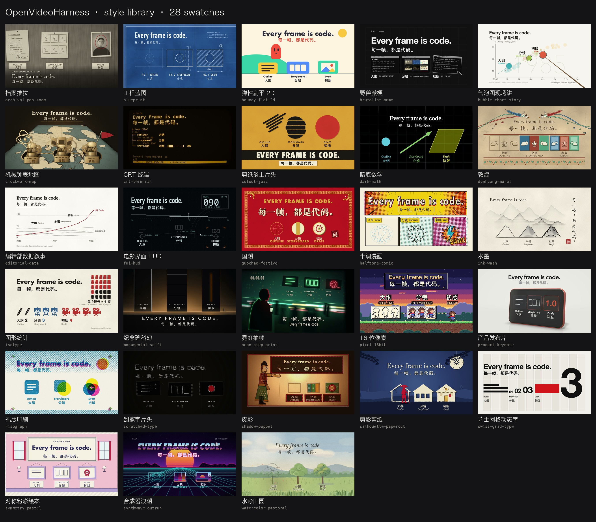
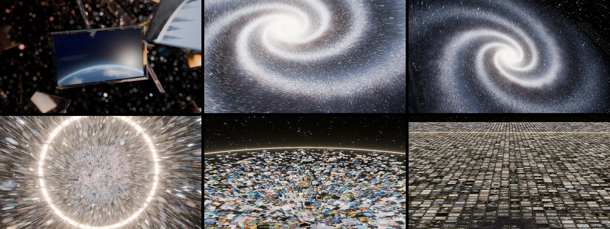

<div align="center">

# OpenVideoHarness

**给 Claude Code、Codex 用的做视频工作台：AI 写代码出片，你在三个节点拍板。**

科普、讲解、产品片、MV、数据故事、论文讲解、手绘短片、梗图快剪，还有一类在试验中的"剪你自己录的素材"。

[English](README.md) · **中文** · [Wiki](https://github.com/ZLHad/OpenVideoHarness/wiki)


https://github.com/user-attachments/assets/48923404-eff1-41cd-b303-82c9ede51c1f


<sub>▶ 介绍片的开场（25 秒，有声音）。这支片子是 agent 只照着本仓库的文档做的，开场用代码驱动 Blender 渲染，配乐也是代码写的。完整的 103 秒在 <a href="showcase/04-intro-film/README.zh-CN.md">showcase/04</a>。</sub>

</div>

---

## 这是什么

现在让 AI"一句话做一支视频"已经不稀奇：它写一段程序，程序算出每一帧的样子，浏览器或 Manim 把帧渲染出来，再配上声音。难的是每次都做好。同一个模型，这次惊艳，下次就节奏乱、满屏发光、数字乱编，因为它手里没有一套做视频的流程和检查办法。

这个仓库就是这套流程和检查办法，写成 agent 能照着执行的文档和命令行工具 `bin/vh`：

- **按片子类型给做法**：说"做个科普"或"做个发布片"，agent 就去读那一类的工作流：用哪个引擎、分几步、什么算好看、什么不能做。
- **三个节点停下来等你**：创意方向和大纲、分镜、初版，各停一次，你点头再往下做。还没写代码时就把方向定下来，返工最便宜。只想试一版时，说"快速出一版"，它就直接出片。
- **自己检查自己**：AI 看不了视频、听不了声音，所以它看渲染出来的帧、用数据查声音，对着一张 20 条的清单改；整片再交给另一个没参与制作的 agent 打分。
- **声音一起做**：中英配音、双语字幕、用代码写的配乐和音效、混音和质检。
- **风格库和 Blender**：31 种从名作里提炼的风格，各带一段实际渲染的样片，可以借来用，不必照搬；要真玻璃、体积光、上百万粒子时，agent 写 Python 驱动 Blender。

它不是新的渲染引擎，而是架在 HyperFrames、Manim、Remotion、p5.brush、Blender 之上的"怎么做"。

## 能做出什么

下面每一支都是 agent 只看本仓库的文档做的。点标题看它的需求、分镜、审阅记录和全部源码，可以直接拿来当同类片子的起点；需求只摘了一小段，点"需求"看全文。

<table>
<tr>
<td width="40%" valign="top">

https://github.com/user-attachments/assets/1f5873bd-a83f-4d5e-96fe-08aff0c3a96c

<sub><a href="https://github.com/ZLHad/OpenVideoHarness/releases/download/media/02-vertical-science-short.mp4">下载原片</a></sub>
</td>
<td valign="top"><b><a href="showcase/02-short-leo-doppler/">02 · 竖屏科普</a></b>（HyperFrames · 24.8 秒 · 1080×1920）<br>低轨卫星信号的多普勒频移，关掉声音也看得懂。中文配音，中英字幕。<br><b><a href="showcase/02-short-leo-doppler/README.md#the-request-this-was-built-from">需求</a>：</b>"为什么低轨卫星的信号会'变调'？——多普勒频移"</td>
</tr>
<tr>
<td width="40%" valign="top">

https://github.com/user-attachments/assets/c2368f76-b157-4a48-9945-8048a515efd4

<sub><a href="https://github.com/ZLHad/OpenVideoHarness/releases/download/media/03-math-explainer.mp4">下载原片</a></sub>
</td>
<td valign="top"><b><a href="showcase/03-math-fourier/">03 · 3Blue1Brown 式数学讲解</a></b>（Manim · 25 秒 · 1920×1080）<br>正弦波一层层叠成方波，最后停在吉布斯过冲上。英文旁白，每个谐波有自己的音。<br><b><a href="showcase/03-math-fourier/README.md#the-request-this-was-built-from">需求</a>：</b>"Building a square wave from sine waves"（用正弦波拼出方波）</td>
</tr>
<tr>
<td width="40%" valign="top">

https://github.com/user-attachments/assets/da028240-fcff-4e02-95a0-a0abd3238d07

<sub><a href="https://github.com/ZLHad/OpenVideoHarness/releases/download/media/01-handdrawn-short.mp4">下载原片</a></sub>
</td>
<td valign="top"><b><a href="showcase/01-handdrawn-clawd-leaf/">01 · 手绘角色短片</a></b>（p5.brush · 12 秒 · 1920×1080）<br>没有字、没有旁白的三镜头默剧，配乐和拟音跟着每个动作走。<br><b><a href="showcase/01-handdrawn-clawd-leaf/README.md#the-request-this-was-built-from">需求</a>：</b>"Clawd 用手摇小摄影机拍一片落叶，风总在它对准的时候把叶子抢走……"</td>
</tr>
<tr>
<td width="40%" valign="top">

https://github.com/user-attachments/assets/7b5e2d6a-1683-4a01-8cf8-2b27b5bf0c97

<sub><a href="https://github.com/ZLHad/OpenVideoHarness/releases/download/media/00-launch-short.mp4">下载原片</a></sub>
</td>
<td valign="top"><b><a href="showcase/00-promo-launch-film/">00 · 发布短片</a></b>（HyperFrames · 20 秒 · 1920×1080）<br>用这个仓库自己的终端、目录和联系表搭成，每个画面动作都有音效。<br><b><a href="showcase/00-promo-launch-film/README.md#the-request">需求</a>：</b>"做 README 首屏的主视频：一支给 OpenVideoHarness 本身的发布短片……"</td>
</tr>
<tr>
<td width="40%" valign="top">

https://github.com/user-attachments/assets/dfa4a89e-ab81-4d2a-abab-5ba3eec57fbe

<sub>6 段里的第 3 段；<a href="showcase/04-intro-film/README.zh-CN.md">全部 6 段</a> · <a href="https://github.com/ZLHad/OpenVideoHarness/releases/download/media/intro-film-1080p.mp4">下载 1080p（297 MB）</a> · <a href="https://github.com/ZLHad/OpenVideoHarness/releases/download/media/intro-film-4k.mp4">4K（1.04 GB）</a></sub>
</td>
<td valign="top"><b><a href="showcase/04-intro-film/README.zh-CN.md">04 · 介绍片</a></b>（Blender + HyperFrames + Three.js · 103 秒 · 1920×1080）<br>本仓库自己的产品片。立意是"每颗星都是一支片子"：开场的星系用 Blender 路径追踪渲出来，坍缩、爆开、被压平；之后一个连续的 3D 长镜头，跟着一句需求走完整个仓库。这一段讲的是三道关卡和自查回环。<br><b><a href="showcase/04-intro-film/README.zh-CN.md#你说了什么原话">需求</a>（关卡上的原话）：</b>"玻璃、宇宙、星穹……令人瘫坐眩晕的感觉"，之后"或者使用blender？好莱坞大片质感"</td>
</tr>
<tr>
<td width="40%" valign="top">

https://github.com/user-attachments/assets/7fee4f5a-f081-4b7e-82a6-9be8be9f5b7e

<sub><a href="https://github.com/ZLHad/OpenVideoHarness/releases/download/media/styles-gallery.mp4">下载原片</a></sub>
</td>
<td valign="top"><b><a href="styles/">31 种风格，连播</a></b>（每种约 1.5 秒）<br>同一段内容，换 31 种风格，每种配自己的音乐。<br><code>bin/vh style list</code> 看全部，<code>bin/vh new promo launch-film --style cutout-jazz</code> 挂一种当参考。</td>
</tr>
</table>

视频都在 GitHub 上：README 里播的片段每个不到 10 MB（1080p，风格连播是 720p），右下角是仓库名，完整文件在 [Release `media`](https://github.com/ZLHad/OpenVideoHarness/releases/tag/media)，不进 git，所以克隆仓库不用下载它们。社区里的同类作品和我们的拆解在 [cases/](cases/README.md)。你做出来的片子也欢迎 PR 进 `showcase/`。

## 快速开始

需要 macOS 或 Linux、Node.js ≥ 22、Google Chrome、FFmpeg、Python 3 和 [uv](https://github.com/astral-sh/uv)，以及 Claude Code 或 Codex。详细的要求见[下文](#要求成本和限制)。

```bash
curl -fsSL https://raw.githubusercontent.com/ZLHad/OpenVideoHarness/main/install.sh | bash
```

这条命令把仓库装到 `~/OpenVideoHarness`，装好依赖，拉取 30 个只读的参考仓库，并把 `open-video-harness` skill 注册给 Claude Code 和 Codex（之后在任何目录说"做个视频"，agent 都能找到这里），一共占约 590 MB 磁盘。然后：

```bash
cd ~/OpenVideoHarness && claude
```

```text
做一个 30 秒的竖屏科普：为什么低轨卫星的信号会"变调"。中文配音，中英双语字幕。
```

接下来它会：
1. 先给两三个创意方向，每个配一张示意画面，附一份大纲，等你选；
2. 再给分镜和每个镜头的关键帧；
3. 最后给初版，并说出自己最不满意的两三处。

你点了头，它才出成片。从零走到第一支视频的完整过程见 wiki 的[快速开始](https://github.com/ZLHad/OpenVideoHarness/wiki/%E5%BF%AB%E9%80%9F%E5%BC%80%E5%A7%8B)。

## 怎么提需求

说清楚讲什么、给谁看、发在哪就够了，不用写长篇 brief。

> **科普短视频**：45 秒竖屏，讲为什么 GPS 必须考虑相对论。发 B 站和小红书，中文旁白，结尾给出一个具体数字。

> **数学讲解**：3Blue1Brown 那种风格，讲傅里叶级数怎么一点点拼出方波，20 秒，静音也能看懂。

> **产品片**：给我的 App 做一支 30 秒发布片，用水墨风格，只用真实截图，关键动作配音效。

> **论文讲解**：把 `papers/main.tex` 的核心方法做成 3 分钟讲解，论文信息照抄原文，英文旁白加中文字幕。

> **快速试一版**：快速出一版 15 秒的草稿，看看赛博故障风适不适合我的游戏预告，不用问我。

> **深度参与**：做一支 90 秒的知识视频，讲卫星怎么避免相撞，要精品。开头钩子、主角、主旋律、标题和封面我来定，其余你定。

## 它怎么工作

<p align="center"></p>

1. **判断类型**：agent 先查 [CLAUDE.md](CLAUDE.md) 里的路由表，判断这是哪一类视频，再读那一类的工作流。
2. **创意方向和大纲（第一次停）**：两三个一句话的点子，比如"把回车后的 3 秒放慢成 2 分钟"，各配一张示意画面；你选定以后，画面风格从这个点子推出来，也可以借风格库。
3. **分镜（第二次停）**：每个镜头写清观众要依次看懂什么、各占几秒，附每镜一帧的预览图。
4. **声音先行**：先做旁白或配乐，量出每句话、每一拍的时间，画面跟着声音走。
5. **写代码，自己查**：每写完一段，把渲染出的帧拼成一张联系表看，对着清单改；用数据查声音有没有断、有没有爆、卡点有没有对上；整片再交给另一个 agent 按 8 项打分。
6. **初版（第三次停）**：给你看初版和它最不满意的地方。你说不清哪里不对时，它把同一段做成两三个版本让你挑。
7. **收尾**：出成片，把这次踩的坑写回文档。

几条从不放松的规则（完整版见 [CLAUDE.md](CLAUDE.md)）：每一帧只由时间决定，同一时刻永远算出同一帧，所以能并行渲染、随时抽查任意一帧；有声音时声音决定时长；先分镜后代码；数字、引文、论文信息照抄原文，拿不准的不编进片子。

**和直接让 AI 做有什么不同？** 我们做过一次小实验（[docs/research/06](docs/research/06-concept-first-ab.md)）：两条一句话需求，各按流程（快出档）做一支、只给几条底线做一支，都是无声片，盲评。按流程做的点子更新，但评审觉得只守底线的那两支做得更好，两次都选了它们去发；两边的耗时和 token 差不多。评审指出的问题（字在手机上太小、开头太慢）后来都补进了检查。流程想省的是返工：方向在写代码前定，问题在出片前查；这一点还没有量过。

## 类型和风格

| 类型 | 适合做什么 | 首选引擎 | 文档 |
|---|---|---|---|
| 01 数学、科学讲解 | 3Blue1Brown 式的原理动画 | Manim | [01](video-types/01-math-science-explainer.md) |
| 02 知识科普短视频 | 抖音、B 站、小红书、视频号、Shorts | HyperFrames | [02](video-types/02-knowledge-short.md) |
| 03 产品片、发布片 | App、SaaS、开源项目的介绍和功能演示 | HyperFrames | [03](video-types/03-product-promo.md) |
| 04 歌词视频、MV | 跟着音乐走的动画 | p5.brush 或 HyperFrames | [04](video-types/04-lyric-music-video.md) |
| 05 数据故事 | 动态图表、数字可视化 | HyperFrames + SVG | [05](video-types/05-data-story.md) |
| 06 论文讲解 | 会议视频、学术报告 | Manim + HyperFrames | [06](video-types/06-paper-explainer.md) |
| 07 手绘短片 | 水彩、白板、剪纸、角色小短片，能按笔顺写汉字 | p5.brush（自带） | [07](video-types/07-hand-drawn.md) |
| 08 梗图快剪 | 野兽派、科技推特风 | HyperFrames | [08](video-types/08-brutalist-meme.md) |
| 09 剪你自己的素材（试验中） | 口播、访谈：删口水词、加字幕和图解、出竖屏版 | HyperFrames | [09](video-types/09-editing-talking-head.md) |

要写实人物或真实物理时，接生成式视频再用代码叠加（[playbook/05](playbook/05-hybrid-genvideo.md)）；讲有起伏的故事或 3 分钟以上的长片看 [playbook/09](playbook/09-narrative.md)；开头钩子、标题和封面看 [playbook/10](playbook/10-hooks-and-packaging.md)。

**风格。** AI 做的视频很容易长成一个样子：暗底、发光、玻璃卡片。所以 [`styles/`](styles/) 收了 31 种从名作里提炼的风格：Saul Bass 的片头、瑞士网格、3Blue1Brown、《纽约时报》的数据图、《蜘蛛侠：平行宇宙》的网点、韦斯·安德森的对称构图、水墨、敦煌、皮影、国潮等。每种都写清颜色、字体、构图、运动、转场和声音，并用同一段内容实际渲染了一段 5 秒样片，差别只在风格：

<a href="styles/"></a>

风格是参考，不是模板：可以借一种、借几种，也可以完全不借。学的是这些作品的视觉语法，不用原作的角色、logo 和镜头。详见 [styles/README.md](styles/README.md)。

## 3D 和电影级特效：代码驱动 Blender

网页引擎给不了真玻璃的折射、体积光、真实的景深和上百万粒子的运动模糊。这时 agent 直接写 Python 驱动 Blender：numpy 算出每颗星、每张卡片在每一帧的位置，Cycles 路径追踪渲染，再和 HyperFrames 的字和界面接成一支片子。

<p align="center"></p>

介绍片的开场就是这样做的：118 万颗星组成一个星系，15.8 秒、475 帧，1080p 在 M3 Max 上渲了 1 小时 28 分。脚本在沙箱里跑，不联网，也拿不到你的 API key；长渲染分块、可以续渲。什么时候值得用、怎么接进片子、踩过哪些坑，见 [engines/blender.md](engines/blender.md)。

## 声音

AI 听不见，所以声音尽量做成能计算、能测量的：

- **配音**（`bin/vh tts`）：默认是本地开源的 Qwen3-TTS，离线免费，中文 5 个音色、英文 2 个；也接了阿里云百炼、ElevenLabs、Gemini TTS（样片 02、03 用的是 Gemini）。每句都能单独指定语气和重音，有配乐时可以落在拍点上。
- **字幕**（`bin/vh captions`）：旁白稿写成 `中文 || English`，出中文、英文或双行字幕，也能封装成可开关的字幕轨。
- **配乐**（`bin/vh music`）：用代码作曲，同一份谱永远生成同一段音乐，并给出每一拍的时间让画面卡点；有编钟、古筝、竹笛这些中国乐器。用你自己的曲子时，`bin/vh beats` 分析节拍。
- **音效**（`bin/vh sfx`）：21 个代码合成的原创音效，摆在动作发生的那一帧；大多数音效每次略有变化，听着不重复。
- **混音和质检**（`bin/vh mix`、`bin/vh qa`）：有旁白时音乐自动让开，整体响度按 −14 LUFS；`qa` 查断音、掉音、忽大忽小、爆音，以及每个卡点是否落在一帧以内。

详见 [playbook/04-audio.md](playbook/04-audio.md)。

## 做多认真、谁来拍板

不是每支片子都值得走全套。在需求里说"快速出一版"或"做成精品"，或者建项目时写 `--effort`：

| | 快出 `quick` | 标准 `standard`（默认） | 精品 `studio` |
|---|---|---|---|
| 适合 | 试方向、草稿 | 大多数正式视频 | 发布片、旗舰内容 |
| 停下来等你 | 不停，直接出片 | 三次 | 三次，另附每个创意方向的样片和全片动态分镜（animatic） |
| 另一个 agent 打分 | 不打 | 1 轮，修最差的 3 处 | 3 到 10 轮，做工五项都要 7 分以上，其余三项交给你看；小修只复查改过的那一段，不重开一轮 |
| 30 秒的片子大概要 | 10–30 分钟 | 1–2 小时 | 3 小时以上 |

哪一档都不放松的：事实不编、有声片里没有突然的静音、画面不频闪、字不小于目标屏幕的下限。

除了档位，你还可以点名哪些事自己定：开头钩子、风格、主角、主旋律、配音、旁白稿、分镜、标题和封面等。点了名的，它会出几个选项等你挑；没点名的，它自己定，理由写进项目的 `DECISIONS.md`，你随时能改。每次停下来，它会生成一个本地审阅页（`bin/vh review`），第一屏只放要你定的事，图、动态分镜和配乐都能在浏览器里直接看、直接听。`studio` 档的停顿换成审阅台（`bin/vh desk`）：大纲、字幕、分镜、声音、事实核对和初版各占一页，每一项都能标"可以 / 要改 / 有疑问"、写一句话，最后一次提交；agent 在后台等着，你一提交它就接着做，原话抄进 `REVIEW.md`。两种页面都有中英文，按你第一句话的语言来。

## 要求、成本和限制

| 需要 | 用来做什么 |
|---|---|
| macOS 或 Linux、git | 基础（Windows 没有测过） |
| Node.js ≥ 22、Google Chrome | 在浏览器里渲染画面 |
| FFmpeg | 编码、混音、检查 |
| Python 3 + [uv](https://github.com/astral-sh/uv) | 声音工具、联系表、Manim；依赖第一次用时装进 uv 的缓存 |
| Apple Silicon | 本地 Qwen3-TTS 配音（换云端配音就不需要） |
| LaTeX | Manim 里的公式 |
| Blender 5.2 | 只有 3D 镜头需要；沙箱渲染脚本目前只在 macOS 上跑 |

- **成本**：渲染、配乐、音效都在本地跑，不花钱。要花的是 agent 本身（Claude Code 或 Codex 的订阅或 API 用量）；接云端配音或生成式视频时，按各家收费，key 一律从环境变量读。
- **时间**：30 秒的标准档片子大约 1–2 小时，大部分花在自查和返工上。
- **限制**：agent 看不了视频、听不了声音，只能看渲染出的帧、读声音的数据，所以最后一关还是要你看、你听；目前只在 macOS（Apple Silicon）上完整跑过；写实人物要靠生成式视频；第 09 类剪辑还在试验，没有用真实素材试过。

## 安装、更新和国内网络

```bash
bash install.sh --dir ~/code/OpenVideoHarness   # 装到别的位置
bash install.sh --no-refs                        # 先不拉参考仓库（之后用 references/fetch.sh 拉）
bash install.sh --no-skill                       # 不注册全局 skill
```

- 安装脚本只拉最新的一个提交（下载约 85 MB；完整历史约 95 MB）；想参与贡献或翻历史，就正常 `git clone`，再运行 `bin/vh setup`。
- 更新：用同样的参数再运行一次安装命令；`LOCAL.md` 和 `projects/` 不动，要覆盖你改过的文件时会先停下来。
- 样片的视频不在 git 里，要在本地复现样片时运行 `tools/fetch_media.sh`，它从 Release 下载到原来的位置。
- 第一次渲染、第一次用声音工具时还会下载 Chrome、Python 依赖和配音模型，各有多大、放在哪里，见 wiki 的[快速开始](https://github.com/ZLHad/OpenVideoHarness/wiki/%E5%BF%AB%E9%80%9F%E5%BC%80%E5%A7%8B)。
- 国内网络连不上 npm、PyPI、Hugging Face 或 Google Fonts 时，镜像设置见 wiki 的[国内网络](https://github.com/ZLHad/OpenVideoHarness/wiki/%E5%9B%BD%E5%86%85%E7%BD%91%E7%BB%9C)。

只装 skill：`npx skills add https://github.com/ZLHad/OpenVideoHarness --skill open-video-harness`。它只是一个指针，第一次用时会征得你同意，再把完整的工作台装好。

## 文档地图

| 想看 | 去哪 |
|---|---|
| agent 读的入口：路由表、档位、拍板规则、硬规则 | [CLAUDE.md](CLAUDE.md)（`AGENTS.md` 内容相同） |
| 每类视频的工作流 | [video-types/](video-types/) |
| 通用知识：流程、自查、运动设计、声音、特效、叙事、钩子、作曲、创意 | [playbook/](playbook/) |
| 风格库、镜头配方、案例拆解 | [styles/](styles/README.md)、[recipes/](recipes/README.md)、[cases/](cases/README.md) |
| 本仓库自己做的片子，带全部过程记录 | [showcase/](showcase/) |
| 我们量过什么、因此改了什么 | [docs/research/](docs/research/README.md) |
| 命令行 | `bin/vh help`，每个子命令加 `-h` |
| 新手教程、排错、常见问题 | [Wiki](https://github.com/ZLHad/OpenVideoHarness/wiki) |

## 和其他项目的关系

| 项目 | 它是什么 | 这里的不同 |
|---|---|---|
| [Code2Video](https://github.com/showlab/Code2Video) | 用 Manim 做教学视频的研究管线 | 把"代码即视频"推广到多类视频，交给通用的 coding agent 执行 |
| [HyperFrames](https://github.com/heygen-com/hyperframes)、[Remotion](https://github.com/remotion-dev/skills) 的官方 skills | 单个引擎的用法 | 在引擎之上：选引擎、定流程、定审美、做自查，需要时再调用它们 |
| [OpenMontage](https://github.com/calesthio/OpenMontage) | 全套 agent 视频制作系统 | 更轻：主要是 markdown、模板和一个命令行，任何 coding agent 都读得懂、改得动 |
| [归藏 product-video skill](https://github.com/op7418/guizang-product-video-skill) | 专做软件产品更新片 | 覆盖更多类型，有三次人工拍板、风格库和中英双语声音；配乐音效的思路受它启发，代码是独立写的 |

## 参与贡献

欢迎 PR：新的视频类型（`video-types/`）、新的风格和它的样片（`styles/`）、案例拆解（`cases/`）、你在项目里总结出的通用经验（`playbook/`），以及你用本仓库做出的片子和它的全部过程（`showcase/`）。分支、自查和视频文件怎么放，见 [CONTRIBUTING.md](CONTRIBUTING.md)。

## 致谢

感谢 HyperFrames、Remotion、Manim、p5.brush、Three.js、Blender、Qwen3-TTS、mlx-audio、FFmpeg；Code2Video、Paper2Video、TheoremExplainAgent 等研究；ClaudeAnimationBase、PDoomVideo、functional-emotions-video、Battle-of-Austerlitz-Film、归藏 product-video skill、lemo-opuscar、OpenMontage、awesome-opus5-5-videos 等开源项目；以及在时间线上公开分享实验和提示词的创作者，包括 Movez 和 Eian。完整名单、许可证和用途见 [ACKNOWLEDGMENTS.md](ACKNOWLEDGMENTS.md)。

本项目是独立项目，与 Anthropic、HeyGen、Remotion、Show Lab、阿里云均无隶属关系。

## 许可

原创内容采用 [MIT](LICENSE)。自带的 ClaudeAnimationBase 也是 MIT（© John Heibel）。`recipes/` 里改编自 Apache-2.0 项目的部分仍按 Apache-2.0，见 [`recipes/NOTICE.md`](recipes/NOTICE.md)。调用 Blender Python API（`import bpy`）的文件按 GPL-3.0-or-later 分发，每个文件头都有 SPDX 标注，见 [`engines/blender.md`](engines/blender.md)。参考仓库遵循各自的许可证，不进本仓库。

## 引用

```bibtex
@misc{openvideoharness2026,
  title        = {OpenVideoHarness: A Code-to-Video Harness for Coding Agents},
  author       = {ZLHad and contributors},
  year         = {2026},
  howpublished = {\url{https://github.com/ZLHad/OpenVideoHarness}}
}
```

## 赞赏

如果这个项目帮你做出了片子，或者省了你一些时间，欢迎请作者喝杯咖啡 ☕

<p align="center"></p>
