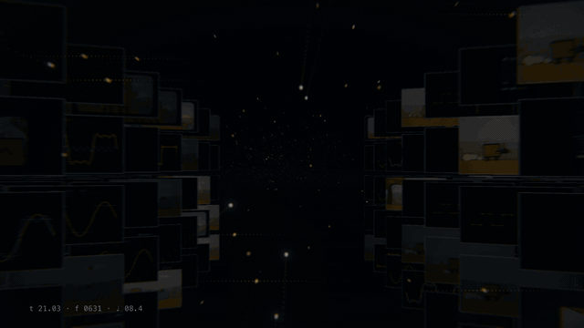
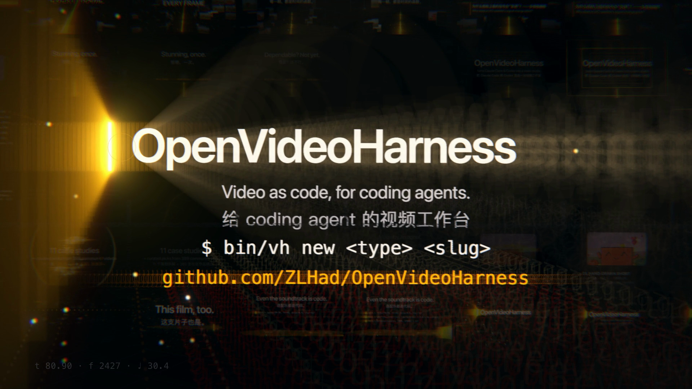

<div align="center">

# OpenVideoHarness

**让 Claude Code、Codex 这类写代码的 AI，用写程序的方式做视频，而且做得稳。**

科普、讲解、产品片、MV、数据、论文、手绘、梗图快剪：8 类视频，28 种风格，一套流程。

[English](README.md) · **中文**


<a href="showcase/04-intro-film/"></a>

<sub>▶ 完整介绍片：81 秒，有配乐，可以开中英字幕，见 <a href="showcase/04-intro-film/media/final.mp4">showcase/04-intro-film</a>。这支片子本身也是 agent 照着这个仓库做的，连配乐都是代码写的。</sub>

</div>

---

## 这是什么

现在的 AI 已经能"一句话做出一支视频"。它不直接画画面，而是写一段程序：程序算出每一帧长什么样，浏览器（或 Manim）把这些帧一张张渲染出来，最后配上声音。社区里已经有很多这样做出来的黑洞科普、手绘 MV、发布片和数学动画。

难的是**稳**。同一个 AI，这次做得惊艳，下次就节奏乱掉、满屏发光、数字乱编。问题不在模型不够聪明，而在于它手里没有一套做视频的行规。

OpenVideoHarness 就是这套行规，写成了 AI 能照着执行的文档和工具：

- **按片子类型给做法**：你说"做个科普"或"做个发布片"，它就去读那一类的工作流：用哪个引擎、分几步、什么算好看、什么不许做。
- **三个节点停下来问你**：大纲、分镜、初版，每到一处都等你点头再往下做。方向在最便宜的时候定下来。只想快速试一版时，可以切到"快出"档，直接出片。
- **不止一种口味**：28 个从名作里学来的风格，每个都附一段真渲的样片，开工前让你挑。
- **自己检查自己**：AI 看不了视频，也听不了声音。所以让它看渲染出来的帧、测混音的数据，照着清单改到合格；整片还要交给一个没参与制作的 reviewer 打分。
- **声音一起管**：中英配音（本地开源模型）、双语字幕、用代码写配乐和音效、混音和质检。

它不是新的渲染引擎，而是架在 HyperFrames、Manim、Remotion、p5.brush 这些引擎之上的一层"怎么做"。

## 30 秒开始

```bash
curl -fsSL https://raw.githubusercontent.com/ZLHad/OpenVideoHarness/main/install.sh | bash
```

这一条命令会：
- 把仓库装到 `~/OpenVideoHarness`；
- 装好自带的手绘引擎；
- 拉取参考资料；
- 把 `open-video-harness` skill 注册给 Claude Code 和 Codex，之后在任何目录说"做个视频"，agent 都能找到这里。

然后打开 Claude Code（或 Codex），直接说你要什么：

```bash
cd ~/OpenVideoHarness && claude
```

```text
做一个 30 秒的竖屏科普：为什么低轨卫星的信号会"变调"。中文配音，中英双语字幕。
```

接下来：
1. 它先交一份一屏长的大纲，附两三个风格让你选；
2. 再交分镜和一张关键帧预览图；
3. 最后交初版，并主动说出自己最不满意的两三处。

你点了头，它才出成片。

## 看看它做出来的东西

下面每支片子，都是 agent **只看本仓库的文档**做出来的。每个目录里都有需求、分镜、审阅记录、返工记录和全部源码，可以直接当同类视频的起点。

<table>
<tr>
<td rowspan="2" width="30%" valign="top"><a href="showcase/02-short-leo-doppler/"></a><br><b>02 · 竖屏科普</b><br><sub>HyperFrames · 24.8 秒 · 1080×1920 · 静音也能看懂</sub><br><sub>“为什么低轨卫星的信号会变调？”</sub></td>
<td width="35%" valign="top"><a href="showcase/04-intro-film/"></a><br><b>04 · 介绍片（一镜到底 3D）</b><br><sub>HyperFrames + Three.js · 81 秒 · 代码作曲 · 中英字幕</sub><br><sub>本仓库的产品宣传片，改过两轮人的意见</sub></td>
<td width="35%" valign="top"><a href="showcase/01-handdrawn-clawd-leaf/"></a><br><b>01 · 手绘角色短片</b><br><sub>p5.brush · 12 秒 · 3 轮自查</sub><br><sub>“Clawd 用手摇摄影机拍一片落叶，风总把叶子吹走”</sub></td>
</tr>
<tr>
<td width="35%" valign="top"><a href="showcase/03-math-fourier/"></a><br><b>03 · 3b1b 式数学讲解</b><br><sub>Manim · 25 秒 · 独立评审后修订</sub><br><sub>“用正弦波一点点拼出方波”</sub></td>
<td width="35%" valign="top"><a href="showcase/00-promo-launch-film/"></a><br><b>00 · 发布短片</b><br><sub>HyperFrames · 20 秒 · 静音</sub><br><sub>“只用真实的终端和目录，给这个仓库做一支发布片”</sub></td>
</tr>
</table>

GIF 是压缩过的预览，原片在各目录的 `media/final.mp4`。你做出来的片子也欢迎 PR 进 `showcase/`。

<details>
<summary><b>社区里的同类作品，以及我们对它们的拆解</b></summary>

| 作品 | 类型 | 怎么做的 | 拆解 |
|---|---|---|---|
| [I'm Upping My P(doom)](https://x.com/other__reality/status/2102514581684052169) | 手绘 MV · 156 秒 | p5.brush，9 个章节由 subagent 并行画 | [cases/mv-pdoom.md](cases/mv-pdoom.md) |
| [Functional Emotions](https://x.com/eudaemonea/status/2102610626321490404) | 绘画 MV · 372 秒 | 自己写的 WebGL 笔触渲染器，7 个 subagent | [cases/mv-functional-emotions.md](cases/mv-functional-emotions.md) |
| [Claude Pop](https://x.com/donaldjewkes/status/2102801274173587569) | 混合 MV | 生成式视频打底，再用代码转描，连续跑了 12 小时 | [cases/mv-claude-pop.md](cases/mv-claude-pop.md) |
| [星际穿越里的真物理·黑洞篇](https://x.com/AndyL5cc/status/2104519528873103773) | 横屏科普 · 143 秒 | 一句话需求，一个黑洞着色器撑起全片 | [cases/explainer-interstellar-blackhole.md](cases/explainer-interstellar-blackhole.md) |
| [Applore 宣传片](https://x.com/decohack/status/2104502625055949242) | 产品片 · 15 秒 | 一句 showreel 提示词加真实素材 | [cases/promo-applore.md](cases/promo-applore.md) |
| [Austerlitz, 2 December 1805](https://x.com/WinterArc2125/status/2103116235009347650) | 3D 历史片 · 301 秒 | WebGL2 加真实地形；旁白有多长，镜头就有多长；音效的左右和远近从画面算出来 | [cases/opus55-gallery.md](cases/opus55-gallery.md) 第 6 节 |
| [389 支社区作品](https://github.com/yihui-dev/awesome-opus5-5-videos) 和 [962 支作品目录](https://github.com/zhuyansen/awesome-opus-5.5-video) | 各类 | 提示词统计、归类、精选 | [cases/opus55-gallery.md](cases/opus55-gallery.md) |

</details>

## 28 种风格，不止一种口味

AI 做的视频很容易长成一个样子：暗底、发光、玻璃卡片、满屏动态 UI。你不说，它就往这个方向走。

所以我们从名作里学了 28 种风格，放在 [`styles/`](styles/)，分成六类：电影片头、品牌发布、数据讲解、插画印刷、中国美学、复古科技。学习对象包括：
- **电影和片头**：Saul Bass 的片头、《七宗罪》、《银翼杀手 2049》、韦斯·安德森的对称构图、王家卫的抽帧；
- **设计**：瑞士网格、3Blue1Brown、《纽约时报》的数据图、纽拉特的图形统计（Isotype）；
- **动画和印刷**：《蜘蛛侠：平行宇宙》的网点、超级任天堂的 16 位像素；
- **中国美学**：水墨、敦煌、皮影、国潮。

每种风格都写成一份 AI 能照着做的说明：用什么颜色和字体、怎么构图、东西怎么动、怎么转场、配什么声音、哪些俗套不许碰。

**每种风格都用本仓库真渲了一段 5 秒样片**，配乐也是各自用代码写的。28 段样片的内容一模一样，差别只在风格：

<a href="styles/"></a>

连着看的版本在 [`styles/gallery.mp4`](styles/gallery.mp4)。用法：

```bash
bin/vh style list                                  # 看 28 种风格
bin/vh new promo launch-film --style cutout-jazz   # 建项目时直接带上一种风格
```

学的是这些作品的"语法"，不是照抄作品：不用原作的角色、logo 和镜头，写给 AI 的提示词里也不写"模仿某某导演"。详见 [styles/README.md](styles/README.md)。

## 你可以这样提需求

不用写长篇 brief，说清楚**讲什么、给谁看、发在哪**就够了。

> **科普短视频**：45 秒竖屏，讲为什么 GPS 必须考虑相对论。发 B 站和小红书，中文旁白，结尾给出一个具体数字。

> **数学讲解**：3Blue1Brown 那种风格，讲傅里叶级数怎么一点点拼出方波，20 秒，静音也能看懂。

> **产品片**：给我的 App 做一支 30 秒发布片，用水墨风格，只用真实截图，配乐要有节奏，关键动作配音效。

> **论文讲解**：把 `papers/main.tex` 的核心方法做成 3 分钟讲解。论文信息照抄原文，公式逐项讲，英文旁白加中文字幕。

> **MV**：给 `audio/song.mp3` 做一支手绘风 MV，歌词不上屏，画面讲故事，每次副歌都要比上一次更炸。

> **学别人的片子**：这个视频挺好，拆一下它是怎么做的，再用我们的工作台做一支类似的。

> **快速试一版**：快速出一版 15 秒的草稿，看看赛博故障风适不适合我的游戏预告，不用问我。

## 它是怎么工作的

<p align="center"></p>

1. **判断类型**：你说一句话，agent 先查 [CLAUDE.md](CLAUDE.md) 里的路由表，判断这是哪一类视频，再去读那一类的工作流。
2. **关卡 ①：大纲**。它交一份大纲，附两三个风格让你挑。
3. **关卡 ②：分镜**。每个镜头写清楚观众要依次看懂什么、各占几秒，再附一张每镜一帧的预览图。
4. **声音先行**：先做旁白或配乐，量出每句话、每一拍的精确时间，画面跟着声音走。
5. **写代码，自己查**：
   - 每写完一段，就把渲染出的帧拼成一张"联系表"自己看，照一张 20 条的清单改；
   - 用数据查混音有没有断音、爆音、音画没对上；
   - 整片再交给一个没参与制作的 reviewer 按 7 项打分，每项 8 分以上才算过。
6. **关卡 ③：初版**。给你看成片，它会主动说出自己最不满意的两三处。你说不清哪里不对时，它把同一段做成两三个版本让你挑。
7. **收尾**：出成片，把踩过的坑写回文档，下一支片子直接受益。


### 做多认真，你来定

不是每支片子都值得走完全套。一个开关管所有"做多认真"，分三档：

| | 快出 `quick` | 标准 `standard`（默认） | 精品 `studio` |
|---|---|---|---|
| 适合 | 试方向、草稿、随手发 | 大多数正式视频 | 发布片、旗舰内容 |
| 停下来问你 | 不问，直接出片 | 大纲、分镜、初版三次 | 三次，外加几种风格的真渲小样和全片灰模预演 |
| 自己检查 | 整片一张联系表 | 每一段都看帧、测声音 | 再加手机尺寸、确定性、音频全检 |
| 找人打分 | 不找 | 1 轮 | 至少 3 轮，7 项都要 8 分 |
| 30 秒的片子大概要 | 10–30 分钟 | 1–2 小时 | 3 小时以上 |

在需求里说"快速出一版"或"做成精品"就行，也可以建项目时写 `bin/vh new promo launch --effort studio`。不管哪一档，底线都不降：每一帧只由时间决定，事实照抄原文，不出现断音，闪光安全。完整规则用 `bin/vh effort` 查看。

### 为什么这样能稳

几条硬规则（完整版见 [CLAUDE.md](CLAUDE.md)）：

1. **每一帧只由时间决定**：不用随机数、不看系统时钟，同一时刻永远算出同一帧。所以能并行渲染、随时抽任意一帧来检查，改一行代码就能重出一版。
2. **有声音时，声音定时长**：画面去对齐声音，不是反过来。
3. **先分镜，后代码**：节奏是 AI 最容易做砸的地方，所以先把每个镜头要让观众看懂什么、看多久定下来。
4. **每一段都自查**：看帧、测声音、对清单，不合格就改。
5. **事实照抄原文**：数字、论文信息、引文都从原文抄，拿不准的记下来，不编进视频。

## 8 类视频

| # | 类型 | 首选引擎 | 一句话要点 | 文档 |
|---|---|---|---|---|
| 01 | 数学、科学原理讲解 | Manim | 一个概念一个颜色，先几何后代数 | [01](video-types/01-math-science-explainer.md) |
| 02 | 知识科普短视频（竖屏或横屏） | HyperFrames | 第 1 秒就要抓人，每 3–5 秒一个新看点 | [02](video-types/02-knowledge-short.md) |
| 03 | 产品宣传、发布片 | HyperFrames | 只用真实界面，而且要把产品本身讲清楚 | [03](video-types/03-product-promo.md) |
| 04 | 歌词视频、MV | p5.brush 或 HyperFrames | 卡点误差不超过 1 帧，副歌一次比一次升级 | [04](video-types/04-lyric-music-video.md) |
| 05 | 数据叙事 | HyperFrames + SVG | 一张图一个结论，每个数字都能追到出处 | [05](video-types/05-data-story.md) |
| 06 | 论文讲解、会议视频 | Manim + HyperFrames | 论文信息照抄，图全部重画成矢量 | [06](video-types/06-paper-explainer.md) |
| 07 | 手绘、水彩、白板、剪纸 | p5.brush（自带） | 手工感，画面一直在动；也能按笔顺写汉字 | [07](video-types/07-hand-drawn.md) |
| 08 | 野兽派、网络梗、快剪 | HyperFrames | 先搭网格再故意打破，笑点 1 秒内看懂 | [08](video-types/08-brutalist-meme.md) |

还有几份专题：
- 要写实人物或真实物理，就接生成式视频模型，再用代码叠加：[playbook/05](playbook/05-hybrid-genvideo.md)；
- 要特效、转场、一镜到底的 3D：[playbook/08](playbook/08-vfx-and-motion-sources.md)；
- 要拆解别人的片子：[playbook/07](playbook/07-reverse-engineer.md)。

## 声音

AI 听不见声音，所以声音这边尽量做成"可以计算、可以测量"的：

| 要什么 | 怎么做 | 说明 |
|---|---|---|
| 中英配音 | `bin/vh tts` | 默认用本地开源的 **Qwen3-TTS**，离线免费，首次运行下载约 2 GB。中文 5 个音色（含京腔、川话），英文 2 个。云端留好了阿里云百炼、ElevenLabs 和 Gemini 3.8 Flash TTS 的接口（后者表演力强，可以用一句话导演语气） |
| 旁白有表情、有节奏 | `bin/vh tts … --beats` | 每句都能单独导演，比如 `[惊讶地提问，语速快，"一句话"重读]`；有配乐时，每句从拍点起，关键句可以指定落在小节头或 drop 上。各类视频的默认语气、帧对齐的速度表和混音参数见 [playbook/04](playbook/04-audio.md) "让声音有表情、有节奏" |
| 双语字幕 | `bin/vh captions` | 旁白稿写成 `中文 \|\| English`，自动出中文、英文、中英双行字幕，还能封装成可开关的字幕轨 |
| 配乐 | `bin/vh music` | 用代码作曲，同一份谱永远生成同一段音乐，还会给出每一拍的精确时间，画面拿它卡点。有编钟、古筝、竹笛、大鼓这些中国乐器，也可以改拍号。用你自己的曲子也行：`bin/vh beats` 会分析出节拍和鼓点 |
| 音效 | `bin/vh sfx` | 15 个代码合成的原创音效，按动作发生的那一帧摆放；物体在画面左边，声音就偏左 |
| 混音 | `bin/vh mix` | 按视频类型选 profile，人声、音乐、音效都相对一个锚点放：音乐逐句让到目标电平，音效按类分级；整体响度调到 -14 LUFS，电影感配乐的起伏不会被压扁 |
| 混音质检 | `bin/vh qa` | 用数据查成品：有没有断音、掉音、忽大忽小、爆音，每个卡点是否落在 1 帧以内，层次是否达标（`qa mix`） |
| 歌曲 | — | 在 Suno 这类网页服务生成后导入；ElevenLabs Music 和本地歌曲模型留好了接口 |

详见 [playbook/04-audio.md](playbook/04-audio.md)。

## 你最后拿到什么

- 一支可以直接发的 **MP4**，可以带中英字幕轨；
- 一个**能重新渲染的工程**：改一行代码就能出新版本，也能改成别的语言、别的风格；
- 全过程的文件：需求、分镜、审阅记录、返工记录、素材来源；
- 联系表和关键帧，方便复盘，也能直接拿来做封面。

## 常用命令 `bin/vh`

| 命令 | 作用 |
|---|---|
| `doctor` / `setup` | 检查环境 / 安装依赖、拉取参考资料 |
| `types` / `new <类型> <名字> [--style <风格>] [--effort <档位>]` | 列出 8 类视频 / 建一个新项目 |
| `effort [quick\|standard\|studio]` | 看三档努力程度各做什么 |
| `style list` / `style <风格>` / `style gallery` | 看风格 / 渲一段样片 / 重建风格总览 |
| `tts` / `voices` / `captions` / `music` / `sfx` / `beats` | 配音（可逐句导演、对拍、逐字核对、双人对话）/ Gemini 音色库和设计音色 / 字幕 / 配乐 / 音效 / 分析外部音乐 |
| `mix` / `qa` / `mux` | 混音 / 混音质检 / 给成片合上声音和字幕 |
| `sheet` / `check` / `readcheck` / `gif` | 带时间戳的联系表 / 查黑场、冻帧、静音 / 查字停得够不够久 / 做 README 用的 GIF |
| `hf-init` / `install-skill` / `sync-agents` | 初始化 HyperFrames / 注册 skill / 同步 AGENTS.md |

## 需要什么环境

| 依赖 | 用来做什么 | 必需吗 |
|---|---|---|
| macOS 或 Linux、git | 基础 | ✅ |
| Node.js ≥ 22、Google Chrome | 在浏览器里渲染画面 | ✅ |
| FFmpeg | 编码、混音、检查 | ✅ |
| Python 3 + [uv](https://github.com/astral-sh/uv) | 声音工具（`bin/vh tts`、`beats`、`music`、`sfx`、`qa`、`mix … profile=`）、带时间戳的联系表、Manim（依赖临时安装，不污染全局环境） | 做声音和联系表时必需 |
| Apple Silicon | 本地 Qwen3-TTS 配音 | 用本地配音时需要 |
| LaTeX | Manim 里的公式 | 做数学讲解时需要 |

渲染不花钱。只有接云端配音、生成式视频这类外部服务时才按各家收费，API key 一律从环境变量读。

## 安装与更新

一键安装见上面的"30 秒开始"。几个可选参数：

```bash
bash install.sh --dir ~/code/OpenVideoHarness   # 装到别的位置
bash install.sh --no-refs                        # 先不拉参考资料，之后再运行 references/fetch.sh
bash install.sh --no-skill                       # 不注册全局 skill
```

手动安装：

```bash
git clone https://github.com/ZLHad/OpenVideoHarness.git && cd OpenVideoHarness
bin/vh setup            # 装引擎和风格样片渲染器，拉取参考资料
bin/vh install-skill    # 可选：注册到 ~/.claude/skills 和 ~/.agents/skills
```

只装 skill（用 [skills CLI](https://github.com/vercel-labs/skills)）：

```bash
npx skills add https://github.com/ZLHad/OpenVideoHarness --skill open-video-harness
```

这个 skill 只是一个指针，第一次用时会征得你同意，再把完整的工作台装好。

更新：在仓库目录运行 `git pull`，再运行 `references/fetch.sh`。

## 仓库里有什么

```
OpenVideoHarness/
├── CLAUDE.md · AGENTS.md     给 agent 的入口：路由表、硬规则（两份内容相同）
├── install.sh                一键安装
├── bin/vh · tools/           命令行和背后的脚本
├── skills/                   open-video-harness skill
├── video-types/              8 类视频的工作流
├── playbook/                 通用知识 00–08：流程、自查、运动设计、声音、特效等
├── templates/                每个新项目要填的文件：需求、分镜、风格、审阅、笔记、经验、清单
├── styles/                   28 种风格，各带样片；_swatch/ 是样片渲染器
├── cases/                    11 个案例拆解 + 社区作品精选 + 一支 3D 长片深读
├── showcase/                 本仓库自己做的片子（源码 + 成片 + 过程记录）
├── engines/                  自带的手绘引擎 + 其他引擎的安装说明
├── references/               fetch.sh（拉取 30 个只读参考仓库）· 开源清单 · 社区 skill 精选
└── projects/                 你自己的视频项目（不进仓库）
```

## 和其他项目的关系

| 项目 | 它是什么 | 我们的不同 |
|---|---|---|
| [Code2Video](https://github.com/showlab/Code2Video) | 用 Manim 做教学视频的研究管线 | 把"代码即视频"的思路推广到 8 类视频，交给通用的 coding agent 执行 |
| [HyperFrames](https://github.com/heygen-com/hyperframes) / [Remotion](https://github.com/remotion-dev/skills) 的官方 skills | 单个引擎的用法 | 在引擎之上：选引擎、定流程、定审美、做自查，需要时再调用它们 |
| [OpenMontage](https://github.com/calesthio/OpenMontage) | 全套 agent 视频制作系统 | 更轻：主要是 markdown、模板和一个命令行，任何 coding agent 都读得懂、改得动 |
| [归藏 product-video skill](https://github.com/op7418/guizang-product-video-skill) | 专做软件产品更新片 | 覆盖 8 类视频，有三道人工关卡、风格库和中英双语声音；配乐音效的思路受它启发，代码是独立写的 |

## 常见问题

**一定要用 Claude 吗？** 不用。`AGENTS.md` 和 `CLAUDE.md` 内容一样，Codex 等能读 markdown 的 agent 都能用。仓库里的片子是用 Claude Opus 5.5 做的。

**要花钱、要显卡吗？** 纯代码这条路不用。渲染在本地的 Chrome 或 Manim 里跑，配音用本地 Qwen3-TTS，配乐和音效都是代码生成的。

**中文支持怎么样？** 文档以中文为主。中文字幕排版、竖屏平台的安全区、中文配音和双语字幕都专门处理过，风格库里也有水墨、敦煌、皮影、国潮。

**能不能不要暗底发光那一套？** 可以。在需求里点名一种风格（比如 `ink-wash`），或者说你喜欢哪部片子的样子。不说的话，agent 在大纲那一关也会给你两三种差别很大的风格来选。

**参考仓库的版权怎么处理？** `references/repos/` 不进本仓库，由 `fetch.sh` 从原作者那里拉取，只供阅读。拉下来之后，别人仓库各层目录里给 agent 的指令文件（`CLAUDE.md`、`AGENTS.md`、`.claude/` 等）都会被改名，免得 agent 把别人的规则当成自己的。每个仓库的许可证见 [ACKNOWLEDGMENTS.md](ACKNOWLEDGMENTS.md)，有些没有许可证或禁止商用，复用前请先确认。

## 路线图

- [ ] 第 9 类：剪辑与口播（给已有素材剪辑、加字幕和 B-roll）
- [ ] 第 10 类：3D 场景（Three.js 和着色器）的正式工作流
- [ ] 逐字高亮的字幕（字级强制对齐）
- [ ] 工作流文档的英文版

## 参与贡献

欢迎提交 PR：
- 新的视频类型，放进 `video-types/`；
- 新的风格，放进 `styles/`，附上用本仓库渲染的样片（见 [styles/README.md](styles/README.md)）；
- 新的案例拆解，放进 `cases/`；
- 你在项目里总结出的通用经验，补进 `playbook/`；
- 你用本仓库做出的片子，连同需求、分镜、记录和源码，放进 `showcase/`。

## 致谢

感谢这些项目、研究和创作者：
- **框架与工具**：HyperFrames、Remotion、Manim、p5.brush、Three.js、Qwen3-TTS、mlx-audio、FFmpeg；
- **研究**：Code2Video、Paper2Video、TheoremExplainAgent 等；
- **开源 skill 与案例**：ClaudeAnimationBase、PDoomVideo、functional-emotions-video、Battle-of-Austerlitz-Film、归藏 product-video skill、lemo-opuscar、product-film-skill、claude-animation-skill、OpenMontage、awesome-claude-video-skills、awesome-opus5-5-videos 等；
- **社区创作者**：在时间线上公开分享实验、课程和提示词的各位，包括 Movez 和 Eian。

完整名单、许可证和各自的用途见 **[ACKNOWLEDGMENTS.md](ACKNOWLEDGMENTS.md)**。

本项目是独立项目，与 Anthropic、HeyGen、Remotion、Show Lab、阿里云均无隶属关系。

## 许可

原创内容采用 [MIT](LICENSE) 许可。自带的 ClaudeAnimationBase 也是 MIT（© John Heibel）。参考仓库遵循各自的许可证。

## 引用

```bibtex
@misc{openvideoharness2026,
  title        = {OpenVideoHarness: A Code-to-Video Harness for Coding Agents},
  author       = {ZLHad and contributors},
  year         = {2026},
  howpublished = {\url{https://github.com/ZLHad/OpenVideoHarness}}
}
```

## 赞赏

如果这个项目帮你做出了片子，或者省了你一些时间，欢迎请作者喝杯咖啡 ☕

<p align="center"></p>
