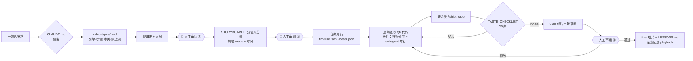

<div align="center">

# OpenVideoHarness

**把 Claude Code / Codex 变成一间多类型视频工作室的 code-to-video harness**

一句话需求 → 路由到对应视频类型 → 分镜与关卡 → 逐帧代码 → 自己看联系表自查 → 成片

[English](README.md) · **中文**


<a href="showcase/00-promo-launch-film/"></a>

</div>

---

## 这是什么

2026 年 9 月，时间线上出现了一批"Opus 5.5 一句话做出来的视频"：手绘 MV、黑洞科普、产品宣传片、数学动画。它们背后是同一种范式，**video-as-code**：模型并不直接生成像素，而是写一个程序，**每一帧都是时间 t 的纯函数**。无头浏览器或 Manim 逐帧渲染，ffmpeg 再合上音轨。Show Lab 的 [Code2Video](https://github.com/showlab/Code2Video) 在教学视频上系统地论证过这条路。

问题在于：一句话能做出惊艳的片子，却做不出**稳定的**片子。换一个类型、换一个主题，节奏就崩了，AI slop 的毛病就冒出来了，事实也开始出错。

**OpenVideoHarness 不是新的渲染器，而是一套驾驭 agent 的harness项目。** 它把分散在论文、开源 skill 和社区实验里的经验，整理成 agent 能照着执行的结构：

- **路由**：`CLAUDE.md` / `AGENTS.md` 把请求分到 8 类视频，每类一份工作流文档，写明引擎、步骤、审美要点、禁止项、prompt 模板、自查重点和参考案例。
- **人在回路**：**三道人工审阅关卡**（大纲、分镜 + 分镜预览图、初版）。每一关 agent 都会停下来等你拍板，你的意见会记进 `REVIEW.md`。改动在最便宜的时候发生。
- **流程**：十个阶段（0–9），音频先行。长片由主 agent 先做样板章节，再派 subagent 并行。
- **把品味写成数字**：缓动曲线、时长、字号下限、安全区、转场法则、字幕密度，以及一张 20 条的 taste checklist。
- **自查闭环**：agent 看不了视频，就让它看帧：联系表看结构，逐帧 strip 看时序，局部 crop 看细节。它自己打分、自己返工。
- **案例和参考**：10 个真实案例的拆解，再加一键拉取的 20+ 个参考仓库，包括框架文档、案例源码和精选社区 skill。
- **上手即用**：`bin/vh` 一条命令检查环境、安装依赖、按类型新建项目；仓库自带一个装好就能跑的手绘引擎。

## 案例展示

以下几支都是 agent 在本仓库里**只按 `CLAUDE.md` 和文档**做出来的。每个目录里都有完整的 BRIEF、STORYBOARD、自评记录和源码。

<table>
<tr>
<td rowspan="2" width="30%" valign="top"><a href="showcase/02-short-leo-doppler/"></a><br><b>02 · 竖屏科普</b><br><sub>HyperFrames · 24.8s · 1080×1920 · 静音可读 · 渲染 46s</sub><br><sub>“为什么低轨卫星的信号会变调？——多普勒频移”</sub></td>
<td width="35%" valign="top"><a href="showcase/00-promo-launch-film/"></a><br><b>00 · 产品发布片</b><br><sub>HyperFrames · 20s · 1920×1080 · 静音 · 渲染约 30s</sub><br><sub>“给这个仓库做一支 15–20 秒发布片，只用真实的终端和目录”</sub></td>
<td width="35%" valign="top"><a href="showcase/01-handdrawn-clawd-leaf/"></a><br><b>01 · 手绘角色短片</b><br><sub>p5.brush · 12s · 1080p24 · 渲染 57s · 3 轮自查</sub><br><sub>“Clawd 用手摇摄影机拍一片落叶，风总把叶子吹走”</sub></td>
</tr>
<tr>
<td width="35%" valign="top"><a href="showcase/03-math-fourier/"></a><br><b>03 · 3b1b 式数学讲解</b><br><sub>Manim CE 0.21 · 25s · 1080p30 · 渲染 24s · 独立评审后修订</sub><br><sub>“用正弦波一点点拼出方波（傅里叶级数与吉布斯现象）”</sub></td>
<td width="35%" valign="middle" align="center"><b>下一支是你的</b><br><br><code>bin/vh new &lt;type&gt; &lt;slug&gt;</code><br><br><sub>8 类视频任选：讲解 · 科普 · 发布片 · MV · 数据 · 论文 · 手绘 · 梗</sub><br><sub>做好了欢迎 PR 进 <code>showcase/</code></sub></td>
</tr>
</table>

每支片子的目录里都有 `BRIEF.md`（需求）、`STORYBOARD.md`（分镜和 reads）、`NOTES.md`（自评和返工记录）、`LESSONS.md` 和源码，可以直接当作同类视频的起点。GIF 是压缩后的预览，原片是 `media/final.mp4`。

<details>
<summary><b>社区里的同类作品（本仓库案例库对它们做了拆解）</b></summary>

| 作品 | 类型 | 做法 | 拆解 |
|---|---|---|---|
| [I'm Upping My P(doom)](https://x.com/other__reality/status/2102514581684052169) | 手绘 MV · 156s | p5.brush，9 个章节由 subagent 并行 | [cases/mv-pdoom.md](cases/mv-pdoom.md) |
| [Functional Emotions](https://x.com/eudaemonea/status/2102610626321490404) | 绘画 MV · 372s | 自写 WebGL 笔触渲染器，7 个 subagent | [cases/mv-functional-emotions.md](cases/mv-functional-emotions.md) |
| [Claude Pop](https://x.com/donaldjewkes/status/2102801274173587569) | 混合 MV | Seedance 打底 + JS 转描，跑了 12 小时 | [cases/mv-claude-pop.md](cases/mv-claude-pop.md) |
| [星际穿越里的真物理·黑洞篇](https://x.com/AndyL5cc/status/2104519528873103773) | 横屏科普 · 143s | 一句话，单一主视觉着色器贯穿全片 | [cases/explainer-interstellar-blackhole.md](cases/explainer-interstellar-blackhole.md) |
| [Applore 宣传片](https://x.com/decohack/status/2104502625055949242) | 产品片 · 15s | 一句话 showreel prompt + 真实素材 | [cases/promo-applore.md](cases/promo-applore.md) |
| [HyperFrames 发布片合集](https://github.com/heygen-com/hyperframes-launches) | 产品片 ×20 | HTML + GSAP，工业级 | [cases/promo-hyperframes-launches.md](cases/promo-hyperframes-launches.md) |

</details>

## 快速开始

需要：macOS 或 Linux，Node ≥ 22，ffmpeg，Google Chrome，git。做数学讲解另外需要 Python（推荐 uv）和 LaTeX。

```bash
git clone https://github.com/ZLHad/OpenVideoHarness.git
cd OpenVideoHarness
bin/vh doctor     # 检查工具链
bin/vh setup      # 安装内置引擎依赖、拉取参考仓库、跑一次冒烟渲染
```

然后在仓库根目录打开 Claude Code（或 Codex），直接说你要什么：

```text
做一个 30 秒的竖屏科普：为什么低轨卫星的信号会"变调"
```

agent 会读 `CLAUDE.md`，路由到 `video-types/02-knowledge-short.md`，在 `projects/` 下建项目，然后在三个地方停下来请你审阅：

1. **大纲**：一句话定位、3–7 段大纲、风格参考、引擎和费用；
2. **分镜**：逐镜头表，加一张分镜预览图（每镜一张关键帧），你看图就能判断；
3. **初版**：draft 成片和联系表，agent 会先说出自己最不满意的 2–3 处。

每一关你都可以选择通过、提意见或推翻重来。它逐场景写代码、渲染联系表对照清单自查，最后交付 `out/final.mp4`。

也可以先用命令行把项目骨架建好：

```bash
bin/vh types                          # 列出 8 类视频
bin/vh new short leo-doppler          # 按类型建项目，prompt 模板自动填进 BRIEF
bin/vh new handdrawn clawd-leaf       # 手绘类会复制内置引擎并装好依赖
```

### 各类型的一句话示例

| 类型 | `bin/vh new` | 一句话示例 |
|---|---|---|
| 数学/科学讲解 | `math` | "用 3b1b 的风格讲清楚傅里叶级数怎么拼出方波，20 秒" |
| 科普短视频 | `short` | "45 秒竖屏：为什么 GPS 必须考虑相对论" |
| 产品宣传 | `promo` | "给这个仓库做一支 20 秒发布片，素材用真实的终端和目录" |
| 歌词/MV | `mv` | "给 assets/song.mp3 做手绘风 MV，歌词不上屏，画面讲故事" |
| 数据叙事 | `data` | "把 data/sales.csv 做成 60 秒数据短片，一图一结论" |
| 论文讲解 | `paper` | "把 papers/main.tex 的核心机制做成 3 分钟讲解，中文旁白" |
| 手绘/角色短片 | `handdrawn` | "Clawd 想抓一只蝴蝶，15 秒" |
| 梗/快剪 | `meme` | "30 秒科技推特风快剪：这周 AI 圈发生了什么" |

## 工作原理

<p align="center"></p>



**几条硬规则**（完整版见 [CLAUDE.md](CLAUDE.md)）：

1. **每一帧都是 t 的纯函数**：不用 `Math.random`、`Date.now`、CSS transition，也不保存跨帧状态。这是并行渲染、断点续渲和"跳到任意一帧自查"的前提。
2. **音频决定时长**：先有配音或歌曲，转成词级时间戳和节拍网格，画面去对齐音频。
3. **先分镜后代码**：每个镜头列出观众必须依次看懂的 *reads*，并标上起止时间。节奏是模型最常犯错的地方。
4. **每个场景都要自查**：联系表、strip、crop，对照清单；不合格就返工。
5. **事实有纪律**：数字和引文照抄原文，拿不准的写进 NOTES，不编进视频。

## 支持的视频类型

| # | 类型 | 首选引擎 | 核心审美 | 文档 |
|---|---|---|---|---|
| 01 | 数学 / 科学原理讲解 | Manim CE | 实体-颜色绑定，先几何后代数，方程逐项点亮 | [video-types/01](video-types/01-math-science-explainer.md) |
| 02 | 知识科普短视频（含竖屏） | HyperFrames | 第 1 秒给钩子，每 3–5 秒一个回报，字幕放在安全框内 | [video-types/02](video-types/02-knowledge-short.md) |
| 03 | 产品宣传 / 发布片 | HyperFrames | 只用真实 UI，二选一语域（Apple / Linear），光标点击推动下一拍 | [video-types/03](video-types/03-product-promo.md) |
| 04 | 歌词视频 / MV | ClaudeAnimationBase · HyperFrames | 拍点对齐 ±1 帧，副歌逐次升级，"这不是歌词幻灯片" | [video-types/04](video-types/04-lyric-music-video.md) |
| 05 | 数据叙事 | HyperFrames + SVG | 一图一结论，分阶段转场，每个数字可追溯 | [video-types/05](video-types/05-data-story.md) |
| 06 | 论文讲解 / 会议视频 | Manim + HyperFrames | 三道关卡，元数据照抄，矢量重画图表 | [video-types/06](video-types/06-paper-explainer.md) |
| 07 | 手绘 / 水彩 / 白板 / 剪纸 | ClaudeAnimationBase（p5.brush） | 手工感、活着、浑然一体；不写字 | [video-types/07](video-types/07-hand-drawn.md) |
| 08 | 野兽派 / 梗 / 快剪 | HyperFrames | 有网格的破坏，笑点 1 秒内读懂 | [video-types/08](video-types/08-brutalist-meme.md) |

需要写实人物或真实物理时，可以接入生成式视频模型，由代码叠加最终画面，见 [playbook/05](playbook/05-hybrid-genvideo.md)。看到好的视频想学，可以让 agent 按 [playbook/07](playbook/07-reverse-engineer.md) 拉片反推。

## 仓库结构

```
OpenVideoHarness/
├── CLAUDE.md · AGENTS.md     agent 入口：路由表、硬规则、目录说明
├── bin/vh                    命令行：doctor · setup · types · new · sheet · check · gif
├── video-types/              8 类视频的工作流（每份含 prompt 增量块）
├── playbook/                 通用知识
│   ├── 00-paradigm.md          范式与引擎选型
│   ├── 01-pipeline.md          十阶段流程、reads、人工关卡、subagent 并行
│   ├── 02-verification.md      七层验证闭环与各引擎取帧命令
│   ├── 03-motion-design.md     缓动、时长、排版、安全区、转场
│   ├── 04-audio.md             TTS、时间戳、节拍、混音
│   ├── 05-hybrid-genvideo.md   生成式视频 + 代码
│   ├── 06-research-mechanisms.md  Code2Video 等学术机制
│   └── 07-reverse-engineer.md  拉片：反推参考视频
├── templates/                BRIEF · STORYBOARD · STYLE · REVIEW · NOTES · LESSONS · TASTE_CHECKLIST
├── cases/                    10 个案例拆解
├── engines/                  ClaudeAnimationBase（内置）+ HyperFrames / Remotion / Manim / Blender 安装说明
├── references/               fetch.sh · open-source.md · community-skills.md（repos/ 不入库）
├── showcase/                 本仓库自己做的案例（源码 + 成片）
└── projects/                 你的视频项目（不入库）
```

## 命令行 `bin/vh`

| 命令 | 作用 |
|---|---|
| `bin/vh doctor` | 检查 node、ffmpeg、Chrome、Python/uv、LaTeX、引擎依赖、参考仓库 |
| `bin/vh setup` | 安装内置引擎依赖，拉取参考仓库，跑一次冒烟渲染 |
| `bin/vh types` | 列出 8 类视频和对应文档 |
| `bin/vh new <type> <slug>` | 建 `projects/<日期>-<slug>`，复制模板，把该类型的 prompt 块填进 BRIEF |
| `bin/vh sheet <mp4> [cols] [fps]` | 从成片拼联系表 |
| `bin/vh check <mp4>` | ffprobe，加上黑场、冻结、静音检测 |
| `bin/vh gif <mp4> [width] [fps]` | 生成调色板优化的 GIF 预览 |

## 引擎

| 引擎 | 写什么 | 适合 | 状态 |
|---|---|---|---|
| [HyperFrames](https://github.com/heygen-com/hyperframes) | HTML + GSAP | 宣传片、科普、字幕、数据、梗 | 首次使用时 `npx hyperframes init` |
| [Remotion](https://www.remotion.dev) | React | 同上（偏好 React、需要云渲染时） | `npx create-video` |
| [Manim CE](https://www.manim.community) | Python | 数学、物理、算法、论文机制 | `uv add manim` |
| [ClaudeAnimationBase](https://github.com/JohnHeibel/ClaudeAnimationBase) | p5.js + p5.brush | 手绘、水彩、角色、MV | **内置**，`bin/vh setup` 后即可用 |
| Blender | bpy | 真 3D | 按需 |
| 生成式视频（fal 等） | API + 代码叠加 | 写实人物、物理 | 按需付费 |

## 和其他项目的关系

| 项目 | 它是什么 | OpenVideoHarness 的不同 |
|---|---|---|
| [Code2Video](https://github.com/showlab/Code2Video) | 教学视频的 Planner–Coder–Critic 研究管线（Manim） | 把它的思路（代码即视频、锚点网格、ScopeRefine、并行生成）推广到 8 类视频，并交给通用 coding agent 执行 |
| [HyperFrames skills](https://github.com/heygen-com/hyperframes) / [Remotion skills](https://github.com/remotion-dev/skills) | 单一引擎的官方 skills | 位于引擎之上的一层：负责选引擎、定流程、定审美、做自查；需要时再调用它们 |
| [OpenMontage](https://github.com/calesthio/OpenMontage) | 全套 agent 视频制作系统（12 条管线） | 更轻：只有 markdown、模板和一个 bash 脚本，任何 coding agent 读得懂、改得动 |
| [awesome-claude-video-skills](https://github.com/zhuyansen/awesome-claude-video-skills) | 183 个社区视频 skill 的清单 | 从中精选并归类到每个视频类型下（[community-skills.md](references/community-skills.md)） |

## 常见问题

**必须用 Claude 吗？** 不必。`AGENTS.md` 会指向同一份 `CLAUDE.md`，Codex 等读 markdown 的 agent 都能用。案例是用 Claude Opus 5.5 做的。

**要花钱或者需要 GPU 吗？** 纯代码路线不需要：渲染在本地的 Chrome 或 Manim 里完成，配音可以用本地 TTS（Apple Silicon 上推荐 mlx-audio）。只有接入生成式视频模型时才需要付费 API。

**中文支持怎么样？** 文档以中文为主（技术词保留英文），并且覆盖了中文字幕规范、竖屏平台安全区、中文 TTS 和时间戳方案。

**参考仓库的版权怎么处理？** `references/repos/` 不入库，由 `fetch.sh` 从原作者处拉取，只作阅读参考。许可证逐项见 [ACKNOWLEDGMENTS.md](ACKNOWLEDGMENTS.md)，其中有些仓库没有许可证或禁止商用，复用前请自行确认。

## 路线图

- [ ] 第 9 类：剪辑与口播（已有真人素材的剪辑、字幕、B-roll）
- [ ] 类型文档的英文版
- [ ] 视频质量的自动评测（基于联系表的 rubric 打分 + 时间对齐检查）
- [ ] 打包成 Claude Code 插件，让任何目录都能调用
- [ ] 更多 showcase：数据叙事、论文讲解、MV

## 参与贡献

欢迎提交这几类 PR：

- 新的视频类型，放在 `video-types/`；
- 新的案例拆解，放在 `cases/`，并在 `cases/README.md` 登记；
- 从你的项目 `LESSONS.md` 里提炼出的通用经验，补进 `playbook/`；
- 你用本仓库做出的片子，放进 `showcase/`，附上 BRIEF、STORYBOARD、NOTES 和源码。

## 致谢

这个项目站在很多人的肩膀上：

- **框架**：HyperFrames、Remotion、Manim、p5.brush；
- **研究**：Code2Video、Paper2Video、TheoremExplainAgent 等；
- **开源 skill 与案例**：ClaudeAnimationBase、PDoomVideo、functional-emotions-video、lemo-opuscar、OpenMontage、awesome-claude-video-skills 等；
- **社区创作者**：在时间线上公开分享过实验和 prompt 的各位。

完整名单、许可证和用途见 **[ACKNOWLEDGMENTS.md](ACKNOWLEDGMENTS.md)**。

本项目是独立项目，与 Anthropic、HeyGen、Remotion、Show Lab 均无隶属关系。

## 许可

本仓库的原创内容采用 [MIT](LICENSE) 许可。内置的 ClaudeAnimationBase 同为 MIT（© John Heibel）。参考仓库遵循各自的许可证。

## 引用

```bibtex
@misc{openvideoharness2026,
  title        = {OpenVideoHarness: A Code-to-Video Harness for Coding Agents},
  author       = {ZLHad and contributors},
  year         = {2026},
  howpublished = {\url{https://github.com/ZLHad/OpenVideoHarness}}
}
```
