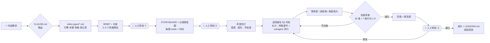

<div align="center">

# OpenVideoHarness

**一句话需求，交给 Claude Code / Codex，出一支像样的视频，而且每次都靠谱。**

用代码做视频（video-as-code）的开源工作台：科普、讲解、发布片、MV、数据、论文、手绘、梗，8 类视频一套流程。

[English](README.md) · **中文**


<a href="showcase/00-promo-launch-film/"></a>

</div>

---

## 这是什么

2026 年 9 月，时间线上冒出一大批"Opus 5.5 一句话做出来的视频"：黑洞科普、手绘 MV、产品发布片、数学动画。它们用的是同一种做法：模型不直接生成像素，而是**写一个程序，程序里每一帧都是时间 t 的函数**，再由浏览器或 Manim 逐帧渲染，ffmpeg 合上声音。Show Lab 的 [Code2Video](https://github.com/showlab/Code2Video) 已经在教学视频上验证过这条路。

一句话能做出惊艳的片子，但做不出**稳定**的片子。换个题材，节奏就乱了，AI 味冒出来了，数字也开始编了。

OpenVideoHarness 不是新的渲染器，而是一套**给 agent 用的"挽具"（harness）**。它把论文、开源 skill 和社区实验里零散的经验，整理成 agent 照着就能做的结构：

- **按类型路由**：说"做个科普""做个发布片"，agent 会找到对应的那份工作流，里面写好了用什么引擎、分几步、审美要点、禁止项、提示词模板和参考案例。
- **人始终在回路里**：大纲、分镜、初版三道关卡，agent 每到一关都停下来等你拍板。改动发生在最便宜的时候。节奏要紧的片子，分镜关可以再附一版灰盒 animatic；你只说得出"感觉不对"时，agent 会把同一段做成 2–3 个变体让你挑。
- **26 种口味，不止一种**：一个从名作里学来的风格库，从 Saul Bass 的片头到水墨。每个预设都附一段用本仓库真渲的样片，到了大纲关卡，agent 会挑两三个彼此拉得开的给你选。
- **把品味写成数字**：缓动曲线、镜头时长、字号下限、竖屏安全区、字幕密度，外加一张 20 条的自查清单。清单之上还有一层打分：由一个严苛的导演型 reviewer 给整片 draft 按 7 个维度打分，至少 3 轮，每一项都要到 8 分。
- **自己看、自己改**：agent 看不了视频，就让它看渲染出的帧。联系表看结构，逐帧条看节奏，局部放大看细节，每格 360 px 宽的手机联系表看小屏上读不读得清。冻帧、空帧、渲染挂住这类不报错的故障，它也查得出来。发现问题就改。
- **声音一条龙**：中英双语配音（默认用本地开源的 Qwen3-TTS）、双语字幕、代码作曲、立体声音效、混音，外加对成品混音的质检，全在 `bin/vh` 里。
- **开箱即用**：一条命令安装，一条命令建项目；仓库自带一个手绘引擎，装完就能出片。

## 30 秒开始

```bash
curl -fsSL https://raw.githubusercontent.com/ZLHad/OpenVideoHarness/main/install.sh | bash
```

它会把仓库克隆到 `~/OpenVideoHarness`，安装内置引擎，拉取参考资料，再把 `open-video-harness` skill 注册到 Claude Code 和 Codex。之后在任何目录说"做个视频"，agent 都能找到这里。环境要求见下文。

然后进入仓库，打开 Claude Code（或 Codex），直接说你要什么：

```bash
cd ~/OpenVideoHarness && claude
```

```text
做一个 30 秒的竖屏科普：为什么低轨卫星的信号会"变调"。中文配音，中英双语字幕。
```

agent 会先交一份一屏长的大纲请你确认，再交分镜和一张关键帧预览图，最后交初版成片，并主动说出它自己最不满意的两三处。你点头之后，它才出最终版。

## 你可以这样提需求

不用写长篇 brief，说清楚**讲什么、给谁看、发在哪**就够了。

> **科普短视频**：45 秒竖屏，讲为什么 GPS 必须考虑相对论。发 B 站和小红书，中文旁白，结尾给出一个具体数字。

> **数学讲解**：用 3Blue1Brown 的风格，讲傅里叶级数怎么一点点拼出方波，20 秒，静音也能看懂。

> **产品发布片**：给这个仓库做一支 20 秒发布片，只用真实的终端和目录，配乐要有节奏感，关键动作配音效。

> **论文讲解**：把 `papers/main.tex` 里的核心机制做成 3 分钟讲解。元数据照抄原文，公式逐项讲，英文旁白加中文字幕。

> **MV**：给 `audio/song.mp3` 做手绘风 MV，歌词不上屏，画面讲故事，副歌每次都要升级。

> **拆解别人的片子**：这个视频挺好，拆一下它是怎么做的，然后用我们的工作台做一支类似风格的。

## 案例展示

下面几支片子，都是 agent 在本仓库里**只按 `CLAUDE.md` 和文档**做出来的。每个目录里都有需求书、分镜、自评返工记录和全部源码，可以直接拿来当同类视频的起点。

<table>
<tr>
<td rowspan="2" width="30%" valign="top"><a href="showcase/02-short-leo-doppler/"></a><br><b>02 · 竖屏科普</b><br><sub>HyperFrames · 24.8s · 1080×1920 · 静音可读 · 渲染 46s</sub><br><sub>“为什么低轨卫星的信号会变调？——多普勒频移”</sub></td>
<td width="35%" valign="top"><a href="showcase/00-promo-launch-film/"></a><br><b>00 · 产品发布片</b><br><sub>HyperFrames · 20s · 1920×1080 · 静音 · 渲染约 30s</sub><br><sub>“给这个仓库做一支 15–20 秒发布片，只用真实的终端和目录”</sub></td>
<td width="35%" valign="top"><a href="showcase/01-handdrawn-clawd-leaf/"></a><br><b>01 · 手绘角色短片</b><br><sub>p5.brush · 12s · 1080p24 · 渲染 57s · 3 轮自查</sub><br><sub>“Clawd 用手摇摄影机拍一片落叶，风总把叶子吹走”</sub></td>
</tr>
<tr>
<td width="35%" valign="top"><a href="showcase/03-math-fourier/"></a><br><b>03 · 3b1b 式数学讲解</b><br><sub>Manim CE 0.21 · 25s · 1080p30 · 渲染 24s · 独立评审后修订</sub><br><sub>“用正弦波一点点拼出方波（傅里叶级数与吉布斯现象）”</sub></td>
<td width="35%" valign="middle" align="center"><b>下一支是你的</b><br><br><code>bin/vh new &lt;type&gt; &lt;slug&gt;</code><br><br><sub>8 类视频任选：讲解 · 科普 · 发布片 · MV · 数据 · 论文 · 手绘 · 梗</sub><br><sub>做好了欢迎 PR 进 <code>showcase/</code></sub></td>
</tr>
</table>

GIF 是压缩后的预览，原片在各目录的 `media/final.mp4`。

<details>
<summary><b>社区里的同类作品（案例库对它们做了拆解）</b></summary>

| 作品 | 类型 | 做法 | 拆解 |
|---|---|---|---|
| [I'm Upping My P(doom)](https://x.com/other__reality/status/2102514581684052169) | 手绘 MV · 156s | p5.brush，9 个章节由 subagent 并行绘制 | [cases/mv-pdoom.md](cases/mv-pdoom.md) |
| [Functional Emotions](https://x.com/eudaemonea/status/2102610626321490404) | 绘画 MV · 372s | 自写 WebGL 笔触渲染器，7 个 subagent | [cases/mv-functional-emotions.md](cases/mv-functional-emotions.md) |
| [Claude Pop](https://x.com/donaldjewkes/status/2102801274173587569) | 混合 MV | Seedance 打底 + JS 转描，连续跑了 12 小时 | [cases/mv-claude-pop.md](cases/mv-claude-pop.md) |
| [星际穿越里的真物理·黑洞篇](https://x.com/AndyL5cc/status/2104519528873103773) | 横屏科普 · 143s | 一句话需求；一个黑洞着色器撑起全片 | [cases/explainer-interstellar-blackhole.md](cases/explainer-interstellar-blackhole.md) |
| [Applore 宣传片](https://x.com/decohack/status/2104502625055949242) | 产品片 · 15s | 一句 showreel 提示词 + 真实素材 | [cases/promo-applore.md](cases/promo-applore.md) |
| [Austerlitz, 2 December 1805](https://x.com/WinterArc2125/status/2103116235009347650) | 3D 历史片 · 301s | WebGL2 + 真实地形；旁白的实测时长决定每个镜头，音效的声像和距离从画面推导 | [cases/opus55-gallery.md](cases/opus55-gallery.md) 第 6 节 |
| [389 支社区作品](https://github.com/yihui-dev/awesome-opus5-5-videos) + [962 支作品目录](https://github.com/zhuyansen/awesome-opus-5.5-video) | 各类 | 提示词统计、原型归类、精选 | [cases/opus55-gallery.md](cases/opus55-gallery.md) |

</details>

## 风格库

社区里用 Opus 5.5 做的视频，很多长得差不多：暗底、发光、玻璃卡片、动态 UI。不加引导，agent 也会往这个口味上走。[`styles/`](styles/) 给了它另外 26 种，分 6 个家族：电影与片头、品牌与发布、数据与讲解、插画与印刷、中国美学、复古与科技。每个预设都从名作里提炼出一套语法（色板、字体、构图、运动、转场、声音）：Saul Bass 的片头、《七宗罪》、《银翼杀手 2049》、韦斯·安德森的对称、王家卫的抽帧、Ken Burns 式推拉、瑞士网格、电影界面 FUI、3Blue1Brown、NYT 和 The Pudding、Gapminder、工程蓝图、《蜘蛛侠：平行宇宙》的半调网点、孔版印刷、CRT 终端、剪影剪纸、水彩田园、合成器浪潮，还有水墨、敦煌、皮影、国潮。

<a href="styles/"></a>

每个预设都附一段用本仓库真渲的 5 秒样片，配乐也是各自用代码写的。26 段样片的内容完全一样（一句"每一帧，都是代码。"，加上大纲、分镜、初版三个元素），差别只来自风格。连播版见 [`styles/gallery.mp4`](styles/gallery.mp4)。

```bash
bin/vh style list                                  # 26 个预设和所属家族
bin/vh new promo launch-film --style cutout-jazz   # 项目以预设为底：STYLE_PRESET.md、tokens，BRIEF 末尾追加预设的 prompt 块
bin/vh style cutout-jazz --draft                   # 改完预设后重渲它的样片（去掉 --draft 出正式版）
bin/vh style gallery --mp4                         # 重建 styles/gallery.jpg 和 gallery.mp4
```

在关卡 ①，agent 会挑两三个彼此拉得开的预设，附上样片，让你选一个或混搭。原则是**学语法，不复制作品**：不用原作的角色、logo 和镜头，prompt 块只描述语法，不写在世艺术家的名字。详见 [styles/README.md](styles/README.md)。

## 它是怎么工作的

<p align="center"></p>



几条硬规则（完整版见 [CLAUDE.md](CLAUDE.md)）：

1. **每一帧都是 t 的纯函数。** 不用随机数、系统时钟和 CSS 动画，不跨帧保存状态。这样才能并行渲染、断点续渲，也才能随时抽任意一帧出来检查。检验时比的是乱序渲染出的无损 PNG 帧，不是编码后的 mp4。
2. **有声音时，声音定时长。** 先有旁白或配乐，转成时间表，画面去对齐声音。
3. **先分镜，后代码。** 每个镜头写清观众要依次看懂的几件事（reads）和各自的起止时间。节奏是模型最容易做砸的地方。
4. **每个场景都要自查**，对着清单改到合格为止。整片 draft 还要交给一个全新的 reviewer 按 7 个维度打分，每一项都要到 8 分。
5. **事实照抄原文**，拿不准的记进 NOTES，不编进视频。

## 八类视频

| # | 类型 | 首选引擎 | 核心审美 | 文档 |
|---|---|---|---|---|
| 01 | 数学、科学原理讲解 | Manim CE | 一个概念一个颜色，先几何后代数，方程逐项点亮 | [01](video-types/01-math-science-explainer.md) |
| 02 | 知识科普短视频（竖屏或横屏） | HyperFrames | 第 1 秒抛出钩子，每 3–5 秒一个新看点，字幕不出安全框 | [02](video-types/02-knowledge-short.md) |
| 03 | 产品宣传、发布片 | HyperFrames | 只用真实界面，风格在 Apple 和 Linear 之间二选一，光标点击推动下一拍 | [03](video-types/03-product-promo.md) |
| 04 | 歌词视频、MV | p5.brush 或 HyperFrames | 卡点误差不超过 1 帧，副歌一次比一次升级，拒绝"歌词幻灯片" | [04](video-types/04-lyric-music-video.md) |
| 05 | 数据叙事 | HyperFrames + SVG | 一张图一个结论，转场分阶段，每个数字都能追溯 | [05](video-types/05-data-story.md) |
| 06 | 论文讲解、会议视频 | Manim + HyperFrames | 三道关卡，元数据照抄，图全部用矢量重画 | [06](video-types/06-paper-explainer.md) |
| 07 | 手绘、水彩、白板、剪纸 | ClaudeAnimationBase（p5.brush） | 手工感、画面始终在动、全片一气呵成；画面里不写字 | [07](video-types/07-hand-drawn.md) |
| 08 | 野兽派、网络梗、快剪 | HyperFrames | 先搭网格再故意打破，每个笑点 1 秒内看懂 | [08](video-types/08-brutalist-meme.md) |

还有几份专题文档：
- **写实人物、真实物理**：接入生成式视频模型，最终画面由代码叠加（[playbook/05](playbook/05-hybrid-genvideo.md)）；
- **特效与动画的来源**：特效预设栈、真正的子帧运动模糊、按屏幕位置给音效定声像、一镜到底的 3D 世界（[playbook/08](playbook/08-vfx-and-motion-sources.md)）；做 3D 长片，再看 [cases/opus55-gallery.md](cases/opus55-gallery.md) 第 6 节的 Austerlitz 深读；
- **汉字按笔顺书写**，适合水墨、书法一类的片子：[video-types/07](video-types/07-hand-drawn.md)；
- **拆解别人的视频**：[playbook/07](playbook/07-reverse-engineer.md)。

## 声音：配音、字幕、配乐、音效、歌曲

| 需求 | 命令 | 说明 |
|---|---|---|
| **中英配音** | `bin/vh tts <项目> qwen Serena zh` | 默认使用本地开源的 **Qwen3-TTS**，离线免费，首次运行下载约 2GB。中文音色 5 个：Serena、Vivian、Uncle_Fu、Dylan（京腔）、Eric（川话）；英文音色 2 个：Ryan、Aiden。云端的阿里云百炼 Qwen3-TTS 和 ElevenLabs 已留好接口 |
| **双语字幕** | `bin/vh captions <项目>` | 旁白稿一行写成 `中文 \|\| English`，自动导出中文、英文、中英双行三种 SRT，外加给引擎用的 `captions.json`；`bin/vh mux` 可以把字幕封装成能开关的软字幕轨 |
| **配乐** | `bin/vh music score.json out.wav` | 代码作曲：段落对齐镜头，同样的谱永远生成同样的音乐，同时输出精确的节拍、段落和冲击点。中国风音色层有编钟（`bell`）、古筝（`zheng`）、竹笛（`dizi`）、大鼓（`taiko`），走五声调式；`meters` 可以改任意一个小节的拍数；`bin/vh music --example zh` 给出一份起步谱。也可以用你自己的曲子：`bin/vh beats` 分析出节拍、hits 和 kick/snare 重音 |
| **音效** | `bin/vh sfx place events.json …` | 15 个代码合成的原创音效（点击、弹出、呼啸、上升音、冲击、叮咚……），按动作的落点自动摆放。输出是立体声：事件可以带 `pan` 和 `dist`，物体在画面哪里，声音就从哪里来 |
| **混音** | `bin/vh mix out.wav voice=… music=… sfx=…` | 立体声混音。人声和音效出现时，音乐自动让位；响度分两遍线性处理到 -14 LUFS，电影感配乐的动态不会被压扁 |
| **混音质检** | `bin/vh qa mix.wav beats.json events.json` | agent 听不见，就用数字查成品混音：数字静音、掉音、抽吸、爆音（只报警告，请人耳复听），以及每个 cue 是否落在 1 帧以内。有问题时退出码为 1，可以当关卡用 |
| **歌曲** | — | Suno 等网页服务生成后导入即可；ElevenLabs Music 和本地歌曲模型留好了接口 |

详见 [playbook/04-audio.md](playbook/04-audio.md)。

## 最后你会拿到什么

- 一支可以直接发布的 **MP4**，可选带中英软字幕轨；
- 一个**能重新渲染的工程**：改一行代码就能出新版本，也能 fork 成别的语言或别的风格；
- 全过程文件：需求书、分镜、审阅记录、自评返工记录、素材台账；
- 联系表和关键帧，方便复盘，也可以直接拿来做封面。

## 命令速查 `bin/vh`

| 命令 | 作用 |
|---|---|
| `doctor` / `setup` | 检查环境 / 安装依赖并拉取参考资料 |
| `types` / `new <type> <slug> [--style <preset>]` | 列出 8 类视频 / 按类型建项目（模板、提示词和引擎一次到位，可选带上风格预设） |
| `style list` / `style <preset> [--draft]` / `style gallery [--mp4]` / `style check <preset>` | 列出 26 个预设 / 渲一段 5 秒样片 / 重建总览图 / 检查样片的确定性 |
| `tts` / `captions` | 配音（中英）/ 字幕（中、英、双语） |
| `music` / `sfx` / `beats` | 代码作曲（含中国乐器）/ 立体声音效摆放，带声像和距离 / 外部音乐的节拍、hits 和 kick/snare 重音 |
| `mix` / `qa` / `mux` | 立体声三轨混音 / 成品混音质检和 cue check / 给成片合上音轨和字幕 |
| `sheet` / `check` / `gif` | 带时间戳的联系表 / 黑场、冻结、静音检测 / README 用的 GIF |
| `hf-init` / `install-skill` / `sync-agents` | 安全初始化 HyperFrames（GSAP 装进项目，断网渲染不会挂住）/ 注册 skill / 同步 AGENTS.md |

## 需要什么环境

| 依赖 | 用途 | 必需？ |
|---|---|---|
| macOS 或 Linux、git | 基础 | ✅ |
| Node.js ≥ 22、Google Chrome | 浏览器引擎渲染（HyperFrames、p5） | ✅ |
| FFmpeg | 编码、混音、质检 | ✅ |
| Python 3 + [uv](https://github.com/astral-sh/uv) | 声音工具、Manim、联系表（依赖都临时安装，不污染全局环境） | 推荐 |
| Apple Silicon | 本地 Qwen3-TTS（mlx-audio） | 用本地配音时需要 |
| LaTeX | Manim 公式 | 做数学讲解时需要 |

不需要为渲染额外付费。只有接入云端配音、生成式视频这类外部服务时，才按各家规则收费，而且 API key 一律从环境变量读取。

## 安装与更新

**一键安装**：见上文"30 秒开始"。可选参数：

```bash
bash install.sh --dir ~/code/OpenVideoHarness   # 装到别的位置
bash install.sh --no-refs                        # 先不拉参考资料（之后可以运行 references/fetch.sh）
bash install.sh --no-skill                       # 不注册全局 skill
```

**手动安装**：

```bash
git clone https://github.com/ZLHad/OpenVideoHarness.git && cd OpenVideoHarness
bin/vh setup            # 安装内置引擎和风格样片渲染器、拉取参考资料
bin/vh install-skill    # 可选：注册到 ~/.claude/skills 和 ~/.agents/skills
```

**只装 skill**（例如用 [skills CLI](https://github.com/vercel-labs/skills)）：

```bash
npx skills add https://github.com/ZLHad/OpenVideoHarness --skill open-video-harness
```

这个 skill 只是一个指针。第一次用时，它会征得你同意，再把完整的工作台装好。

**更新**：在仓库目录运行 `git pull`，然后 `references/fetch.sh`（只更新某一个参考仓库时，用 `references/fetch.sh <dir>`）。

## 仓库结构

```
OpenVideoHarness/
├── CLAUDE.md · AGENTS.md     agent 入口：路由表、硬规则、目录（两份内容相同）
├── install.sh                一键安装
├── bin/vh · tools/           命令行和背后的脚本（声音、混音质检、联系表）
├── skills/                   open-video-harness skill
├── video-types/              8 类视频的工作流
├── playbook/                 通用知识 00–08：范式、流程、自查、运动设计、声音、混合、学术、拉片、特效
├── templates/                BRIEF · STORYBOARD · STYLE · REVIEW · NOTES · LESSONS · TASTE_CHECKLIST
├── styles/                   26 个风格预设，各带真渲样片 · gallery.jpg · _swatch/ 样片渲染器
├── cases/                    11 个案例拆解 + 389 支社区作品精选 + 一支 3D 长片深读
├── showcase/                 本仓库自己做的片子（源码 + 成片 + 过程记录）
├── engines/                  内置手绘引擎 + 其他引擎的安装说明
├── references/               fetch.sh（30 个只读参考仓库）· 开源清单 · 社区 skill 精选
└── projects/                 你的视频项目（不入库）
```

## 和其他项目的关系

| 项目 | 它是什么 | 本项目的不同 |
|---|---|---|
| [Code2Video](https://github.com/showlab/Code2Video) | 教学视频的 Planner–Coder–Critic 研究管线（Manim） | 把它的思路（代码即视频、锚点网格、分级修错、并行生成）推广到 8 类视频，并交给通用 coding agent 来执行 |
| [HyperFrames](https://github.com/heygen-com/hyperframes) / [Remotion](https://github.com/remotion-dev/skills) 的官方 skills | 单个引擎的使用指南 | 位于引擎之上的一层：选引擎、定流程、定审美、做自查，需要时再调用它们 |
| [OpenMontage](https://github.com/calesthio/OpenMontage) | 全套 agent 视频制作系统 | 更轻：主要是 markdown、模板和一个命令行，任何 coding agent 都读得懂、改得动 |
| [归藏 product-video skill](https://github.com/op7418/guizang-product-video-skill) | 专精软件产品更新片 | 覆盖 8 类视频，加上三道人工关卡和中英双语声音；配乐和音效的方法受它启发（代码是独立实现的） |

## 常见问题

**一定要用 Claude 吗？** 不必。`AGENTS.md` 和 `CLAUDE.md` 内容相同，Codex 等能读 markdown 的 agent 都能用。本仓库的案例是用 Claude Opus 5.5 做的。

**要花钱、要 GPU 吗？** 纯代码路线不用：渲染在本地的 Chrome 或 Manim 里跑，配音用本地 Qwen3-TTS，配乐和音效都是代码生成的。只有接入云端配音或生成式视频时才需要付费。

**中文支持怎么样？** 文档以中文为主（技术名词保留英文）。中文字幕排版、竖屏平台安全区、中文配音和双语字幕都做了专门处理。

**能不能不要暗底发光那一套？** 可以。在需求里点名一个预设（例如 `ink-wash`），或者说出你喜欢哪部片子的样子。就算不说，agent 在大纲关卡也会从 `styles/` 里挑两三个彼此拉得开的预设给你选。

**参考仓库的版权怎么处理？** `references/repos/` 不入库，由 `fetch.sh` 从原作者那里拉取，只供阅读。拉取后，别家各层目录里的 agent 文件（`CLAUDE.md`、`AGENTS.md`、`.claude/`、`.agents/` 等）都会改名为 `_upstream_*`，避免被 agent 当成指令自动加载；`fetch.sh --neutralize` 可以不联网重做一遍。每个仓库的许可证见 [ACKNOWLEDGMENTS.md](ACKNOWLEDGMENTS.md)，其中有些没有许可证或禁止商用，复用前请先确认。

## 路线图

- [ ] 项目介绍片（片头），正在按三道关卡制作
- [ ] 第 9 类：剪辑与口播（给已有素材剪辑、加字幕和 B-roll）
- [ ] 第 10 类：3D 场景（Three.js 和着色器）
- [ ] 字级强制对齐（Qwen3-ForcedAligner），支持逐字高亮字幕
- [ ] 类型文档的英文版

## 参与贡献

欢迎提交 PR：
- 新的视频类型，放进 `video-types/`；
- 新的风格预设，放进 `styles/`，附上用本仓库渲染的样片（见 [styles/README.md](styles/README.md)）；
- 新的案例拆解，放进 `cases/`；
- 你在项目 `LESSONS.md` 里总结出的通用经验，补进 `playbook/`；
- 你用本仓库做出的片子，放进 `showcase/`，附上需求书、分镜、记录和源码。

## 致谢

感谢这些项目、研究和创作者：
- **框架与工具**：HyperFrames、Remotion、Manim、p5.brush、Qwen3-TTS、mlx-audio、FFmpeg；
- **研究**：Code2Video、Paper2Video、TheoremExplainAgent 等；
- **开源 skill 与案例**：ClaudeAnimationBase、PDoomVideo、functional-emotions-video、Battle-of-Austerlitz-Film、归藏 product-video skill、lemo-opuscar、product-film-skill、claude-animation-skill、OpenMontage、awesome-claude-video-skills、awesome-opus5-5-videos 等；
- **社区创作者**：在时间线上公开分享实验、课程和提示词的各位，包括 Movez 和 Eian。

完整名单、许可证和各自的用途，见 **[ACKNOWLEDGMENTS.md](ACKNOWLEDGMENTS.md)**。

本项目是独立项目，与 Anthropic、HeyGen、Remotion、Show Lab、阿里云均无隶属关系。

## 许可

原创内容采用 [MIT](LICENSE) 许可。内置的 ClaudeAnimationBase 同样是 MIT（© John Heibel）。参考仓库遵循各自的许可证。

## 引用

```bibtex
@misc{openvideoharness2026,
  title        = {OpenVideoHarness: A Code-to-Video Harness for Coding Agents},
  author       = {ZLHad and contributors},
  year         = {2026},
  howpublished = {\url{https://github.com/ZLHad/OpenVideoHarness}}
}
```
