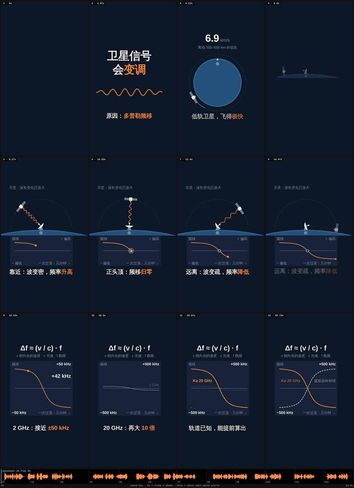
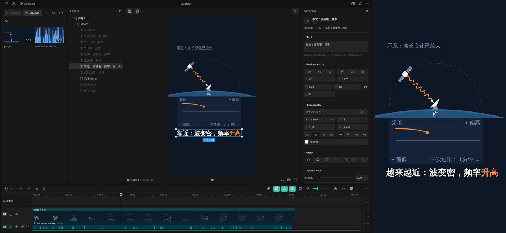
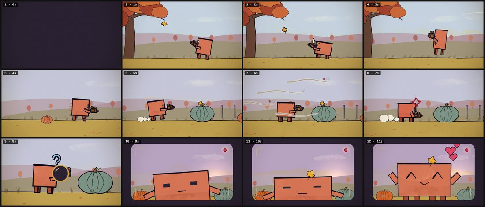

# 提案 01 · 从命令行到导演台：学 OpenFilm，把审阅台做成客户端

*2026-10-10 · 状态：提案，等维护者拍板。这个 PR 只加了这份文档和参考仓库条目，流程、模板和工具都没改。实验文件留在作者的会话里，没有入库；做法见附录 B，可以照着重做。*

**起因。** 维护者提了三件事：项目要有一个好用的客户端；工作流的细节要优化；现在还是命令行，中间产物是一堆乱的审阅文档。同时让我们学习 [OpenFilm](https://openfilm.dev/zh/)。本次会话的网络策略打不开 openfilm.dev，所以本文读的是它的源码仓库 [openfilm/openfilm](https://github.com/openfilm/openfilm)（官网就是这个仓库 README 里写的 homepage）和示例仓库 [openfilm/examples](https://github.com/openfilm/examples)。另外拿我们自己的两支 showcase 做了一次兼容实验。

## 先说结论

1. **剪辑器不自己从零写。** 时间线、在画面里点选改字、导出，这一层 OpenFilm（MIT）和 HyperFrames（Apache-2.0，我们的主引擎）都做好了，而且能直接用在我们的片子上。实验里，showcase 02（HyperFrames）加约 20 行包装、showcase 01（手绘引擎）加 6 行脚本和几行 CSS，就都成了 OpenFilm 的页面，过了它"同一个 t 画出同一帧"的检查。在 OpenFilm Studio 里改一句字幕，改动存成 `film.html` 里的一条 `overrides`，我们的源码一行没动；重新取帧，新字就在画面上（第 3 节）。
2. **我们要做的客户端是"导演台"。** 现在的审阅台（`bin/vh desk`）只在关卡上打开，以后让它在项目一开始就打开。它要放这几样东西：等你定的事、片子本身（实时播放，不用先渲 mp4）、按秒按镜头提的意见、版本、agent 正在做什么。OpenFilm 的手册写明不放"风格建议和方法"，它故意不管的这一层，正是我们有而别人没有的。
3. **中间产物按"谁读、留多久"拆成几层。** 第一层是会播放的作品。第二层是给人拍板的制作档案：带编号的结构化记录，页面从它生成。第三层是 agent 的工作日志，由工具自动写。第四层是工具状态，放在 `.ovh/`，不手改、不发布。现在同一件事，比如大纲、镜头、人的原话，要在 3–4 个文件里各写一遍，审阅台再靠表头的前几个字去认列。
4. **工作流的细节，从"写进文档让 agent 记住"改成"做进工具"。** 一次停顿只跑一条命令。一次自查也只跑一条命令，像 `openfilm look` 那样输出一张 ✗ / ! / ✓ 清单。联系表下面带上波形和每段声音的起点。OpenFilm 有一条规矩值得照搬：agent 出错时，手册含糊才补一个词，工具出了怪事就修工具。
5. **分四步走**，每一步单独能用，也能单独撤回（第 9 节）：
   - 第一步：联系表带声音，加一个导出到 OpenFilm 的试验工具；
   - 第二步：审阅台长成导演台，加上实时播放、活动流、版本和一条命令的停顿；
   - 第三步：制作档案结构化；
   - 第四步：做不做桌面外壳、云端页面，等前三步用过再定。

第 11 节列了要维护者拍板的 5 件事。

---

## 1. 现在卡在哪

### 1.1 人要去好几个地方找东西

一个 `standard` 项目从建到交付，人会在这些地方看到东西：

- 聊天；
- `out/review/gate-<n>.html` 的静态审阅页；
- 审阅台（`127.0.0.1` 的 8780–8799 端口）；
- `out/check/` 里的联系表；
- `out/*.mp4` 的草稿；
- 项目里 8–11 份 markdown。

审阅台已经把其中很多东西排在一起：一共 10 个视图，分别是这一轮、立意、字幕或旁白、分镜、声音、事实、小样、账本、历史、文档（`tools/desk/static/desk.js` 的 `VIEWS`）。但它有三个局限：

- 只在关卡上打开；
- 只能审，不能改；
- 只绑定 agent 所在机器的 `127.0.0.1`。在 claude.ai/code 这类云端会话里，agent 跑在远端容器里，人的浏览器一般打不开它；这份提案就是在这样的会话里写的。

### 1.2 人改不了片子

字幕错一个字、标题挪 20 像素、一个音效早了两帧，现在都要走同一条路：人在页面或聊天里说，agent 改代码，再重渲，再出一页审阅页。片子在关卡之间是看不见的，人只在 agent 停下来时才看到东西。

### 1.3 同一件事写三四遍

| 东西 | 现在写在哪 |
|---|---|
| 大纲 | `BRIEF.md` 的 Outline 表 → gate JSON 的 `segments` → 审阅台再从 BRIEF 的表里认出来 |
| 镜头 | `STORYBOARD.md` 的表 + `shots.json`（给 `bin/vh storyboard` 用）+ gate JSON 用 `include` 带进来 |
| 台词 | `SCRIPT.md` 的表 + `audio/timeline.json` + `audio/captions.json` + `*.srt` |
| 人的话 | `REVIEW.md` + `out/review/feedback/*.md` + 同名 `*.json` |
| 决定 | `DECISIONS.md` + gate JSON 的 `decided` / `delegated` |

还有几处要靠人工记着做：

- **认列靠表头。** 审阅台读 markdown 表格时，按表头的开头几个字认列，读不出来就退回原文（`tools/desk/README.md`"读什么"）。
- **作废靠手划。** 关卡改了立意，作废的决定要自己用 `~~…~~` 划掉、写上原因（`playbook/01-pipeline.md`"三道人工关卡"）。
- **版本靠复制。** 复制目录（介绍片的 `v3/`），给页名加字母（`1b`、`2b`），或另存一个文件（`REVIEW-gate1.md`）。
- **日志和事实混在一起。** NOTES.md 同时是事实台账和实验日志。介绍片 v3 的 NOTES 里就有"Phase B 修正项（协调方清单）""final QA（14:2x）"这样按时间记的小节。

数字（附录 C）：

- showcase 00–03 每个项目有 6–7 份 markdown，各 4.7–5.7 万字符（含公开的 README 和 LESSONS）；
- 介绍片有 22 份 markdown、17.7 万字符、19 份 JSON。

### 1.4 agent 每次停下来都要做一整套步骤

`studio` 档每到一站，agent 要按顺序做这些事：

1. 写 `out/review/gate-<n>.json`；
2. 运行 `bin/vh review`；
3. 在后台起 `bin/vh desk`；
4. 在后台起 `bin/vh desk wait`（超时 7100 s）；
5. 把命令打印的几行贴进聊天，然后停下。

被唤醒以后还要再做几件：

1. 读反馈；
2. 在 `REVIEW.md` 的新一节下补"定了 / 改了"；
3. 把替人定的事记进 `DECISIONS.md`；
4. 作废的旧决定手动划掉。

这些步骤写在 `playbook/01-pipeline.md`（1.75 万字符）和 `tools/desk/README.md`（7,400 字符）里，漏一步就可能卡住。

再看 agent 要读多少。一支 `standard` 知识短视频，agent 照路由要读这几份：

- CLAUDE.md；
- 类型文档 02；
- playbook 01、02、03、04、12；
- `templates/TASTE_CHECKLIST.md`。

合计约 11.5 万字符。OpenFilm 交给 agent 的全部说明（`MANUAL.md`）是 1,170 个英文词、约 6,900 字符。两边语言不同、内容也不同：我们的文档里大部分是方法和口味，这部分是我们的价值，不该删。可比的是"怎么操作工具"那部分。在我们这里，它也写成了文字，要 agent 记住；OpenFilm 则把它做进了工具。

### 1.5 门槛

要用起来，得先具备这些：

- 终端，加上 Claude Code 或 Codex；
- 克隆仓库，跑 `bin/vh setup`；
- uv、ffmpeg、Node。

审阅时还要打开本地文件。不会用命令行的人基本进不来。

---

## 2. OpenFilm 是什么

### 2.1 三样东西

OpenFilm 的 README 开头两句是"开源的 AI 视频智能体。"和"一个 HTML 文件，一个函数，一个真正的剪辑器。"代码是 MIT，npm 包 `openfilm`。它由三样东西组成。

- **格式。**
  - 剪辑是一个 `film.html`：每个 `<section>` 是一条轨道，每个片段是一个元素（`iframe` 页面、`video`、`img`、`audio`）。
  - 片段的属性：`#t=in,out` 定播哪一段，`at` 定从第几秒开始，样式里的 `left` / `top` / `width` / `height` 定放在哪，外观就用 CSS。
  - 页面是一个设置了 `window.film = { frame(t), duration, ready }` 的网页。唯一的规则是：同一个 t 永远画出同一帧。这和我们的硬规则 1 一模一样。
- **命令。** 一共四条：`open`（先打开 Studio）、`look`（检查）、`render`（出片）、`get`（用人自己的 key 生成配音、音乐、图片、视频）。不带参数运行 `openfilm`，就打印给 agent 的手册。
- **Studio 和桌面版。**
  - Studio 是本地网页剪辑器：时间线、在画面里选中页面里的元素改字改位置、检查器、图层、素材、字幕、版本、导出。
  - 桌面版是 Studio 加一列聊天，聊天驱动人自己装的 Claude Code、Codex 等 agent，也可以用自带的 agent 配人自己的 key。

完整的功能清单和源码位置见附录 A。

### 2.2 值得学的十一条

1. **一份剪辑说了算。**
   - `film.html` 是人和 agent 都改的那一份，按严格的格式读：拼错的属性会报出行号，不会被悄悄忽略（`SPEC.md` §1）。
   - 新属性只在"不能用 CSS、页面或文件表达"时才加。
   - 编辑器自己的状态（历史、缓存、显示设置）放在 `.film/`，不进 `film.html`。
2. **人的修改是人的。**
   - 人在画面里改的东西存成片段上的 `overrides`。人锁上的轨道，agent 不碰。
   - 撤销按片段 id 算，撤掉人自己的一步，不会把 agent 同时做的改动一起撤掉（`studio/ui/src/editor/undo.ts`）。
   - agent 重写页面、弄丢了人的修改时，Studio 会提示"恢复"。
3. **先开 Studio。**
   - `open` 是 agent 的第一条命令，人看着片子一点点长出来。
   - 服务端用 `fs.watch` 盯项目文件，120 ms 去抖，用 WebSocket 推给页面（`studio/server/watch.mjs`）。
   - 预览换页时先在后台加载，画面不黑。
4. **一个镜头一个页面。** 五个镜头就是五个页面，在 `film.html` 里剪在一起，人可以单独修剪、调换、替换其中一个（`MANUAL.md`）。
5. **声音是时间线上的片段。** 页面自己不出声，每个声音都是 `film.html` 里的一个片段，人能挪、能剪、能调音量。官方介绍片的 `film.html` 里有 279 个 `audio` 片段。
6. **检查做进工具。** `look` 是一条命令，它做这些事：
   - 把联系表上的 12 帧按两种打乱的顺序各画一遍，比较两遍是否一致；
   - 找出被画面边缘或自己的盒子截断的字（两帧以上才报）；
   - 在每个片段的中点检查画面是不是一整块纯色（页面没画出东西）；
   - 报字体加载失败、声音文件缺失、峰值低于 −30 dB 的声音、找不到元素的人工修改，以及 WebGL 跑在软件渲染上；
   - 联系表下面带混音波形、每段声音的起点和帧号；
   - 输出一张 ✗ / ! / ✓ 清单（`src/look.mjs`）。
7. **手册短，由命令打印。**
   - skill 只有 9 行，只说"运行 `npx -y openfilm@latest`，照它打印的手册做"。
   - CONTRIBUTING 里写着：手册只讲三件事（片子是什么、唯一的规则、工具怎么用），不写风格建议和方法。agent 出错时，手册含糊才补一个词；工具行为怪，就修工具。
8. **项目里分三层**（examples 的 README）：
   - 会播放的：`film.html`、页面、`assets/`；
   - 怎么做出来的：`make/`，放 Blender 场景、录屏脚本、配音、音效脚本，以及早期的脚本草稿和节拍表，都明确标成"早期草稿"；
   - 工具状态：`.film/`，放版本、聊天、日志、缓存、设置，从不发布。
9. **版本是给人看的 git。**
   - 版本存在一个独立的 git 仓库 `.film/history` 里，不碰项目自己的 `.git`。每个版本带一张封面帧。
   - 提交只由人做；回到旧版本时，文件以"未提交的修改"的形式放回项目。
   - 大于 1 MB 的媒体按内容哈希存（`studio/server/history.mjs`）。
10. **桌面版的聊天能指着说。**
    - 在画面上框一块、在时间线上选一段，按 ⌘L，就把这个引用连同截图放进消息。
    - agent 回复里的 `[[t:12.4]]`、`[[clip:id]]` 会变成能点的标签。
    - 问人时用卡片：1–3 个问题，每题 2–5 个选项，可以填自己的话，跳过就由 agent 自己定、并说定了什么。
11. **钱和 key 归人管。**
    - 服务商的 key 在 Studio 的设置里填，存在用户目录（`~/.openfilm/providers.json`，权限 0600），页面只看得到后四位；也认环境变量。
    - agent 用 `get` 生成媒体时，用哪家、哪个模型由人在 Studio 里定。生成视频很花钱，要人在 Studio 里先点确认，15 分钟不回就算没批（`studio/server/get.mjs`）。

### 2.3 它故意不做的，正是我们这层

OpenFilm 的手册不写风格和方法。它没有这些东西：

- 立意卡、关卡、导演模式；
- 独立评审、品味清单、字号和读时的底线；
- 事实台账；
- 不花钱的配乐和音效合成：它的媒体都来自人接入的付费服务。

这些正是 OpenVideoHarness 的内容。两边要解决的问题不重叠，可以合起来用。

### 2.4 成熟度和限制

- **很新。**
  - npm 上 2026-10-03 首次发布，0.1.3 是第一个开源版本（2026-10-10），格式规范写着"0.1 草案"。
  - 克隆下来只有一个提交，看不出发版节奏。
  - 共享包里还留着托管服务的类型（`packages/shared/src/contract.ts`），说明产品形态还在变。
- **名字是商标。** 代码随便用，但改过的版本发布出去不能叫 OpenFilm（`TRADEMARK.md`）。写"works with OpenFilm"可以。
- **桌面版给 agent 全部权限。** 它给 Claude Code 设 `bypassPermissions`，给 Codex 设完全访问，理由是"一轮点十几次允许保护不了什么，每一步都在编辑历史和版本里，能撤回"（`apps/desktop/chat/src/state/local-agent-store.ts`）。这和 Claude Code 默认的权限模型不一样。我们自己做外壳时不照搬。
- **渲染开 GPU 光栅化。** 研究笔记 03 量过：GPU 文字光栅让同一样片的重复渲染有几十个像素不同（最差 73.7 dB），GPU 和 CPU 渲的同一帧差 33.5–43.6 dB；Chrome 的 canvas 读回噪声曾让手绘引擎每次启动相差约 39 dB。`look` 比较的是同一次启动里两种顺序画的帧，跨启动的差别它看不到。所以用它出成片之前，要按我们的口径（无损帧、跨进程）另外量一次。
- **混音简单。** 每段只有音量和淡入淡出，用 ffmpeg `amix normalize=0` 混在一起，没有响度目标，没有旁白压低，也没有 QA。我们的 `bin/vh mix` 和 `bin/vh qa` 应该继续做最终混音。
- **其他。** Windows 安装包没签名；生成媒体要付费服务；Studio 依赖本机的 git（版本功能）和 ffmpeg。

---

## 3. 实验：我们的片子能直接进 OpenFilm 吗

**问题。** 我们的片子不重写，能不能当 OpenFilm 的页面用？人在 Studio 里改的东西，能不能和我们的源码分开存？

**做法。**

- 环境是这次的云端容器：没有 GPU，WebGL 跑在 SwiftShader 上。
- 用的是 OpenFilm 0.1.4。它带的 playwright-core 1.61.1 要 Chrome 149（rev 1228），容器里只有 Chromium 140（rev 1194），用符号链接顶上。
- 断网，所以去掉了 Google Fonts，字体是回退字体。
- 把两支 showcase 复制到临时目录，各加一个包装页，再写一个 `film.html`。
- 运行 `openfilm look`、`openfilm render`，再用 Playwright 打开 Studio，选中一句字幕、在检查器里改字。

具体命令和包装代码见附录 B。

**结果。**

| | showcase 02 多普勒 | showcase 01 Clawd |
|---|---|---|
| 引擎 | HyperFrames 0.8.82：DOM、canvas 和 GSAP | ClaudeAnimationBase：p5.brush，WEBGL |
| 画面 | 1080×1920，24.8 s | 1920×1080，12 s |
| 包装 | 页头 1 行：先定义 `window.__timelines`。页尾 20 行（含注释）：`.clip` 按 `data-start` / `data-duration` 显隐，再 `tl.seek(t)` | 页尾 6 行：`T = t; await redraw(); composite(t)`。另加 3 行 CSS，让 `#out` 铺满视口。`core.js` 改 1 行：有 `window.filmHost` 时不开开发界面 |
| `openfilm look` | ✓ 12 帧按两种乱序各画一遍，同一个 t 同一帧 | ✓ 同左 |
| 用时 | 7 s（含混音） | 10 min（软件 WebGL） |
| 声音 | 旁白母带作为一个 `audio` 片段放进 `film.html`：−17.2 LUFS，波形画在联系表下面 | 样片本来就是静音片 |
| `openfilm render 3-7` | 120 帧，15.2 s；h264、yuv420p、`tv` / `bt709` ×3，加 AAC。正是 `bin/vh check` 要的色彩标签 | 没测 |
| Studio | 字幕成了可以选中的文字图层。在检查器里改字，`film.html` 多了一条 `overrides`，`page.html` 没变。取 8.27 s 那一帧，新字在画面上，橙色的"升高"还在，`look` 报"✎ changed in Studio" | 没测 |

图 1 是 showcase 02 在 OpenFilm `look` 里的联系表，旁白的波形画在下面；第 1 格是 t = 0，片子从这里淡入：



图 2 是同一支片子在 OpenFilm Studio 里：左边选中 `#c3` 字幕，检查器里有文字、位置、字体、颜色、蒙版和透明度；右边是把字改成"越来越近：……"之后取的 8.27 s 那一帧。改动只写进了 `film.html`：

```html
<iframe id="doppler" src="page.html" overrides='[{"at":"#c3 > span.captxt","text":"越来越近：波变密，频率"}]'></iframe>
```



图 3 是 showcase 01（手绘引擎）在 OpenFilm `look` 里的联系表；第 1 格是 0 s，这一镜从取景框打开开始，所以是暗的：



**没测的。**

- 有 GPU 的机器、macOS；
- 联网字体；
- HyperFrames 里 `.clip` 以外的功能：子合成、合成里的 `video` / `audio`、变量、着色器转场。真做导出器时，应该让包装页调用 HyperFrames 自己的运行时或播放器，不要自己重写一遍；
- 时间线上的剪辑操作（挪、剪、分割）；
- 桌面版；
- OpenFilm 渲染和 HyperFrames 渲染逐像素比对；
- Manim 和 Blender 的片子。按格式它们只是 `video` 片段，最简单，但没试。

**这说明什么。**

- 我们的片子不用改写，生成一个包装页就能在一个现成的剪辑器里打开。
- 人的修改落在 `overrides` 里，和我们的代码分开；OpenFilm 每次取帧、出片都把它叠上去。我们自己的出片路径（HyperFrames 渲染）现在不认 `overrides`，第 10 节说怎么办。
- "人能直接小改、agent 不覆盖"，正是 1.2 节缺的那块，现在有现成的机制可借。

---

## 4. 另一块拼图：HyperFrames 自带的客户端零件

npm 上的 HyperFrames 0.8.145（Apache-2.0）已经拆出了三个包。

| 包 | 是什么 | 我们能怎么用 |
|---|---|---|
| `@hyperframes/player` | 网页组件 `<hyperframes-player>`：在沙盒 iframe 里播一个合成，带播放控件，`range-start` / `range-end` 只播一段，有 `seek()`、`timeupdate`、`ended` 等事件；也能直接播 mp4 | 放进审阅台：不渲 mp4，分镜页每个镜头直接播自己那一段，小样页按秒点评 |
| `@hyperframes/studio` | React 写的编辑器：可视时间线、CodeMirror 代码编辑、实时预览、元素检查器。`npx hyperframes preview` 打开的就是它 | 给会写代码的人用；今天就能用，文档里写一句就行 |
| `@hyperframes/sdk` | 无界面的合成编辑引擎：`openComposition`、补丁、撤销历史、`OverrideSet`，带类型的变量（字符串、数字、颜色、布尔、枚举、字体、图片），以及 fs、iframe、memory、headless 四种适配器 | 让人改"变量"而不碰代码，比如主色、标题字、某段的时长。look-dev 用的 `fx` 变量（`playbook/01-pipeline.md`）就是这个思路 |

我们现在钉在 0.8.82（`engines/README.md`）。用这几个包之前，先单独做一次升级核对。审阅台只用 Python 标准库、不从 CDN 拉东西，所以播放器要放进本地文件，不走 CDN。

---

## 5. 几条路怎么选

| 路 | 做什么 | 好处 | 代价和风险 |
|---|---|---|---|
| A 全部自己做 | 自己写时间线、检查器、聊天、导出 | 完全可控 | 工作量最大；重复造 OpenFilm 和 HyperFrames 已有的东西；维护跟不上 |
| B 整个搬到 OpenFilm 上 | 片子写成 `film.html`，客户端就用 OpenFilm Studio 和桌面版，我们只剩文档 | 最省事，马上有剪辑器 | 立意卡、关卡、评审、账本没有地方放；押在一个上线一周的项目上；桌面版给 agent 全部权限 |
| **C 导演台 + 开放的片子层（推荐）** | 审阅台长成导演台：关卡、意见、版本、账本、活动流、实时播放。片子用 HyperFrames 播放器实时放；要精修时导出成 `film.html` 在 OpenFilm Studio 里改，人的修改以 `overrides` 回到项目，agent 照着保留 | 集中做我们独有的那层，剪辑器借现成的；每一步单独可用、可撤回；不绑死在一个外部项目上 | 要跟两个外部项目的版本；导出器要维护；`film.html` 先只当交换格式，不当真相 |
| D 嵌进现有的 agent 宿主 | 关卡页做成 Claude 的 Artifact 页面、MCP 应用页或 IDE 面板 | 云端会话里也能点选，不用装 | 每个宿主一套；只能审，不能剪 |

**推荐 C，D 作为补充。** 同一份关卡数据可以从三个出口给人看：静态 HTML（哪里都能打开）、导演台（本地，能交互）、云端页面（云端会话，能交互）。云端出口要另外验证；它依赖 Claude 平台，不能是唯一的出口。

为什么不选 B？B 省掉的是剪辑器，而剪辑器在 C 里也是借来的。B 丢掉的是导演那一层，而用户找我们，要的就是这一层。

---

## 6. 目标形态：导演台长什么样

### 6.1 人看到的

| 页 | 人在这里做什么 | 现在有没有 |
|---|---|---|
| 首页 | 片名、档位、流程走到哪一站（立意 → 分镜 → 声音 → 制作 → 初版 → 交付）；"等你定的事：N 件"；最新一版的播放器；agent 正在做什么 | 没有。现在的"这一轮"页只在关卡上有 |
| 立意 | 2–3 张立意卡并排，各配一帧或一段小样；选一张，或者"这张的画面 + 那张的钩子"；改一句话 | 有（立意页），缺小样播放 |
| 分镜 | 按段一页；点一个镜头，播放器就只播那一段；逐镜点"可以 / 要改 / 疑问" | 有，镜头播放要靠 mp4 |
| 片子 | 实时播放；在画面上框一块、在时间线上选一段写意见，截图自动带上；小改直接改（字、颜色、位置、字幕时间），存成 `overrides` | 有按秒点评（小样页），没有框选，不能改 |
| 声音 | 波形、节拍、cue 标记；"请你听这几处" | 有 |
| 账本 | 我替你定的事（一键翻案）、事实核对、素材许可 | 决定和事实有，素材许可没有 |
| 版本 | 每过一站、每出一版 draft，自动存一版（带封面帧）；两版同一时刻并排比；回到旧版 | 没有 |
| 交付 | 成片、字幕、封面、标题候选、各平台尺寸；"在 OpenFilm Studio 里精修"，导出给剪映、Premiere、Resolve | 没有 |
| 设置 | 服务商 key（存在用户目录，不进项目）、默认档位和导演模式、环境检查（缺什么点按钮装） | 没有 |

### 6.2 agent 那边怎么接

- **还是文件和命令。**
  - agent 照旧用 `bin/vh`。导演台读写项目文件，不另存状态，这和现在审阅台的原则一样。
  - 人的提交，以及人在画面里改的东西，由导演台写进项目。`bin/vh desk wait` 收到就唤醒 agent，现在已经是这样。
- **活动流不用 agent 写。** 每条 `bin/vh` 命令跑完，自动往 `.ovh/activity.jsonl` 追加一行，例如"渲完 draft 3（24.8 s）""混音 −14.0 LUFS""qa：1 条警告"。导演台首页从这里读。这样 NOTES.md 里手写的阶段日志也就不用写了。
- **项目一建好就开导演台。** 不只是关卡上才开。人想看就看，不看也不耽误流程。

### 6.3 在哪里打开

- **本地**：现在的样子。agent 在终端里，导演台开在浏览器里。
- **桌面外壳**：以后再定。导演台加一列聊天，聊天通过 ACP（Agent Client Protocol，OpenFilm 桌面版用的就是它）驱动人自己装的 Claude Code 或 Codex；运行时（uv、ffmpeg、Chromium）打包进去，做到一键安装。
- **云端**：同一份关卡数据生成云端页面，人在页面上点选，agent 读回结果。要验证。

---

## 7. 中间产物怎么理

### 7.1 按"谁读、留多久"分层

| 层 | 放什么 | 谁写 | 人怎么看 | 发布吗 |
|---|---|---|---|---|
| 作品 | 场景代码、`assets/`、音频源；以后可能加 `film.html` | agent；人的精修以 `overrides` 记 | 在导演台里看片子 | 是 |
| 制作档案 `production/` | 规格、立意卡、段、镜头、台词、事实、决定、审阅轮次 | agent 用命令写；人的话和人的选择只由导演台写 | 导演台的页面，由档案生成 | 是（showcase 要给读者看） |
| 文字稿 | `STYLE.md`、立意的长理由、`LESSONS.md` | agent 或人 | 需要时打开 | 是 |
| 工作日志 `.ovh/log/`、`.ovh/activity.jsonl` | 命令的结果、渲染和 QA 报告、评审原文 | 工具自动写 | 默认折叠在"历史"里 | 否 |
| 工具状态 `.ovh/` | 当前轮、已交给 agent 的反馈、服务、缓存、渲染、版本 | 工具 | 不看 | 否 |

### 7.2 现在的文件去哪

| 现在 | 去处 |
|---|---|
| `BRIEF.md` | Spec 几行和立意保留为短文；Outline 表变成结构化的 `segments`（带编号），页面和 markdown 视图从它生成 |
| `STORYBOARD.md` + `shots.json` | 只留 `shots`（就是现在 `bin/vh storyboard` 的格式）；`STORYBOARD.md` 改成生成的视图 |
| `SCRIPT.md` + `audio/timeline.json` | `lines`：编号、属于哪段、文字、要读的事实、实测起止；`timeline.json` 继续由 TTS 写，`lines` 引用它 |
| `NOTES.md` | 拆开。事实（带出处和核实状态）进 `facts`；阶段日志进 `.ovh/log/`；自评进审阅轮次 |
| `DECISIONS.md` | `decisions`：编号、话题、定了什么、谁定的、理由、依赖什么、状态（有效 / 被取代） |
| `REVIEW.md`、`REVIEW-gate1.md`、`out/review/gate-<n>.json`、`out/review/feedback/` | `rounds`：每一站一条，记问了什么、选项和推荐、人选了什么、逐条意见的原文、怎么处理的；`REVIEW.md` 改成生成的视图 |
| 每个项目一份 `TASTE_CHECKLIST.md` | 不再复制，记仓库里清单的版本；逐条的结果写进审阅轮次 |
| `out/check/*` | `.ovh/cache/`，可以重建 |
| `v3/`、页名 `1b` / `2b` | `.ovh/history`：一个独立的 git，像 OpenFilm 的 `.film/history`，每站、每版自动存 |
| `LESSONS.md` | 不变 |

### 7.3 几条规矩

- **一件事一个编号、一个地方。** 段 `G2`、镜头 `S04`、台词 `C11`、事实 `F3`、决定 `D7`、轮次 `R2`。页面、聊天、提交都用编号互相引用；gate 数据只引用编号，不再复制内容。
- **人写的和 agent 写的分开。** 人的原话、人的选择、人的精修只由导演台写；agent 只追加"怎么处理的"。两边不会写同一个文件的同一处，也就不会互相覆盖。这是 OpenFilm"人的修改是人的"那一条。
- **作废按依赖自动标。** 每个决定记下它依赖的上游，比如立意、规格、某一段。上游一改，依赖它的决定自动标成"待复核"，由 agent 确认作废还是保留；作废的在页面里自动划掉，不用再手写 `~~…~~`。
- **版本不靠复制目录。** 每过一站、每出一版 draft 就存一版，带封面帧；页面里能把两版的同一时刻并排比较，也能回到旧版。OpenFilm 的版本只由人提交；我们的关卡本来就是存档点，所以在关卡上自动存，人另外想存也可以。
- **markdown 是打印出来的视图。** 给 GitHub 读者看的 REVIEW、DECISIONS、STORYBOARD 由命令从档案生成；agent 要读时，也用命令打印摘要。
- **旧项目照样能读。** 导演台先读结构化档案，没有就退回读 markdown，也就是现在的读法。

结构化用 JSON：仓库已经在用 JSON（`shots.json`、gate JSON、`timeline.json`），审阅台用 Python 标准库就能读。

---

## 8. 工作流细节：从"写进文档"改成"做进工具"

下表里的命令名都是提案，`bin/vh` 现在还没有。

| # | 现在 | 改成 | 借自 |
|---|---|---|---|
| 1 | 每次停顿要按顺序做 5 步，被唤醒后再做 4 步（1.4 节） | 一条子命令 `gate` 管一站：检查数据、出页面、标成这一轮、确保导演台在跑、打印聊天消息，加 `--wait` 就一直等到人提交；人的原话由导演台自动记进 `rounds`；处理结果用一条命令记 | OpenFilm 把步骤做进 `open` 和 Studio |
| 2 | 自查分在 `sheet`、`check`、`readcheck`、`textcheck`、`qa`、`rhythm` 几条命令里，各有各的输出 | 一条汇总命令，按所在的站挑要跑的检查，最后打出一张 ✗ / ! / ✓ 清单和一张联系表。原来的命令照旧可以单独用 | `openfilm look` |
| 3 | 联系表只有画面 | 有声音时，`bin/vh sheet` 在联系表下面加一条混音波形，标出每段声音的起点和帧号；agent 看一张图就能对声画 | `look` 的联系表 |
| 4 | 进度靠 agent 在聊天和 NOTES 里写 | `bin/vh` 命令自动写活动流（6.2 节） | 桌面版把工具调用映射成 24 种动作 |
| 5 | 意见要描述"哪里" | 框选画面、选时间段，意见自动带上截图、时刻和镜头号 | 桌面版的 ⌘L 引用 |
| 6 | 改一个字也要 agent 改代码、重渲 | 人在导演台或 OpenFilm Studio 里直接改；存成 `overrides`；agent 改写页面时必须保留，检查命令报"人的修改找不到元素了" | `overrides`、"恢复"提示 |
| 7 | 关卡最多 3 件事；`quick` 档有歧义时最多问 1 个问题 | 不变，问法和 OpenFilm 对齐：每个问题 2–5 个选项，可以填自己的话；不回就照推荐，记进决定账本 | `ask` 卡片 |
| 8 | agent 要读约 11.5 万字符的流程文档 | 方法和口味照旧按需读；"怎么操作工具"那部分改成按站打印的卡片（一条子命令 `guide`，参数是站名），CLAUDE.md 只留路由和底线 | OpenFilm 的手册由命令打印 |
| 9 | key 只能放环境变量 | 导演台的设置页里填，存在用户目录（不进项目、不进仓库），花钱的生成要人点确认。这要改硬规则 7 的写法，见第 11 节 | Studio 的服务商设置和花钱确认 |
| 10 | 环境靠 `bin/vh doctor` 打印 | 导演台显示同样的检查结果，缺什么点按钮装 | 桌面版自动下载 ffmpeg |

以关卡 ② 为例，前后对比：

| | 现在 | 改完 |
|---|---|---|
| agent 写 | `STORYBOARD.md` 的表、`shots.json`（同样的镜头写两遍）、`gate-2.json` | 只写 `shots`；`gate` 一条命令出图、出节奏图、出页面、等人 |
| 人看 | 静态页或审阅台；镜头靠 animatic 或草稿 mp4 播 | 导演台；每个镜头用播放器直接播自己那一段 |
| 人改 | 写意见，等下一轮 | 写意见；字幕和标题直接改 |
| 记录 | agent 把原话抄进 REVIEW.md，补"定了 / 改了"，手改 DECISIONS | 导演台写原话；agent 用一条命令记处理结果；REVIEW.md 自动生成 |

---

## 9. 分四步走

每一步一到两个 PR，单独能用，也能单独撤回。

| 步 | 交付 | 验收 |
|---|---|---|
| 0（本 PR） | 这份提案；OpenFilm 进 `references/`（`fetch.sh`、`community-skills.md`、`open-source.md`） | 维护者读完，回第 11 节的问题 |
| 1a | 联系表带声音（第 8 节第 3 条） | showcase 02 的联系表下面，旁白波形和字幕时刻对得上；CI 有用例 |
| 1b | OpenFilm 导出（试验）：给 HyperFrames 和手绘引擎的项目生成 `film.html` 和包装页，旁白、配乐、音效作为 `audio` 片段；一个检查列出项目里所有 `overrides`；`engines/README.md` 写一节 | showcase 00–03 能在 Studio 里打开；`openfilm look` 通过；在 Studio 里改一个字，用我们自己的出片路径重新出片，这个字还在（第 10 节的 (b)） |
| 2a | 导演台的"片子"页：本地放进 `@hyperframes/player`，分镜和小样直接播；mp4 留作退路 | 关卡 ② 不渲 mp4 也能逐镜看；离线能用 |
| 2b | 首页、流程条、活动流 | 首页显示当前站、等人定的事和最近的命令结果 |
| 2c | 版本（`.ovh/history`）和两版对比 | 每站自动存一版；两版同一时刻并排 |
| 2d | 子命令 `gate` | 1.4 节的步骤由一条命令完成；原来的命令保留 |
| 3a | `rounds` 和 `decisions` 结构化；REVIEW.md、DECISIONS.md 改成生成的视图；按依赖自动标作废 | 新项目里不再手写 REVIEW 和 DECISIONS；旧项目审阅台照样读 |
| 3b | `facts`、`segments`、`shots`、`lines`；模板和 playbook 跟着改 | `bin/vh new` 建的项目里，同一件事只写一处 |
| 4 | 选一个外壳：桌面应用（导演台 + 聊天 + 运行时打包）、云端页面，或者给 OpenFilm 上游贡献一个"制作"面板 | 看 1–3 步的使用情况再定 |

衡量好不好，用这几个数，现在就可以先量一次当基线：

- 从一句需求到人第一次看到东西，要多久；
- 每道关卡人要发几条消息；
- agent 在停顿步骤上出错几次（漏起 `wait`、漏记原话）；
- 一个项目有几份要手写的 markdown；
- agent 每支片子读多少字符的流程文档。

---

## 10. 风险和要验证的

- **OpenFilm 太新。** 先只把 `film.html` 当交换格式，不当真相；钉版本。它的格式很简单，参考实现是 MIT，真停更了，我们也能自己托管播放器和检查工具。
- **商标。** 不发布叫 OpenFilm 的分支或产品；文档和界面里写"在 OpenFilm Studio 里打开""works with OpenFilm"。
- **权限。** 我们的外壳不默认给 agent 全部权限，保留 agent 自己的权限模型。
- **确定性。** OpenFilm 开 GPU 光栅化，它的检查只比同一次启动里的帧。成片照旧走我们量过的渲染路径（研究笔记 03），要换路径先按跨进程、无损帧的口径量。
- **声音。** OpenFilm 的混音没有响度目标和旁白压低。最终混音照旧由 `bin/vh mix` 和 `bin/vh qa` 做；人在时间线上挪了音效，导出器要能把位置读回我们的 `events.json`。这一步最复杂，放在最后。
- **人的修改怎么进成片。** `overrides` 现在只在 OpenFilm 取帧和出片时叠上去，我们用 HyperFrames 出片时看不到。有三种办法：
  - (a) 项目里有人的修改时，改用 OpenFilm 出片；
  - (b) 我们的出片路径也叠 `overrides`：把 OpenFilm 播放器里叠修改的那段逻辑（MIT）移进 HyperFrames 渲染用的页面；
  - (c) agent 把修改合进源码，再删掉那条 `overrides`。

  建议 (b)：人的修改照旧归人，走哪条路出片都在。(c) 留给 agent 重写那一段代码时顺手做，做完要确认画面没变。
- **HyperFrames 运行时。** 包装页现在只重现了 `.clip` 的显隐。真做导出器，要用 HyperFrames 自己的运行时或播放器，按 showcase 00–04 逐个验证。
- **客户端变成产品。** 每加一个功能，都要说清它省了人的时间还是减少了 agent 的错，用第 9 节的数来量。agent 用的照旧是命令行：命令行对 agent 最顺手，客户端是给人用的。
- **云端会话。** 云端页面能不能把人的选择交回 agent，要实际做一次才知道。做不成，退回"静态页 + 在聊天里回复"，也就是现在的做法。

---

## 11. 要你拍板的 5 件事

1. **方向**：同意走 C 吗？导演台加开放的片子层，剪辑器借 OpenFilm 和 HyperFrames 的。
2. **`film.html` 的地位**：先只当交换格式（"在 Studio 里精修，改动回到项目"），做 2–3 支真片子之后再决定要不要当剪辑的真相？人的修改怎么进成片，第 10 节给了三种办法，我建议 (b)。
3. **制作档案结构化**：同意把审阅轮次、决定、事实、段、镜头、台词从 markdown 表搬到带编号的 JSON，markdown 改成生成的视图吗？这会改 `templates/`、`tools/desk/README.md` 和 playbook 里不少写法；旧项目照样能读。
4. **硬规则 7**：现在写的是"一律从环境变量读取"。客户端要在设置页里管 key，需要改成"key 只放在用户目录或系统钥匙串，不进项目、不进仓库"。改不改？
5. **先做哪个**：1a 联系表带声音（小）、1b OpenFilm 导出（中）、2a 导演台实时播放（中），先做哪一个？我的建议是 1a → 1b → 2a。1b 最能验证这条路，做完人马上就能在一个真正的剪辑器里改我们的片子。

---

## 附录 A：OpenFilm 功能清单（带源码位置）

路径相对 [openfilm/openfilm](https://github.com/openfilm/openfilm)，本地读的是 v0.1.4（提交 `6dee7cd`）。

**Studio 服务端**（`packages/openfilm/studio/server/`）

- **两个源。** 编辑器和 API 在 `127.0.0.1:<端口>`；片子文件在另一个端口上只读提供，agent 写的页面碰不到 API（`server.mjs`、`pages.mjs`）。启动 key 放在 `~/.openfilm/key`；有防 DNS 重绑的检查；崩溃后由监护进程在原端口重启。
- **改动怎么到浏览器。** `watch.mjs` 用 `fs.watch`，120 ms 去抖。`film.html` 的哈希变了才发 `film` 事件，其余文件发 `files` 事件，都走 WebSocket。预览用 postMessage 桥（`bridge.js`）。
- **人的编辑怎么存。**
  - 编辑是按片段 id 的操作（`ops.mjs`），可以设的只有 `at, time, box, volume, speed, overrides, src`。
  - 前端先改再排队写，带基准版本；文件中途变了，服务端在新文件上重放这些操作，片段没了回 409（`film.mjs`）。
  - 只重写改了的那几行；`film.html` 解析不了时绝不覆盖。
- **版本。** `history.mjs`、`history-store.mjs`：独立的 git，提交由人做，媒体按内容存。
- **导出。**
  - 视频：h264、hevc、vp9、prores 422 HQ / 4444、带透明的 hevc、PNG 序列；可以换画幅（9:16、1:1 等），可以带字幕文件或烧进画面（`exports.mjs`）。
  - 还有：GIF；音频混音和分轨（人声、音乐、音效、素材）；静帧；字幕（srt、vtt、txt）；幻灯片（pptx、pdf，`slides.mjs`）；Premiere / Resolve 的 xmeml 文件夹，页面渲成 ProRes 4444（`nle.mjs`）；整个项目打包。
  - 有各平台的预设。
- **服务商。** ElevenLabs、OpenAI、Google Gemini、fal.ai、Groq、Pexels、Pixabay、Brave、Tavily（`providers/`）。key 存在 `~/.openfilm/providers.json`（0600）；生成视频要人在 Studio 里确认，15 分钟不回就算没批（`get.mjs`）。
- **项目库。** 最近打开的项目、从 GitHub / GitLab 导入（浅克隆，不带 `.git`，上限 500 MB）、示例片。

**Studio 前端**（`packages/openfilm/studio/ui/src/`）

- **时间线。** 多轨；挪、修剪、滚动、滑动、分割、关缝；吸附；标记；字幕行；J / K / L 走带。转场就是淡入淡出和重叠（`lib/transitions.ts`）。
- **画面。** 选中页面里的图层；拖拽、缩放、旋转；就地打字；裁切；蒙版；按 Alt 量距离。
- **检查器、图层面板**（眼睛、锁、重排）、**素材库和源监视器**、**字幕**（转写、翻译，改动写回 `.vtt`）、**版本和编辑历史**（⌘Z，最多 100 步）、**导出中心**、**设置**（常规、Agents、服务商、模型、开发者、快捷键）。

**桌面版**（`apps/desktop/`）

- **结构。** Electron；一个窗口里是 Studio 的编辑器加一列聊天；Studio 跑在子进程里。
- **agent。** 通过 ACP 驱动人自己的 Claude Code、Codex（官方 ACP 适配器）、Gemini CLI、Copilot、Cursor、OpenCode、Qwen、Kimi 等（`src/agents.mjs`）。登录用 agent 自己的命令，应用碰不到 token。
- **自带 agent。** "pi"（`@earendil-works/pi-coding-agent`，MIT），用人自己的 key（`src/pi-agent.mjs`、`src/pi-config.mjs`）。
- **聊天。** 工具调用折叠成一行动作；`[[clip:…]]`、`[[t:…]]` 变成可点的标签；人的引用带截图，存在 `.film/refs/`；问人用卡片（1–3 个问题，每题 2–5 个选项）。
- **性能测量**（`bench/`）。空闲、播放、拖动时间线、聊天流式输出时的掉帧和内存。2026-10-07 在 Apple Silicon 上：冷启动 1.4–2.4 s，整个应用 1.2–1.6 GB 内存，片子掉帧 0%。

**渲染核心**（`packages/openfilm/src/`）

- **`host.mjs` 的 `FILM_CLOCK`。** 页面脚本运行前注入，第一帧起把这些时钟钉在 t 上：
  - `performance.now()` 和 `requestAnimationFrame` 的时间戳读 t；
  - `Date` 读 2026-01-01 加 t；
  - `Math.random` 每帧按 t 重新播种；
  - CSS 动画停在 t，CSS transition 直接走完。

  这是硬规则 1 的兜底：页面写错了，画面也还是 t 的函数。我们的硬规则是"不许用"，它是"用了也没事"，两者可以并存。
- **视频 seek。** 每次 seek 加 1 ms，落在要的那一帧里面；截图前等 `seeked` 和 `requestVideoFrameCallback`。
- **`render.mjs`。** 默认 30 fps；最多 4 个并行 worker；`--blur` 每帧取 8 个子帧做运动模糊；可以出透明背景；mp4 是 x264 crf 16，带 BT.709 标签。

**过程**

- CLI、Studio 和桌面版共用一个版本号；用 changesets 管理；npm 用 OIDC 可信发布。
- 测试用真 Chromium 和 ffmpeg，在 Ubuntu、macOS、Windows 上都要过；CI 还跑 gitleaks 和公开内容审计。
- 没找到遥测代码，对外的请求都写明了用途。

## 附录 B：实验怎么重做

需要 Node 22 和 ffmpeg，在任意空目录里：

```bash
npm i openfilm@0.1.4
# 容器里只有 Chromium 140（rev 1194），它要 rev 1228：建一个目录，用符号链接顶上，再设 PLAYWRIGHT_BROWSERS_PATH
# 有网的机器直接让 openfilm 自己下载，不用这一步
mkdir -p pwb/chromium_headless_shell-1228/chrome-headless-shell-linux64
ln -s /opt/pw-browsers/chromium_headless_shell-1194/chrome-linux/* pwb/chromium_headless_shell-1228/chrome-headless-shell-linux64/
ln -s headless_shell pwb/chromium_headless_shell-1228/chrome-headless-shell-linux64/chrome-headless-shell
touch pwb/chromium_headless_shell-1228/INSTALLATION_COMPLETE
export PLAYWRIGHT_BROWSERS_PATH=$PWD/pwb
```

**showcase 02**：把 `showcase/02-short-leo-doppler/index.html` 复制成 `doppler/page.html`，`npm i gsap@3.14.2`，把 `audio/voiceover.zh.flac` 复制到 `doppler/assets/`。然后做两处改动：

在加载 GSAP 的那行之前加：

```html
<script>window.__timelines = window.__timelines || {};</script>
```

在 `</body>` 之前加：

```html
<script>
  (function () {
    const root = document.querySelector("[data-composition-id]");
    const tl = window.__timelines[root.dataset.compositionId];
    const clips = [...document.querySelectorAll(".clip")];
    window.film = {
      duration: parseFloat(root.dataset.duration),
      ready: document.fonts.ready,
      frame(t) {
        for (const el of clips) {
          const s = parseFloat(el.dataset.start), d = parseFloat(el.dataset.duration);
          el.style.visibility = t >= s && t < s + d ? "" : "hidden";
        }
        tl.seek(t, false);
      },
    };
  })();
</script>
```

`doppler/film.html`：

```html
<!doctype html>
<html>
<head>
<meta charset="utf-8">
<meta name="viewport" content="width=1080, height=1920">
</head>
<body>
<section>
  <iframe id="doppler" src="page.html"></iframe>
</section>
<section>
  <audio id="vo" src="assets/voiceover.zh.flac"></audio>
</section>
</body>
</html>
```

然后在 `doppler/` 里运行 `npx openfilm look`、`npx openfilm render 3-7`、`npx openfilm look 8.27`。`look` 会顺带起一个 Studio，打印它的地址。

**showcase 01**：把 `engines/ClaudeAnimationBase/src/` 的 `clawd.js`、`core.js`、`sheets.js`、`timeline.js`，以及 showcase 的 `src/config.js`、`src/scenes/leaf.js` 复制进 `clawd/src/`，`npm i p5@2.3.3 p5.brush@2.2.3`。然后：

- 把 `studio.html` 复制成 `page.html`，加 `<meta name="viewport" content="width=1920, height=1080">`，用 CSS 让 `#out` 是 1920×1080、`main` 无边距、`.bar` 隐藏；
- 把 `core.js` 里的 `if (!location.search.includes('render')) devUI();` 改成有 `window.filmHost` 时也不开开发界面；
- 在 `</body>` 之前加：

```html
<script>
  window.film = {
    duration: PROJECT.duration,
    ready: new Promise((ok) => { const wait = () => (window.ready ? ok() : setTimeout(wait, 50)); wait(); }),
    async frame(t) { T = t; await redraw(); composite(t); },
  };
</script>
```

`film.html` 和上面一样，只是视口改成 1920×1080，也没有声音轨。

## 附录 C：数字的来源

- 文档字符数：Python 按字符计（`len(str)`），CLAUDE.md 是 9,884 字符。`standard` 知识短视频要读的 8 份文件见 1.4 节，合计 115,042 字符。OpenFilm 的 `MANUAL.md`：`wc` 计 1,170 个词、6,852 字节。
- showcase 的文档量：对 `showcase/<项目>/` 下所有 `*.md` 计字符，`*.json` 计个数（不含 `node_modules`）。
- OpenFilm 的版本和日期：`npm view openfilm` 的 `time` 字段；`packages/openfilm/CHANGELOG.md`。
- 实验的数字：`openfilm look` 和 `openfilm render` 的输出、`ffprobe`、`time`；环境见第 3 节。
- 审阅台的视图、端口、等待时长：`tools/desk/static/desk.js`、`tools/desk/README.md`。
- HyperFrames 的包：`npm view @hyperframes/player`、`@hyperframes/studio` 的 README，以及 `@hyperframes/sdk` 0.8.145 包里的 `dist/index.d.ts`。
