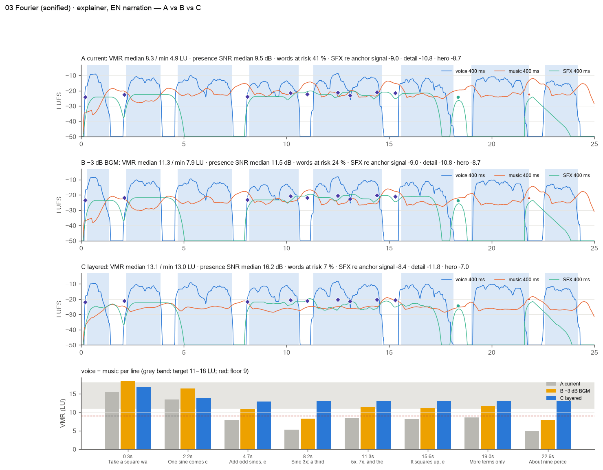
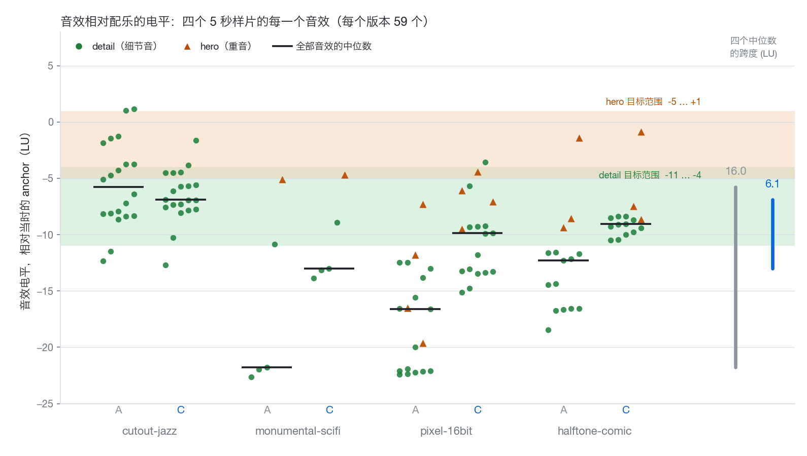
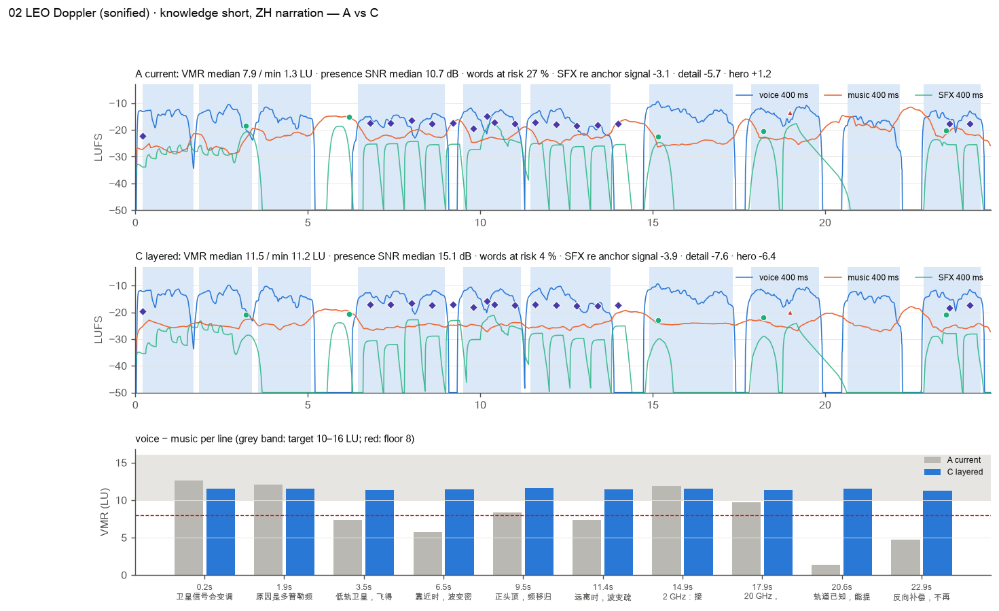

# 01 · 旁白、配乐、音效的层级：旁白为什么还是被埋掉

*记录于 2026-10-01 · 状态：已合并（[#21](https://github.com/ZLHad/OpenVideoHarness/pull/21)）· [English](en/01-mix-hierarchy.md)*

> **现状（2026-10-01）**
>
> - **落地**：[#21](https://github.com/ZLHad/OpenVideoHarness/pull/21) 把原型合并进了仓库。混音器是 [`tools/audio/mix.py`](../../tools/audio/mix.py)（`bin/vh mix … profile=explainer|short|promo|cartoon|mv|swatch`），混音报告是 [`tools/audio/qa.py`](../../tools/audio/qa.py) 的 `qa mix`，用法和各 profile 的数字写在 [`playbook/04-audio.md`](../../playbook/04-audio.md) 的"混音"一节。
> - **复算**：用入库的实现重算，下面 C 行的 VMR 和风险词数没有变：03 的 VMR 中位数 / 最差句 13.1 / 13.0 LU，02 是 11.5 / 11.2 LU，风险词 3/46 和 1/26。
> - **母带**：默认仍是 `tp=-1.65`，比 −1.5 dBTP 低 0.15 dB，但 AAC 对真峰值的影响取决于内容和码率（#21 在四个样片、128k 下测到 +0.16…+0.86 dB，[#31](https://github.com/ZLHad/OpenVideoHarness/pull/31) 在 28 份新配乐上是 −1.9…+1.4 dB），0.15 dB 不总是够。所以 `styles/_swatch/render.sh` 要量编码后的 mp4，超过 −1.5 dBTP 就降低 `tp` 重混，最多 3 次。
> - **风险词**：没有词级时间时只警告、不判失败（按 0.4 s 一段算，03 上读 11 %，真实词是 7 %）。
> - **抽吸检查**：给了 `--stems` 时，不再算配乐自己的凹陷。

## 问题

`bin/vh mix` 的 `music_db` 和 `duck_ratio` 调到听测通过之后，有旁白的样板片里仍有 27–41 % 的词在 1–4 kHz 里信噪比低于 6 dB。到底是哪些量没人管？

## 做法

- **对象**：4 支样板片（`showcase/03-math-fourier`：英文旁白，explainer；`02-short-leo-doppler`：中文旁白，short；`00-promo-launch-film`、`01-handdrawn-clawd-leaf`：无旁白）和 4 个 5 s 风格样片（音乐加 foley）。下文简称 03、02、00、01。
- **三个版本**：**A** 是现状（从各片的 build 重建三条总线；两部带旁白的片与成品混音的残差是 −39.5 和 −36.2 dB）；**B** 只在 03 上做"音乐再低 3 dB"（`music_db` −5 → −8），这是最直接的修法；**C** 是原型 `mix_layers.py`（现为 `tools/audio/mix.py`）按 profile 重混。
- **量法**：`mix_report.py`（现为 `bin/vh qa mix`），BS.1770 K 加权响度（单位 LU），用 numpy 和 scipy 计算（ffmpeg 只负责解码），30 s 的片约 1–2 s，结果确定：
  - **anchor**：旁白各句响度的中位数；没有旁白时取音乐的 3 s short-term 响度（下限为它的 integrated 减 8 LU）。
  - **VMR**（voice-to-music ratio）：一句话里旁白响度减去同一段里音乐的响度。
  - **风险词**：用本地 Whisper 给脚本里的词打时间，某个词在 1–4 kHz 里相对"音乐加音效"的信噪比低于 6 dB，就算风险词。
  - **停顿里的回升**：停顿里的音乐响度，减去相邻两句里音乐响度的平均。
  - 另外报每个音效相对 anchor / 局部底 / 旁白的电平、三条总线的宽度与相关性、限幅器吃掉了多少。
- **命令**（原型脚本，没有入库；入库后的写法是 [`playbook/04-audio.md`](../../playbook/04-audio.md) "混音"一节开头的代码块）：

```bash
uv run --with numpy --with scipy python mix_layers.py OUT --profile explainer --voice vo.flac --music music.wav \
    --events events.json --sfx-lib sfx/ --timeline timeline.en.json --dur 25 --fade 0.5
uv run --with numpy --with scipy python mix_report.py --stems OUT --profile explainer --timeline timeline.en.json --words words.json
```

来源：混音实验的设计说明、A/B/C 三版的构建脚本，以及重建 A 版三条总线时的拟合记录（两部带旁白的片、cutout-jazz 与成品混音的残差）；这些是实验目录里的文件，没有入库。指标的定义和实现现在是 [`tools/audio/qa.py`](../../tools/audio/qa.py) 文件头里的 `qa mix`（[#21](https://github.com/ZLHad/OpenVideoHarness/pull/21)，由实验里的 `mix_report.py` 移植）。

## 发现

**1. 旁白离音乐太近，而且各句不一样近。** 03 的 A 版有 6 句低于 9 LU 的硬下限，19/46 个词低于 6 dB，共 7 项硬性不过；最差的一句只比音乐高 4.9 LU。02 的最差一句只有 1.3 LU。

| 片 · 版本 | VMR 中位 / 最差句 (LU) | 风险词 | 旁白各句响度跨度 | 停顿里音乐回升（中位） | 硬性不过 |
|---|---|---|---|---|---|
| 03 A 现状 | 8.3 / 4.9 | 41 %（19/46） | 5.4 LU | +6.0 LU | 7 |
| 03 B 音乐 −3 dB | 11.3 / 7.9 | 24 %（11/46） | 5.4 LU | +6.0 LU | 3 |
| 03 C 分层 | 13.1 / 13.0 | 7 %（3/46） | 2.2 LU | +3.4 LU | 0 |
| 02 A 现状 | 7.9 / 1.3 | 27 %（7/26） | 3.8 LU | +6.1 LU | 7 |
| 02 C 分层 | 11.5 / 11.2 | 4 %（1/26） | 1.4 LU | +2.3 LU | 0 |



*图 1 · 03 fourier（25 s，英文旁白）：旁白（蓝）、音乐（橙）、音效（绿）的 400 ms 响度，底部是每句的 VMR（灰带为目标 11–18 LU，红虚线为 9 LU 硬下限）。*

**2. 压低音乐只解决了一半。** B 把 VMR 中位拉到 11.3，但最差的句子仍是 7.9，还有 3 项不过：旁白自己的响度在各句之间差 5.4 LU，全局降音乐不动这个差。C 先把各句旁白向中位数拉近（`mix_layers` 日志记的是 5.5 → 2.2 LU，每句增益在 −1.5 到 +1.8 dB 之间），再逐句解出音乐要压多深（03 里是 2.0 到 6.3 dB）：后六句的 VMR 落在 13.0–13.2 LU，前两句偏高（16.9 和 13.9），因为压深有 2.0 dB 的下限，而开头的音乐本来就轻。

**3. 停顿里音乐会冒出来。** 现有的压缩器是 `sidechaincompress=threshold=0.02:ratio=1.6:attack=15:release=350`，句子一停，350 ms 内音乐回升。A 版里停顿中的音乐中位数只比旁白低 3.2 LU（03）和 2.3 LU（02）；02 在 22.17–22.85 s 的停顿里，音乐比旁白的中位响度还高 2.6 LU。C 里同一指标是 −10.4 和 −8.9 LU。

**4. 音效不是"都太响"，而是彼此没有秩序。** 00 里 detail 最高到 +2.0 LU、hero 到 +3.7 LU（相对当时的音乐）；01 在音乐的空当里是 +6.0 和 +7.9（C 之后：00 是 −0.7 和 +0.7，01 是 +0.8 和 +3.8）。四个 5 s 样片里，foley 电平中位数相对音乐从 −5.7 到 −21.8 LU，跨 16.0 LU（pixel-16bit、monumental-scifi 的 detail 音效中位数约 −20 LU，基本被音乐盖住）。C 之后跨度是 6.1 LU。



*图 2 · 四个 5 s 样片的每个音效相对 anchor 的电平（每版本 59 个）：横线是中位数，绿带和橙带是 detail 和 hero 的目标范围，最右是四个中位数的跨度。*

**5. 深度只有两层。** 当时的 `tools/audio/mix.py`（#21 之前）里没有混响，旁白和音效天生是干的，空间全来自配乐自己（四部片的配乐直接声与混响能量比 DRR：00 是 14.0 dB，01 是 8.2，02 是 10.4，03 是 6.8，数越小越湿）。A 版里 03 的旁白和音效总线都是单声道（L/R 相关 1.00）；01 里音乐和音效总线同宽（side/mid −11.6 与 −11.7 dB）。



*图 3 · 02 doppler（24.8 s，中文旁白）的 A 与 C；中文另外削 250 Hz–1 kHz（`body_share` 0.6），因为声调的信息也在这一段。*

来源：A、B、C 三版的混音报告（表中各项、第 3 点的停顿数字、风险词数、图 2 的逐音效电平），原型的运行日志（每句增益与压低深度），以及四部配乐的 DRR 测量；都是混音实验的输出，没有入库。C 版的数字在 #21 里用入库的实现复算过，一致（见"现状"）。`qa mix` 的 [6] depth 也报各总线的干湿比，口径和这里的 DRR 不一定相同。压缩器参数取自 [`tools/audio/mix.py`](../../tools/audio/mix.py) 的默认链。图 1、3 是实验原图缩小，图 2 是按报告里的逐音效数据重画的。

## 因此改了什么

### 设计：C 怎么排层次

一切相对一个 anchor 来定，顺序是 **旁白 → 音乐 VMR → 音效分类 → 深度 → 母带**：

- **旁白**：80 Hz 高通；每句向中位数拉 60 %，上限 ±3 dB；峰值不超过 anchor 加 10.5 dB。
- **音乐**：逐句做前瞻的"推子"，不是压缩器：提前 0.15 s 开始压，短于 1.5 s 的停顿保留一半压深，压深在闭环里逐句解出，直到该句达到 profile 的 VMR（explainer 目标 13、下限 11、上限 18 LU）。再在 1–4 kHz 削（carve），只削到字需要的程度，上限 7 dB。
- **音效**：按 `role`（或名字里的线索）分成 hero、detail、ambience、signal 四类，每个音效向本类的中心走一半，且留在范围内 0.5 LU；同一个手势和 0.2 s 内的连发一起动；低频能量占 60 % 以上的不往上推；整个类最多动 ±9 dB。音效共用一间短房间（RT60 0.25–0.3 s）。
- **母带**：一个静态增益加 numpy 前瞻真峰值限幅器，留 0.15 dB 给 AAC。

这也绕开了 ffmpeg `sidechaincompress` 在文件尾丢一段的毛病（见[笔记 03](03-render-determinism.md)）。

来源：混音实验的设计说明，以及原型 `mix_layers.py` 的文件头和 `PROFILES`；入库后是 [`tools/audio/mix.py`](../../tools/audio/mix.py) 的文件头和 `PROFILES`，各 profile 的数字在 [`playbook/04-audio.md`](../../playbook/04-audio.md) 的"混音"一节。

### 进了仓库的

- [#2](https://github.com/ZLHad/OpenVideoHarness/pull/2)：`duck_ratio` 默认值从 6 改成 1.6（同一段旁白三档比较，qa 抽吸 3 处、2 处、0 处）。那是旋钮级的修法，上面的数据说明为什么旋钮不够。
- [#15](https://github.com/ZLHad/OpenVideoHarness/pull/15)：`bin/vh mix` 变成确定的（同一条命令跑 12 次原来有 6 种不同的文件）。
- [#21](https://github.com/ZLHad/OpenVideoHarness/pull/21)：混音 profile，`bin/vh mix … profile=explainer|short|promo|cartoon|mv|swatch`；`bin/vh qa mix` 读取各总线并在硬指标不过时退出 1；`bin/vh sfx` 支持每个事件的 `role` 并写出 `events.json` 旁路文件；`styles/_swatch/render.sh` 改用 `profile=swatch`。移植版与原型在八个测试混音上，用原型最后一次的 `lufs` / `tp` 时逐字节相同；用产品默认值（`lufs=-14`、`tp=-1.65`）时所有相对指标相同，只有总增益和限幅器不同。
- 同一个 PR 里的文档：[`playbook/04-audio.md`](../../playbook/04-audio.md) 的混音一节按上面的顺序重写，给出各 profile 的数字。

来源：PR #2、#15、#21 的描述。

## 局限与没解决的

- **没有听感结论。** 现有文件里没有 A/B/C 的听测记录，所有数字都是表读数，不是耳朵。
- **样本小**：两部带旁白的片（各 25 s 左右）、四个样片；A 版的总线是重建出来的，不是导出的（cutout-jazz 的残差只有 −18.6 dB，限幅器在那里吃得最多）。
- **目标值是设计选择。** 13 / 11.5 LU 这类数字没有听测标定。参照：英国 DPP 的交付规范建议对白与背景至少差 4 LU，一项研究报告评论员盖过音乐需要至少 10 LU（Torcoli 等，2019；研究笔记里只记了摘要）。
- **C 里还剩的警告**：02 在 5.09–6.45 s 和 22.17–22.85 s 的停顿里音乐回升仍超过 5 LU；03 的两个 sonification 音效（10.2 s、12.5 s）的 1–4 kHz 能量仍与旁白相近；02 在 18.97 s 的 hero 有 99 % 的能量在 150 Hz 以下，手机上偏弱。增益补不了低频，需要声音设计（`bin/vh sfx` 给 impact 和 boom 加了 1–4 kHz 的脆响层）。
- **±9 dB 的上限会留下尾巴**：monumental-scifi 的 detail 音效被拉到 −13.1 LU，仍低于 −11…−4 的范围。
- `bin/vh qa` 的抽吸阈值（4 dB / 60 ms）偏敏感，01 在 8.45 s 有一处误报；不同平台上 FFT 最低位是否一致没验证；loudnorm 和 ebur128 在 03 的 mp4 上差 0.2 LU（−14.0 与 −13.8），所以母带以 BS.1770 表为准。

来源：混音实验的风险清单和 A/B/C 报告里的警告部分，以及实验时读文献的笔记（DPP 与 Torcoli 的引用只记了摘要）；这些没有入库。同类的警告现在由 `qa mix` 报出，已知的局限写在 [`playbook/04-audio.md`](../../playbook/04-audio.md) "混音"一节末尾的"局限"里。
