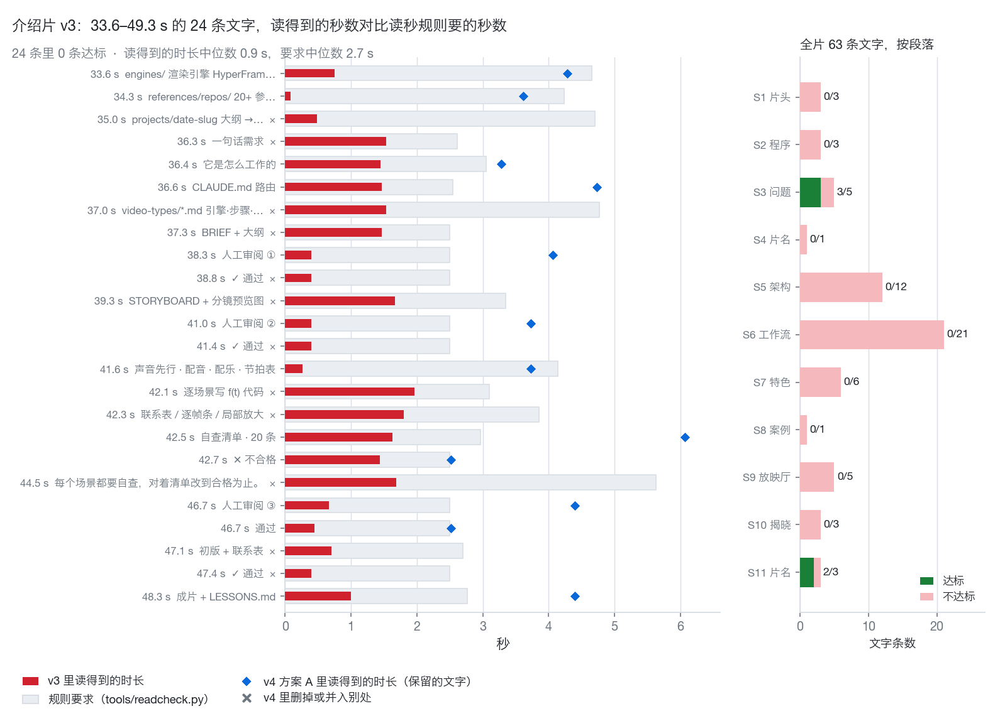
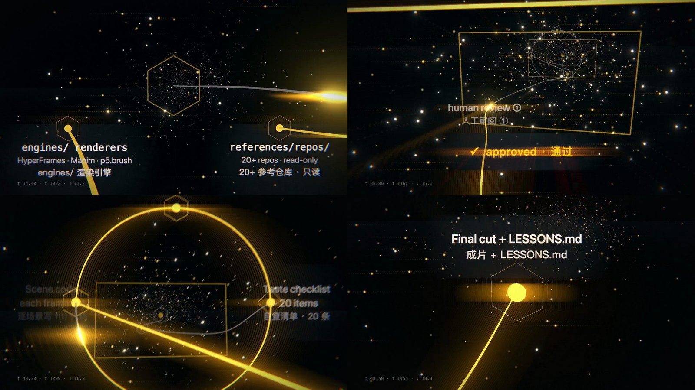

# 04 · 画面上的字要停多久才读得完

*记录于 2026-10-01 · 状态：读秒工具已合并（v0.2.1），读合成文件、`--export` 和 `--budget` 已合并（[#25](https://github.com/ZLHad/OpenVideoHarness/pull/25)）；介绍片 v4 的修订方案记录时等待批准，还没动手 · [English](en/04-readability.md)*

> **现状（2026-10-01）**
>
> - **落地**：笔记里"在做"的那一块已经由 [#25](https://github.com/ZLHad/OpenVideoHarness/pull/25) 合并：[`tools/readcheck.py`](../../tools/readcheck.py) 能不开浏览器读 HyperFrames 合成文件（`bin/vh readcheck index.html`），按 HyperFrames 的规则解出每个片段的起止，项目自带 HyperFrames 时用它的 `timeline --json`；`--export` 把这份时间表写成 `texts.json` 供手改，`--budget <秒>` 先问一段时间放得下多少字。算不出时间的（解析不了的引用、脚本在整片长的片段里画的字）会列为"没检查"，不算通过。
> - **介绍片**：它的文字是 Three.js 场景里的脚本逐帧画的，`index.html` 里没有文字片段，所以对它跑 `bin/vh readcheck showcase/04-intro-film/index.html` 只得到"没检查：没有找到文字"；那 63 条的窗口仍然是照 JS 公式重建的，下面"局限"的第一条没变。
> - **没动的**：`showcase/04-intro-film` 在 main 上没有改动。
> - **规则改了（2026-10-04）**：下文的 max(2.5 s, 汉字数 ÷ 4.5 + 其他字符数 ÷ 15 + 1.5 s) 不再是底线。底线改成够快读一遍：max(1.5 s, 汉字数 ÷ 7 + 其他字符数 ÷ 20 + 0.8 s)，就是 #53 的短标签规则，舒服的时长按 BRIEF 的 `Pace`（relaxed / normal / brisk），`readcheck` 低于底线报 FAIL、只低于目标报 WARN；见 [`playbook/03-motion-design.md`](../../playbook/03-motion-design.md) §2。下文的数字和图都是按旧规则算的。

## 问题

画面上没人念的字（标题、标签、数字卡）至少要停多久，观众才读得完？我们自己的介绍片够不够？

## 做法

- **规则**（[`tools/readcheck.py`](../../tools/readcheck.py)，公式改写自 lemo-opuscar 的 `core/render/readcheck.mjs`，MIT）：
  - 画面文字：至少停 `max(2.5 s, 汉字数 ÷ 4.5 + 其他非空白字符数 ÷ 15 + 1.5 s)`；
  - 字幕条：汉字每秒不超过 9 个（半角算半个）、英文每秒不超过 20 个字符，每条至少 1.8 s（Netflix 对成人节目的上限）；
  - 时间从"字完整显示"算起（decode 乱码字从定住算），到"开始离开"为止。例如一行 16 个汉字要停约 5.1 s，一个 4 字的标签停 2.5 s。画面文字的读速比字幕慢（汉字 4.5 对 9 字/s，英文 15 对 20 字符/s），因为字幕和声音同时到，观众是在核对刚听到的话，而没人念的字要先在画面里找到，再从头读，所以另加 1.5 s。
- **对象**：介绍片 v3（`showcase/04-intro-film`，81.3 s）。用它的 `captions.json`（v5 换上来以后不在仓库里了，见提交 c649392 的 `showcase/04-intro-film/audio/captions.json`）直接跑只是近似：软字幕一条 cue 把一站的好几块标签并在一起，英、中各 5/23 通过。所以照 js 里的出现和退场公式，重建了 63 条上屏文字的真实窗口（重建脚本没有入库）：可读窗口 = [出现 + decode 0.3 s，退场 − 淡出]。
- **两种读者**：英文读者读英文行加共享行（路径、数字、命令、产品名），中文读者读中文行加共享行，一对翻译取两者中较大的需要时间。63 条里有 29 条是中文更慢，12 条是英文更慢，22 条一样。
- **命令**：`bin/vh readcheck <texts.json|project> [--mode onscreen|subtitle] [--lang zh|en]`，不通过时退出 1。

来源：[`tools/readcheck.py`](../../tools/readcheck.py) 的文件头、[`playbook/03-motion-design.md`](../../playbook/03-motion-design.md) §2；63 条文字的重建依据是介绍片自己的脚本里出现和退场的公式（[`showcase/04-intro-film/js/`](../../showcase/04-intro-film/js/)），重建用的脚本，和介绍片修订方案里"现状核对""怎么算、双语怎么算"两节，是作者本地的文件，没有入库。用 `bin/vh readcheck showcase/04-intro-film --lang en`（或 `--lang zh`）可以复现"5/23 通过"。

## 发现

**1. v3 的 63 条文字里只有 5 条停够**：三个 FAIL 章、片名和 tagline。整片都快，不只是某一段：63 条里读得到的时长中位数 1.6 s，规则要求的中位数 3.2 s。

**2. 引出这次核对的那一段，24 条里 0 条。** 这 24 条是 S5 最后三块标签加上整个 S6（33.6–49.3 s；修订方案里写作 34.67–49.33 s）：读得到的时长在 0.08–1.97 s 之间，中位数 0.9 s；规则要求 2.5–5.6 s，中位数 2.7 s。最短的是 `references/repos/` 那块：34.30 s 定住，34.38 s 就开始淡出，只清楚 0.08 s。

*图 1 · 左：24 条文字，红条是 v3 里读得到的秒数，灰条是规则要求的秒数，蓝菱形是方案 A 里保留文字的新时长，× 是 v4 里删掉或并入别处；右：63 条按段落的达标数。*

**3. 三个具体原因。**
1. **标签跟着镜头走。** S6 的 14 个节点标签每个只亮 0.3–2.0 s（多数约 1.5 s），镜头一离开就淡出；三个 approved 章各 0.4 s，pass 0.45 s，三个关卡标签 0.4–0.7 s。
2. **标签被安全框"推挤"成半透明。** `pin()` 把出画的标签推回安全框（x 96–1824，y 54–1026）里，推得越远越透明，系数是 `clamp(1 − (pushed − 50) / 90)`。42–44 s 回环两侧的标签因此只剩约 1/3 的不透明度，运动模糊的 guard 又按标签不透明度算，它们还被抹糊了。
3. **decode 占掉了读的时间。** 文字要先经过 0.3 s 的乱码解码才定住，`references/repos/` 那块出现后就只剩 0.08 s。

*图 2 · v3 的四帧（34.4、38.9、43.3、48.5 s，左上到右下）：标签被光带划过、被关卡框压着、被安全框推成约 1/3 不透明，最后一帧清楚但只停 1.0 s（要求 2.8 s）。*

*图 3 · v4 方案 A 的原型帧（42.93 s，对应图 2 第三帧）：回环标签挪进环内，不再被安全框推挤。原型只改文字和布局，是示意，不是渲出的成片。*

**4. 方案（修订方案的草稿，没有入库，还没有动手）。** 方案 A 只重排 S6 及其前一站，这一段从 6 小节放宽到 10 小节，片长 81.3 s → 92.0 s：24 条旧文字里 9 条删掉、3 个 approved 章改成关卡标签后面的 ✓，其余 12 块改写后全部停够，最紧的两块（fail 和 pass 状态）只多 0.02 s。方案 B 再把全片按同样的规则重排，片长 124.0 s，所有 50 条上屏文字都停够（两拍说完的一句按整句检查）。两个方案用同样的做法：删字和延长并用（中文更慢的条数更多，所以先删中文）；图上的标签"累积"，点亮后一直留到镜头离开这一站；同屏最多 3 块，每拍最多新出 1 块。

来源：63 条文字的窗口和要求时长（重建的结果表，图 1 和本节的统计由它算出）、介绍片修订方案的"现状核对""节奏修正""时间表"三节、v3 的四帧截图（图 2，转成 JPEG 缩小）、v4 方案 A 的原型联系表里 K9 一格（图 3，裁出）；这些都是作者本地的文件，没有入库。`pin()` 的安全框和不透明度公式在 [`showcase/04-intro-film/js/main.js`](../../showcase/04-intro-film/js/main.js) 的 `pin()` 里（系数 `clamp(1 − (pushed − 50) / 90)`）。

## 因此改了什么

- **已合并**：[`tools/readcheck.py`](../../tools/readcheck.py) 和 `bin/vh readcheck`、[`templates/TASTE_CHECKLIST.md`](../../templates/TASTE_CHECKLIST.md) 第 5 条、[`playbook/03-motion-design.md`](../../playbook/03-motion-design.md) §2（v0.2.1）。
- **已合并**（[#25](https://github.com/ZLHad/OpenVideoHarness/pull/25)；笔记写作时还是工作区里没提交的改动）：让 `readcheck` 直接读 HyperFrames 合成文件里的 `data-start` / `data-duration`，并加 `--export`（导出这套时间表供手改）和 `--budget <秒>`（先问"这一段放得下多少字"）。这针对的是上面的限制：`captions.json` 只是近似。
- **方案待批**：修订方案给出 A、B 两个方案，等维护者选；[`showcase/04-intro-film`](../../showcase/04-intro-film) 目前没有改。

来源：[#25 的描述](https://github.com/ZLHad/OpenVideoHarness/pull/25)、`CHANGELOG.md`（readcheck 一条）；方案的待批状态来自修订方案的"风险和需要你定的 3 件事"一节（没有入库）。

## 局限与没解决的

- **窗口是照 js 公式重建的，不是从渲染出来的帧里量的**，也没有逐帧 OCR。"63 条"本身也是一种建模选择（例如两拍说完的一句按一条算）。
- **0/24 其实偏乐观**：模型只算出现和退场的时间，不算不透明度，所以被推成 1/3 透明的标签仍算"可读"；`readcheck` 也看不出字被裁出画面。这两件事要看联系表。
- **常数没有标定。** 4.5 字/s、15 字符/s、1.5 s、2.5 s 来自 lemo-opuscar 和本仓库原有的下限，没有拿我们自己的观众测过，也不知道读不完对完播率的影响。
- **修订方案里写的 34.67–49.33 s** 和这 24 条的实际起点（第一块标签 33.6 s 才可读）差一点；条数不受影响。
- v4 还没做，图 1 里蓝菱形是计划中的时长，不是渲出来的。

来源：重建脚本和结果表（没有入库）、[`tools/readcheck.py`](../../tools/readcheck.py) 的文件头（"只读时间"的说明）。
