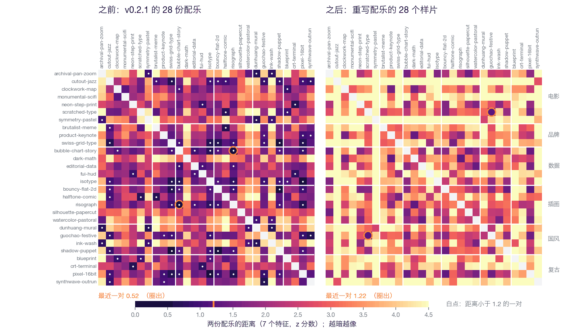
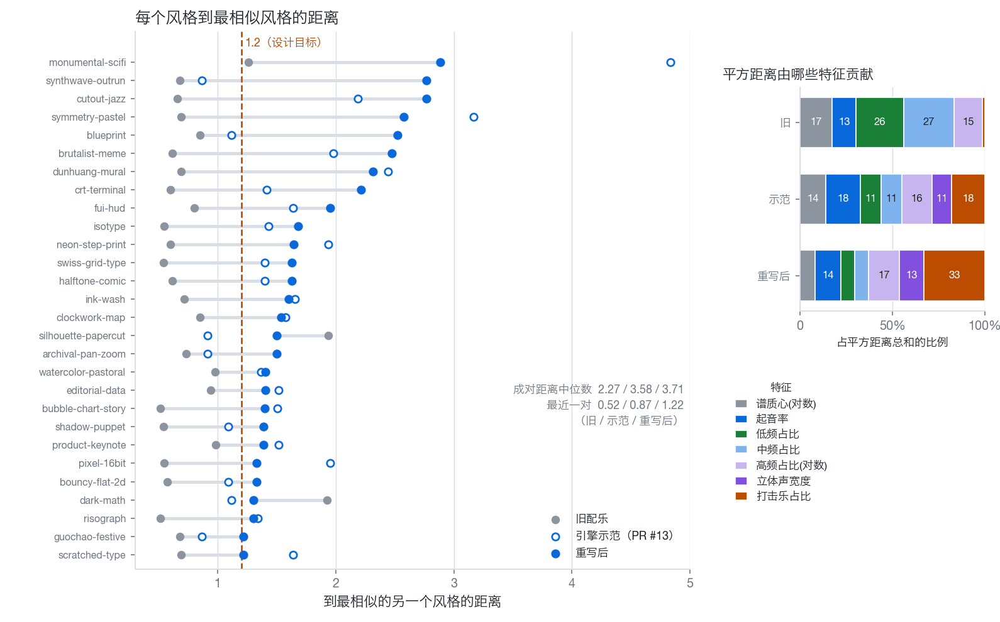
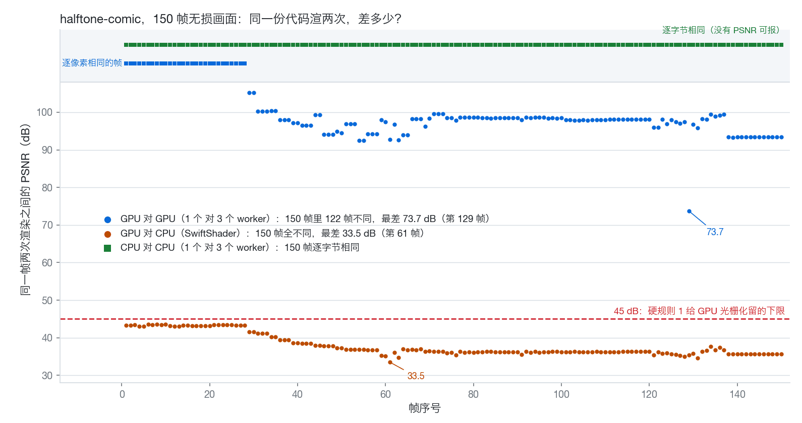
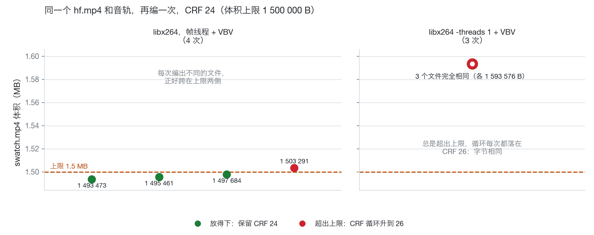

# OpenVideoHarness 研究笔记

用代码做视频时，我们量过的几件事，和量完之后改了什么。每篇是一份实验记录：一个问题、怎么量的、量到的数字、因此改了仓库里的什么、还有哪些没弄清楚。数字后面都有来源行。

[English](en/README.md)

## 目录

| # | 笔记 | 摘要 |
|---|---|---|
| 01 | [旁白、配乐、音效的层级](01-mix-hierarchy.md) | 有旁白的片子里，全局压低音乐只解决一半：旁白各句自己的响度差 5.4 LU，停顿里音乐还会冒出来。改成按旁白定 anchor、逐句解出压低深度之后，03 的 VMR 中位数从 8.3 升到 13.1 LU，风险词从 41 % 降到 7 %。 |
| 02 | [28 份配乐怎么量"太像"](02-soundtrack-distance.md) | 用 7 个频谱特征量配乐的相似度：引擎加新乐器抬高了中位数（2.27 → 3.58），重写把最近一对从 0.52 拉到 1.22；但去掉立体声宽度，下限的提升就不成立。 |
| 03 | [同一份代码，为什么渲出不同的像素](03-render-determinism.md) | GPU 文字光栅、截帧路径和 x264 线程各自让输出不同，x264 再把几个像素放大成整条码流的差别。CPU 光栅加单线程编码之后样片逐字节相同，代价是画面变一次、渲染慢一些。 |
| 04 | [画面上的字要停多久](04-readability.md) | 介绍片 v3 的 63 条画面文字只有 5 条停够，引出这次核对的那一段 24 条全不够（读得到的中位数 0.9 s，要求 2.7 s）：标签跟着镜头走、被安全框推成半透明、decode 吃掉读的时间。 |
| 05 | [配乐的篇章、主题和起伏](05-music-form.md) | 介绍片配乐的响度是一块平台，最响的一段只比第二响高 1.8 LU；三首示范有谷有峰。没人能听时，用响度曲线、音头密度和发声声部数来量篇章和起伏。 |
| 06 | [立意先行到底管不管用](06-concept-first-ab.md) | 同一句需求，只守底线对走流程，各做两支、盲评：评审两次都觉得走流程的那支更有新意，两次都选了只守底线的那支去发（理由是手机上读不出的字、叠化掉的关键变形，不是"慢"：按同一口径量，两组静止差不多）。两对里有一对，模型不走流程也想到了差不多的点子。因此给 `quick` 加了手机联系表和前 2 s 的 strip。 |

## 图

| | |
|---|---|
|  图 1.1 · 01：旁白、音乐、音效的响度，和每句的 VMR（A 现状、B 音乐 −3 dB、C 分层） |  图 1.2 · 01：四个样片里每个音效的电平，A 对 C |
|  图 2.1 · 02：28×28 的配乐距离，越暗越像 |  图 2.2 · 02：每个风格到最近邻的距离，和各特征的贡献 |
|  图 3.1 · 03：三种比较的逐帧 PSNR |  图 3.2 · 03：同一个文件编多次，体积与上限 |
|  图 4.1 · 04：24 条文字，读得到的秒数对比要求的秒数 |  图 4.2 · 04：v3 的四帧：被镜头带走、被安全框推成半透明 |
|  图 5.1 · 05：介绍片现有配乐对三首示范的响度曲线 |  图 5.2 · 05：示范 1 的响度、动机入口和音头密度 |
|  图 1.3 · 01：中文旁白的 A 对 C |  图 2.3 · 02：四个重写后样片的频谱图 |
|  图 3.3 · 03：同一帧 GPU 与 CPU 渲的差别（放大 8 倍） |  图 4.3 · 04：v4 原型的一帧：回环标签挪进环内 |
|  图 6.1 · 06：四支片子各五帧，A 只守底线、B 走流程 | |

## 怎么读

- 每篇都按同一个顺序：问题、做法、发现、因此改了什么、局限与没解决的。题目下面的"现状"一段写的是笔记写完以后仓库里发生的事：合并了哪个 PR，数字有没有重量。正文是写作时的记录，只改了链接、状态、来源行、命令的说明，和几处已经不成立的说法。"现状"以 2026-10-01 的 main（`bc8aca2`，已含 [#31](https://github.com/ZLHad/OpenVideoHarness/pull/31) 和 [#32](https://github.com/ZLHad/OpenVideoHarness/pull/32)）和各 PR 的描述为准。
- 来源行写的是数据从哪来，以及方法现在在仓库的哪里（文件或 PR）。原始数据、运行日志和画图的脚本是作者本地的，没有入库，所以这些数字能用 PR 描述和仓库里的工具核对一部分，不能全部从仓库重算。
- 新画的图（文件名带 `.zh` 的是中文标注，不带的是英文标注）由同一份数据生成；沿用的图是原图缩小，只有英文标注。
- 这些数字主要是仪表读数。A/B/C 混音和介绍片 v4 方案没有听测或观看结论；重写的配乐没有记录逐对的听测结论；这些数字背后的听测只有 [#2](https://github.com/ZLHad/OpenVideoHarness/pull/2) 里的 `duck_ratio`。
