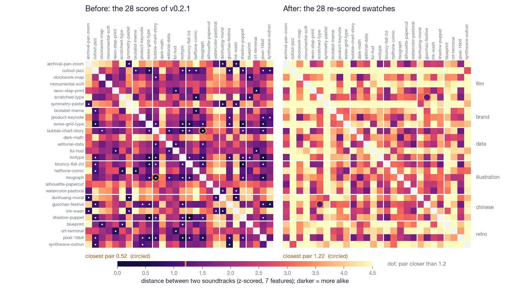
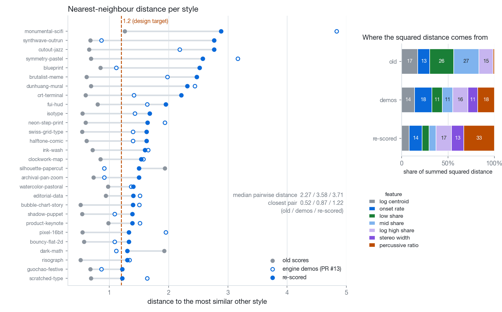
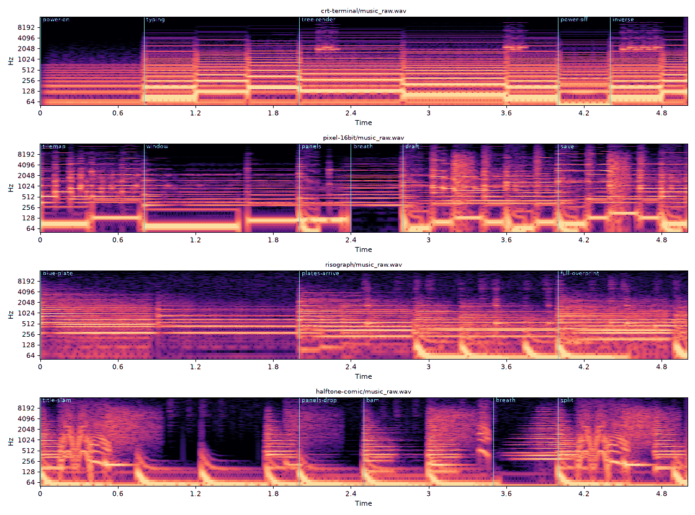

# 02 · 28 soundtracks that sounded alike: how we measured "too similar" and pushed them apart

*Written 2026-10-01 · Status: the engine work is merged ([#13](https://github.com/ZLHad/OpenVideoHarness/pull/13), [#16](https://github.com/ZLHad/OpenVideoHarness/pull/16)); the re-scored soundtracks for all 28 swatches are merged ([#31](https://github.com/ZLHad/OpenVideoHarness/pull/31)) · [中文](../02-soundtrack-distance.md)*

> **Current state (2026-10-01)**
>
> - **Landed**: the "re-scored" column is the 28 soundtracks of the WIP branch. They have been ported onto the current main and re-rendered on the current chain (CPU rendering, [#17](https://github.com/ZLHad/OpenVideoHarness/pull/17); the `profile=swatch` mix, [#21](https://github.com/ZLHad/OpenVideoHarness/pull/21)), and are merged in [#31](https://github.com/ZLHad/OpenVideoHarness/pull/31); the committed `score.json`, `swatch.mp4` and gallery are now this version.
> - **Recomputed**: #31 re-measured the final soundtracks with the same recipe: median pairwise distance 3.71, closest pair 1.22 (guochao-festive / scratched-type), no pair under 1.2, the same as the "re-scored" column below; the description of #31 records no re-measurement of the other rows.
> - **Unchanged**: the scores keep their original bpm and meters, and counting on main still gives 20 at 150 BPM, 5 at 120 and 3 at 90; the distance script is still not in the repo.
> - **Engine**: since then [#20](https://github.com/ZLHad/OpenVideoHarness/pull/20) added 14 instrument parts (physically modelled plucked strings and others), so the synthesised instruments went from the 77 of #13, as stated below, to 91; #31 does not use them.

## Question

A listening pass found that the soundtracks of the 28 style swatches overlap in taste. Can one number say how alike two soundtracks are, and can we push them apart by that number?

## Setup

- **What the numbers showed**: every old soundtrack came from one subtractive synth palette; 20 of the 28 run at 150 BPM (5 at 120, 3 at 90); all are mono; spectral centroids lie between 102 Hz and 1.2 kHz.
- **Feature vector**: the first 5 s of each render, seven values from librosa: log spectral centroid, onset rate (per second), the energy share below 250 Hz and between 250 Hz and 4 kHz, the share above 4 kHz (log), stereo width (RMS of side over mid), and the percussive share (HPSS).
- **Distance**: each feature is z-scored with the mean and standard deviation of the pool of "old 28 + engine demos 28" (56 renders), and the distance is Euclidean. The ruler stays fixed, so the three sets below can be compared directly.
- **Three sets**: **old** (the 28 scores of v0.2.1); **demos** (one rough demo per style that the engine author wrote with the instruments added in [#13](https://github.com/ZLHad/OpenVideoHarness/pull/13)); **re-scored** (the 28 soundtracks four agents rewrote in parallel).
- **Constraints while re-scoring**: keep each swatch's `bpm`, `meters` and section bar counts (the picture is timed to that grid); one signature instrument per style that no other style leads with; a different groove for any two styles in a family; the old `layers` only as support, and only in synthwave-outrun, fui-hud and crt-terminal; the design target was a nearest-neighbour distance of at least 1.2.
- **Commands** (the scripts are not in the repo yet):

```bash
uv run --with librosa --with soundfile --with numpy python features.py <dir>    # <dir>/old/*.wav and <dir>/demos/*.wav → features.json, prints the statistics
uv run --with librosa --with soundfile python ana.py feat slug=path.wav ...     # nearest neighbours of a new render among the other styles
```

The distance matrices are computed straight from the feature tables (seven numbers per soundtrack), with no audio rendering; the two new figures are drawn from them. Recomputing with the same recipe reproduces the old and demo numbers in the description of [#13](https://github.com/ZLHad/OpenVideoHarness/pull/13) (medians 2.27 and 3.58, closest pairs 0.52 and 0.87).

Sources: the feature tables of the old soundtracks and the 28 demos, the feature table of the 28 re-scored soundtracks, and the sound-design and re-scoring briefs (see "Constraints while re-scoring" above). These are the author's local files and are not in the repo; the features are the seven values written out above, and the script is not in the repo. The BPM counts are of `styles/*/score.json`. The old and demo numbers are also in [the description of #13](https://github.com/ZLHad/OpenVideoHarness/pull/13), the re-scored ones in [the description of #31](https://github.com/ZLHad/OpenVideoHarness/pull/31).

## Findings

| | old | engine demos (#13) | re-scored |
|---|---|---|---|
| median pairwise distance | 2.27 | 3.58 | 3.71 |
| mean distance to each style's nearest neighbour | 0.80 | 1.64 | 1.78 |
| closest pair | 0.52 · bubble-chart-story / risograph | 0.87 · guochao-festive / synthwave-outrun | 1.22 · guochao-festive / scratched-type |
| pairs under 1.0, of 378 | 40 | 2 | 0 |
| pairs under 1.2 | 57 | 4 | 0 |
| spectral centroid range | 102 Hz–1.2 kHz | 91 Hz–3.4 kHz | 186 Hz–3.0 kHz |
| stereo width | all 0 (mono) | 0.02–0.74 | 0–0.58 (one mono) |
| onset rate (per second) | 2.0–9.6 | 1.2–14.2 | 1.4–14.0 |



*Figure 1 · 28×28 pairwise distances, ordered by swatch family; darker means more alike, a white dot marks a pair closer than 1.2, the circle marks each set's closest pair.*

**1. The engine raised the median; the re-score raised the floor.** The demos, written with new instruments and stereo (one per style), lifted the median from 2.27 to 3.58 and the closest pair from 0.52 to 0.87. Rewriting the 28 scores added only 0.13 to the median, but it moved the closest pair to 1.22 and the number of pairs under 1.2 from 4 to 0. What got pulled apart was the crowded end, not the average.

**2. The floor's improvement comes from stereo width.** Drop the width feature and use the other six: the old set is unchanged (its width is always 0), the demos have a median of 3.43 and a closest pair of 0.78, and the re-scored set a median of 3.33 and a closest pair of 0.74 (dark-math / risograph), with 9 pairs under 1.2. On those six features the re-scored set is no more spread out than the demos.

**3. Two or three features dominate the distance.** In the re-scored set the percussive share carries 33 % of the summed squared pairwise distance (2 % in the old set), the high-frequency share 17 %, the onset rate 14 % and the stereo width 13 %. The percussive share has a z standard deviation of only 0.045 and the width 0.152, so small differences in them are magnified in z space.



*Figure 2 · left: each style's distance to its most similar style (grey old, hollow demo, blue re-scored, dashed line the 1.2 target); right: each feature's share of the squared distance.*



*Figure 3 · agents cannot listen, so they look: the first 5 s of the re-scored crt-terminal, pixel-16bit, risograph and halftone-comic; cyan lines are section boundaries.*

Sources: distances, counts and shares are recomputed from the two feature tables (old and demos; re-scored) with the recipe above; the range rows come from the same two tables; Figure 3 is a spectrogram left over from the re-scoring, scaled down. The two tables and the spectrogram are the author's local data and are not in the repo; [the description of #31](https://github.com/ZLHad/OpenVideoHarness/pull/31) re-measured the median and the closest pair on the final soundtracks and agrees.

## What we changed because of it

- [#13](https://github.com/ZLHad/OpenVideoHarness/pull/13): `bin/vh music` gained `parts` ([`tools/audio/instruments.py`](../../../tools/audio/instruments.py)): 77 synthesised instruments (no samples), a pattern language, stereo and reverb buses, and a render error for any part that cannot be heard. Its "Spread" table is the old-versus-demos column above.
- [#16](https://github.com/ZLHad/OpenVideoHarness/pull/16): the engine problems the re-scoring ran into (notes dropped when a step does not divide the bar, section params ignored by mono voices, what a section's `gain_db` means, an over-loud guqin harmonic).
- **The re-score itself** is in [#31](https://github.com/ZLHad/OpenVideoHarness/pull/31): `score.json` for 28 swatches, the "声音" paragraph of each STYLE.md, re-rendered `swatch.mp4` and a gallery with sound. Of what the WIP commit message listed as left to do, #31 did three: the re-render on the engine after #16, the guqin harmonic velocity in ink-wash (0.12 → 0.85) and the gallery rebuilt with sound (`bin/vh style gallery --mp4`); in addition the SFX levels of 7 swatches were adjusted after `qa`.
- The rules used are the ones under "Constraints while re-scoring" above: one signature instrument per style, different grooves within a family, old layers only as support, nearest neighbour of at least 1.2.
- The distance script is not in the repo yet. Whether to make it a `bin/vh` check (for instance, showing a new swatch's nearest neighbours before it goes in) is open.

Sources: the descriptions of PR #13, #16 and #31; the sound-design brief of the re-scoring (not in the repo).

## Limits and open questions

- **Seven statistics over 5 s.** They cannot see melody, harmony, or whether two sounds are "the same instrument". No per-pair listening verdicts were recorded and the numbers are instrument readings, so "pushed apart" means distance on this ruler.
- **The ruler can be optimised.** The agents who re-scored had this target and these features in hand; points 2 and 3 show that stereo width and the percussive share are the two cheapest levers.
- **The closest re-scored pair is, by design, two very different sounds** (guochao-festive: suona over a trap beat; scratched-type: metal hits and an industrial pulse). Nobody listened to that pair; the ruler probably cannot tell them apart rather than them really being alike, but that is a guess.
- **Rhythm was not spread.** To keep the picture's cues, BPM and meters stayed: on main, 28 scores are still 20 at 150 BPM, 5 at 120 and 3 at 90 (the count is the same before and after #31). The description of #13 and the sound-design brief say 18 of 28 at 150 BPM; counting `score.json` on main gives 20, and the two counts have not been reconciled.
- **When the note was written, the re-scored column had not been re-rendered on the engine after #16** (the WIP commit says it must be), so the numbers might move. The files do not say who produced that feature table or with which command; the recipe is assumed to be the same feature script. Later, #31 re-measured the median and the closest pair on the re-rendered final soundtracks and they did not move (see "Current state"). The ruler only means something against these 56 reference renders and cannot be compared with another library.

Sources: the sound-design and re-scoring briefs (not in the repo), [the description of #13](https://github.com/ZLHad/OpenVideoHarness/pull/13), `styles/*/score.json`, [the description of #31](https://github.com/ZLHad/OpenVideoHarness/pull/31).
