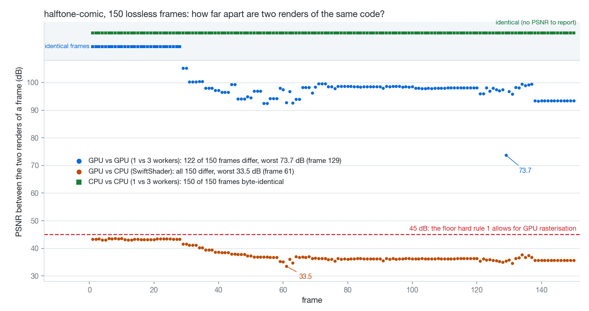
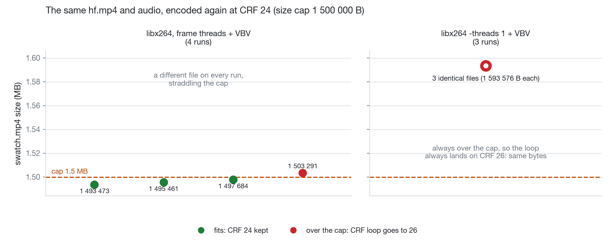

# 03 · Same code, different pixels: what made our renders irreproducible

*Written 2026-10-01 · Status: merged ([#17](https://github.com/ZLHad/OpenVideoHarness/pull/17)); the committed swatch media used to be the GPU renders and were all re-rendered in [#31](https://github.com/ZLHad/OpenVideoHarness/pull/31) · [中文](../03-render-determinism.md)*

> **Current state (2026-10-01)**
>
> - **Landed**: the fix is merged in [#17](https://github.com/ZLHad/OpenVideoHarness/pull/17): `--no-browser-gpu` and `-threads 1` in [`styles/_swatch/render.sh`](../../../styles/_swatch/render.sh), and a strict [`styles/_swatch/determinism.sh`](../../../styles/_swatch/determinism.sh). [#21](https://github.com/ZLHad/OpenVideoHarness/pull/21) changed `render.sh` afterwards (the `profile=swatch` mix, the true-peak loop after the encode) and kept both flags.
> - **Audio side**: the default chain was made deterministic in [#15](https://github.com/ZLHad/OpenVideoHarness/pull/15); the new profile mix does its ducking in numpy with no ffmpeg filter in the signal path, and two builds gave identical bytes in #21.
> - **Media**: the committed swatch media used to be the GPU renders; all 28 swatches were re-rendered on the CPU and merged in [#31](https://github.com/ZLHad/OpenVideoHarness/pull/31), so the committed media are now the CPU renders. #31 also re-ran the check on the final chain: crt-terminal and ink-wash with `determinism.sh` (150/150 frames identical across 1 and 3 workers) and blueprint (two `render.sh` runs, identical mp4 and poster bytes).
> - **Different from the note**: #31 compared old and new renders side by side: the differences that show are in ink-wash, synthwave-outrun, scratched-type and risograph (the pink-plate slide at 4.0–4.5 s, which #17 did not list); cutout-jazz and halftone-comic changed, but it is hard to see, and for every other swatch the old and new PSNR is above 37 dB (codec-level differences). So in the list of four under "Limits" below, risograph replaces cutout-jazz.

## Question

Every swatch frame is a pure function of `t`: no random numbers, no clock, no state carried between frames. So why did a second render give a different mp4 and poster, and how do we get identical bytes?

## Setup

- **Symptom**: re-rendering a swatch with `styles/_swatch/render.sh <slug>` gave different media each time. `halftone-comic` flipped between CRF 24 (1.48 MB) and CRF 26 (1.31 MB) at its 1.5 MB size cap; `fui-hud` got a new poster on every run (about 44 dB between posters); the committed poster of `guochao-festive` was 49.9 dB from a fresh render.
- **Environment**: M3 Max (14 cores), HyperFrames 0.8.82, chrome-headless-shell 152.
- **Method**: render lossless PNG sequences with `--png` (150 frames), compare decoded RGB pixel by pixel, and run ffmpeg's PSNR on the frames that differ. For mp4s and posters, compare the real output of `render.sh` on a scratch copy of the style folder. Three variables: the worker count (1, 2, 3), GPU or CPU rasterisation, and the x264 thread count.
- **Commands**:

```bash
styles/_swatch/determinism.sh <slug>        # lossless PNGs, 1 worker against 3 workers, frame by frame; bin/vh style check <slug> is the same
styles/_swatch/render.sh <slug> --workers 2 [--png]
ffmpeg -i a.png -i b.png -lavfi "[0:v]format=rgb24[a];[1:v]format=rgb24[b];[a][b]psnr" -f null -
```

Sources: [the description of #17](https://github.com/ZLHad/OpenVideoHarness/pull/17) (symptom, environment, method); for the 1-worker against 3-worker comparison, the script in the repo is [`styles/_swatch/determinism.sh`](../../../styles/_swatch/determinism.sh). The GPU against CPU comparison (the "GPU (before)" column of the table) used throwaway scripts that are not in the repo, and since the fix [`render.sh`](../../../styles/_swatch/render.sh) has no GPU path any more; the method is the per-frame PSNR command above.

## Findings

**1. The frames differ very little, but not by zero, and it is not a render-order effect.** Before the fix (GPU rasterisation, `--use-angle=metal`):

| lossless PNGs, 150 frames | GPU (before) | CPU (after) |
|---|---|---|
| halftone-comic, 1 worker, repeated 3 times | byte-identical | byte-identical |
| halftone-comic, repeats at different worker counts | 2 workers ×2 / 3 workers ×2: 86 / 122 frames differ, tens of pixels one level off on the title lettering, worst 73.7 dB (frame 129) | 1 worker ×2, 3 workers ×2 and `determinism.sh`: six renders, 150/150 byte-identical |
| fui-hud, repeats at different worker counts | 2 / 3 workers: frames 22–23 differ, 39–49 pixels one level off inside the flying frame counter | the same, six renders 150/150 byte-identical |
| whole `render.sh`, halftone-comic | 1 worker: CRF 24, 1.48 MB; 2 workers: CRF 26, 1.31 MB; two identical 2-worker runs also differ | `hf.mp4`, `poster.jpg` and `swatch.mp4` byte-identical at 1 and 2 workers (CRF 26, 1 341 164 B) |

With 3 workers, worker 0 draws frames 0–49 in the same order in every run and those frames still differ, so it is not render history. A single-process render was byte-identical three times, so it is not Chrome's canvas readback noise either (that was a different problem in ClaudeAnimationBase, see below). The cause is GPU rasterisation of text edges in the 2D canvas, which is not repeatable across Chrome processes.



*Figure 1 · per-frame PSNR of three comparisons: blue, GPU against GPU (122 frames differ, 73.7–105.3 dB); orange, GPU against CPU (all 150 differ, 33.5–43.6 dB); green, CPU against CPU (all byte-identical).*

**2. Three independent sources.** (a) The GPU text rasterisation above. (b) The capture path depends on the worker count: HyperFrames captures a 1-worker render through `drawElement` plus `toDataURL` and a render with 2 or more workers through `Page.captureScreenshot`, two paths about 80 dB apart, and `render.sh` picked 1 or 2 workers depending on whether another `hyperframes render` happened to be running. (c) x264: with `-maxrate`/`-bufsize` (VBV) and frame threads, four encodes of the same `hf.mp4` and the same audio came out at 1 493 473, 1 495 461, 1 497 684 and 1 503 291 B, straddling the 1 500 000 B cap, so the CRF loop flipped between 24 and 26; with `-threads 1` all three runs gave 1 593 576 B, byte for byte.



*Figure 2 · the x264 size experiment (CRF 24, cap 1 500 000 B): left, frame threads plus VBV, four runs, four different files; right, `-threads 1`, three identical files, always over the cap, so the CRF loop always climbs to 26.*

**3. The encoder turns a few pixels into a different stream.** The lossless frames are at least 73 dB apart, but after encoding, two 2-worker renders of halftone-comic differ in 122 of 150 `hf.mp4` frames with posters 34.7 dB apart; fui-hud differs in 129 of 150 frames with posters 43.9 dB apart.

**4. The check let it through.** The old `determinism.sh` passed anything whose worst frame was at least 45 dB (the margin hard rule 1 leaves for GPU rasterisation): halftone-comic's worst frame was 73.7 dB, and it passed. In one round over nine swatches on the GPU, seven were 150/150 identical, halftone-comic had only 28 identical frames and risograph 139 (worst 92.4 dB). `determinism.sh` now fails on any differing frame.

**5. The price: the picture changes once, and rendering is slower.** After the switch to the CPU each swatch's picture changes once (per-frame PSNR, GPU render against CPU render):

| swatch | median | worst (frame) | poster frame | what changed |
|---|---|---|---|---|
| pixel-16bit | identical | — | identical | nothing (integer pixel art) |
| crt-terminal | 77.8 dB | 72.0 (123) | 74.7 | a few pixels at the shader edge |
| fui-hud | 52.5 | 41.0 (22) | 50.8 | text and line anti-aliasing |
| guochao-festive | 51.5 | 39.3 (127) | 49.1 | the same |
| symmetry-pastel | 48.4 | 29.6 (125) | 46.6 | the whip smear (sub-frame samples) |
| ink-wash | 46.6 | 20.2 (124) | 47.3 | ink-bleed outlines: CPU `feTurbulence` noise differs, visible side by side |
| cutout-jazz | 46.4 | 41.2 (121) | 45.6 | roughened edges: the same |
| archival-pan-zoom | 43.3 | 40.5 (23) | 43.4 | anti-aliasing of grain and blur |
| halftone-comic | 36.4 | 33.5 (61) | 36.2 | every dot edge and the text; invisible at 2× zoom |

PNG sequences (1 worker / 3 workers): halftone-comic 22 s / 13 s (GPU: 17 / 11), fui-hud 31 / 14 (10 / 6); a whole `render.sh` run takes 20–50 s on the CPU against 13–19 s on the GPU.


*Figure 3 · the same frame rendered on the GPU and on the CPU, plus their difference ×8 (halftone-comic frame 61, 33.5 dB): the differences are in letter outlines and every dot edge.*

**6. The audio side had the same disease.** In ffmpeg 8.0.1, `sidechaincompress` ends its output as soon as the frames of its main input are consumed and drops whatever the sidechain queue has not matched yet; music and key come from different decoder threads, so how much is dropped changes from run to run. Twelve runs of one `bin/vh mix` command gave six different files, and the worst had digital silence from 25.3 to 26.0 s. The fix pads every bus to the same length and feeds both inputs of the compressor from one stream; afterwards twelve runs give one result ([#15](https://github.com/ZLHad/OpenVideoHarness/pull/15)).

Sources: [the description of #17](https://github.com/ZLHad/OpenVideoHarness/pull/17) (the tables, the four x264 sizes, PSNRs, timings); the comparison output of the nine-swatch round (on the GPU), the per-frame PSNR log of Figure 1 (halftone-comic) and the enlargement of Figure 3 are local files left from the time and are not in the repo; [the description of #15](https://github.com/ZLHad/OpenVideoHarness/pull/15) (point 6).

## What we changed because of it

- [#17](https://github.com/ZLHad/OpenVideoHarness/pull/17): [`styles/_swatch/render.sh`](../../../styles/_swatch/render.sh) passes `--no-browser-gpu` to `hyperframes render` (HyperFrames' documented deterministic mode: SwiftShader for WebGL, 2D canvas and compositing on the CPU, and the capture path no longer depends on the worker count), and the `swatch.mp4` encode runs with `-threads 1` (same rate-control model, the same bytes every time, about 3 s per pass at 720p). [`styles/_swatch/determinism.sh`](../../../styles/_swatch/determinism.sh) is strict now and its failure message points at the `gl=` line in the log; [`styles/_swatch/README.md`](../../../styles/_swatch/README.md) and [`playbook/02-verification.md`](../../../playbook/02-verification.md) explain why.
- The independent review written into #17: all 28 swatches give byte-identical PNG sequences at 1 and 3 workers, and whole runs give identical mp4 and poster bytes.
- [#15](https://github.com/ZLHad/OpenVideoHarness/pull/15): `bin/vh mix` is deterministic. The new mix profiles ([#21](https://github.com/ZLHad/OpenVideoHarness/pull/21)) do the ducking in numpy, with no ffmpeg filter in the signal path, and two builds give identical sha256 (see [note 01](01-mix-hierarchy.md)).
- An earlier case had another cause: in [#1](https://github.com/ZLHad/OpenVideoHarness/pull/1), ClaudeAnimationBase frames differed by about 39 dB from launch to launch under `--soft-gl`; the main cause was Chrome's canvas readback noise, and after disabling it frames were pixel-identical. [#2](https://github.com/ZLHad/OpenVideoHarness/pull/2) verified it on a Mac with Metal.

Sources: the descriptions of PR #1, #2, #15, #17 and #21; the signal path of a profile mix has no ffmpeg filter, see the header of [`tools/audio/mix.py`](../../../tools/audio/mix.py); the identical sha256 of two builds is recorded in the description of #21.

## Limits and open questions

- **One machine, one version**: M3 Max, HyperFrames 0.8.82. The CPU path is byte-identical across worker counts and repeat runs here; across machines and operating systems it is untested.
- **The root cause stops at "GPU text rasterisation is not repeatable".** Which step inside ANGLE/Metal varies was not investigated, and no other Chrome version was tried.
- **The picture changed once**: four swatches look different side by side (ink-wash and cutout-jazz through `feTurbulence`, scratched-type because its glyph skeletons are traced from rendered text, synthwave-outrun through its GLSL grain and VHS slicing), and every shipped swatch has to be re-rendered (on the re-scoring branch, later [#31](https://github.com/ZLHad/OpenVideoHarness/pull/31); what the side-by-side comparison found is under "Current state").
- **The 45 dB margin of hard rule 1 still has a use** for engines that cannot reach byte identity (for example the intro film's Three.js scene: in the v3 check 2040 of 2440 lossless frames were bit-identical, worst 80.7 dB); but x264 amplifies differences, so compare lossless frames, never mp4s.
- Whether `-threads 1` x264 stays byte-identical across x264 versions was not tested.

Sources: [the description of #17](https://github.com/ZLHad/OpenVideoHarness/pull/17); the intro film v3 round (2040 of 2440 frames bit-identical, worst 80.7 dB) comes from a check in the intro film's revision plan, which is not in the repo (see [note 04](04-readability.md)); the method is in the section "确定性：比无损帧，不比 mp4" (determinism: compare lossless frames, not mp4) of [`playbook/02-verification.md`](../../../playbook/02-verification.md), which quotes another round: v3 at 1 and 3 workers, lossless frames, worst PSNR 60–92 dB.
