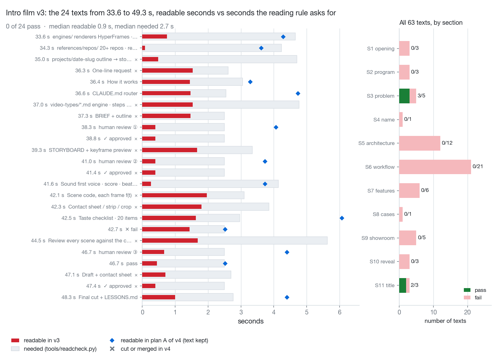

# 04 · How long does on-screen text have to stay to be read?

*Written 2026-10-01 · Status: the reading-time tool is merged (v0.2.1), and so are composition reading, `--export` and `--budget` ([#25](https://github.com/ZLHad/OpenVideoHarness/pull/25)); the revision plan for the intro film (v4) was awaiting approval when this was written and has not been built · [中文](../04-readability.md)*

> **Current state (2026-10-01)**
>
> - **Landed**: the part the note lists as "in progress" is merged in [#25](https://github.com/ZLHad/OpenVideoHarness/pull/25): [`tools/readcheck.py`](../../../tools/readcheck.py) reads a HyperFrames composition without a browser (`bin/vh readcheck index.html`), resolving each clip's span the way HyperFrames does, or taking it from the project's own `hyperframes timeline --json`; `--export` writes that timetable to `texts.json` for hand editing, and `--budget <seconds>` asks how much text fits in a span before it is written. Whatever it cannot time (a reference that does not resolve, text a script draws inside a full-length clip) is listed as not checked and does not count as a pass.
> - **The intro film**: its text is drawn by script in a Three.js scene and `index.html` has no text clips, so `bin/vh readcheck showcase/04-intro-film/index.html` only answers "NOT CHECKED — no text found"; the 63 windows are still the ones reconstructed from the JS formulas, and the first limit below stands.
> - **Untouched**: `showcase/04-intro-film` is unchanged on main.
> - **The rule changed (2026-10-04)**: max(2.5 s, CJK ÷ 4.5 + other ÷ 15 + 1.5 s) below is no longer the floor. The floor is now one brisk read (CJK ÷ 7 + other ÷ 20 + 0.5 s, never under 1 s), the comfortable time follows the BRIEF's `Pace` (relaxed / normal / brisk), and `readcheck` FAILs under the floor and only WARNs under the target; see [`playbook/03-motion-design.md`](../../../playbook/03-motion-design.md) §2. The numbers and figures below use the old rule.

## Question

How long must text that nobody reads aloud (titles, labels, number cards) stay on screen for a viewer to read it, and does our own intro film meet that?

## Setup

- **The rule** ([`tools/readcheck.py`](../../../tools/readcheck.py); the formula is adapted from lemo-opuscar's `core/render/readcheck.mjs`, MIT):
  - on-screen text stays at least `max(2.5 s, CJK characters ÷ 4.5 + other non-space characters ÷ 15 + 1.5 s)`;
  - subtitle lines follow the voice: at most 9 CJK characters per second (half-width counts half) or 20 Latin characters per second, at least 1.8 s each (the Netflix ceilings for adult programmes);
  - time starts when the text is fully shown (decoding text counts from the moment it settles) and ends when it starts to leave; a line of 16 Chinese characters must stay about 5.1 s, a 4-character label 2.5 s. On-screen text is read more slowly than subtitles (4.5 against 9 Chinese characters per second, 15 against 20 Latin characters) because a subtitle arrives with the sound and the viewer is checking what they just heard, while silent text must first be found on the screen and then read from the start; hence the extra 1.5 s.
- **Material**: the intro film v3 (`showcase/04-intro-film`, 81.3 s). Running the film's `captions.json` through the tool is only an approximation, because a soft-caption cue merges several labels of one station (5/23 pass in each language). So the real windows of all 63 on-screen texts were rebuilt from the show and hide formulas in the film's JS (the reconstruction script is not in the repo): readable window = [on + decode 0.3 s, off − fade-out].
- **Two readers**: an English reader reads the English lines plus the shared lines (paths, numbers, commands, product names), a Chinese reader the Chinese lines plus the shared ones; a translation pair needs the larger of the two. Of the 63 texts, 29 are slower for the Chinese reader, 12 for the English reader, 22 the same.
- **Command**: `bin/vh readcheck <texts.json|project> [--mode onscreen|subtitle] [--lang zh|en]`, exit 1 on a failure.

Sources: the header of [`tools/readcheck.py`](../../../tools/readcheck.py) and [`playbook/03-motion-design.md`](../../../playbook/03-motion-design.md) §2; the 63 texts were reconstructed from the show and hide formulas in the intro film's own scripts ([`showcase/04-intro-film/js/`](../../../showcase/04-intro-film/js/)); the reconstruction script, and the "current-state check" and "how to count, and how to count bilingually" sections of the film's revision plan, are the author's local files and are not in the repo. `bin/vh readcheck showcase/04-intro-film --lang en` (or `--lang zh`) reproduces "5/23 pass".

## Findings

**1. Of v3's 63 texts, 5 stay long enough**: the three FAIL stamps, the title and the tagline. The whole film is fast, not one stretch: over all 63 texts the median readable time is 1.6 s against a median of 3.2 s asked for.

**2. In the stretch that prompted this review, 0 of 24 pass.** The 24 are the last three S5 labels and all of S6 (33.6–49.3 s; the revision plan writes 34.67–49.33 s). Readable time runs from 0.08 to 1.97 s with a median of 0.9 s; the rule asks for 2.5–5.6 s, median 2.7 s. The shortest is the `references/repos/` label: it settles at 34.30 s and starts fading at 34.38 s, readable for 0.08 s.

*Figure 1 · left: the 24 texts; red is the readable seconds in v3, grey the seconds the rule asks for, the blue diamond the new duration in plan A for kept texts, × a text cut or merged in v4; right: pass counts of all 63 texts by section.*

**3. Three concrete causes.**
1. **Labels follow the camera.** Each of S6's 14 node labels is lit for only 0.3–2.0 s (most about 1.5 s) and fades as soon as the camera leaves; the three "approved" stamps last 0.4 s each, "pass" 0.45 s, the three gate labels 0.4–0.7 s.
2. **The safe frame pushes labels into half transparency.** `pin()` slides a label that would leave the picture back inside the graphics-safe box (x 96–1824, y 54–1026) and fades it the further it was pushed, by `clamp(1 − (pushed − 50) / 90)`. At 42–44 s the labels on both sides of the loop end up at about a third of full opacity, and the motion-blur guard is computed from label opacity, so they are smeared as well.
3. **Decoding eats the reading time.** Text passes through a 0.3 s scramble before it settles; the `references/repos/` label is left with 0.08 s.

*Figure 2 · four v3 frames (34.4, 38.9, 43.3 and 48.5 s, top left to bottom right): labels crossed by a light band, pressed by the gate frame, pushed by the safe frame to about a third of full opacity; the last is clear but stays only 1.0 s (2.8 s required).*

*Figure 3 · the v4 plan-A prototype frame (42.93 s, matching the third frame of Figure 2): the loop label sits inside the ring and is no longer pushed by the safe frame. Only text and layout changed; it is a sketch, not a rendered film.*

**4. The plan (a draft of the revision plan, not in the repo, not built yet).** Plan A reworks only S6 and the station before it: that stretch grows from 6 to 10 bars and the film from 81.3 s to 92.0 s. Of the 24 old texts, 9 are deleted, the 3 "approved" stamps become a ✓ after the gate label, and the other 12 are rewritten and all stay long enough; the tightest two (the fail and pass states) have 0.02 s to spare. Plan B applies the same rules to the whole film, which grows to 124.0 s, and all 50 on-screen texts stay long enough (a sentence that spans two beats is checked as one). Both use the same habits: cut characters and lengthen together (Chinese is slower more often, so cut Chinese first); labels on a diagram accumulate and stay until the camera leaves the station; at most 3 on screen, at most 1 new per beat.

Sources: the windows and required times of the 63 texts (the reconstructed table; the statistics here and Figure 1 come from it), the "current-state check", "pacing fixes" and "timetable" sections of the intro film's revision plan, a screenshot of four v3 frames (Figure 2, converted to a smaller JPEG), and the K9 cell of the v4 plan-A prototype contact sheet (Figure 3, cropped out); all of these are the author's local files and are not in the repo. The safe box and the opacity formula of `pin()` are in [`showcase/04-intro-film/js/main.js`](../../../showcase/04-intro-film/js/main.js), in `pin()` (the factor `clamp(1 − (pushed − 50) / 90)`).

## What we changed because of it

- **Merged**: [`tools/readcheck.py`](../../../tools/readcheck.py) and `bin/vh readcheck`, item 5 of [`templates/TASTE_CHECKLIST.md`](../../../templates/TASTE_CHECKLIST.md), and [`playbook/03-motion-design.md`](../../../playbook/03-motion-design.md) §2 (v0.2.1).
- **Merged** ([#25](https://github.com/ZLHad/OpenVideoHarness/pull/25); when the note was written it was uncommitted work in a worktree): `readcheck` reads the `data-start` / `data-duration` of a HyperFrames composition directly, plus `--export` (write that timetable out for hand editing) and `--budget <seconds>` (ask how much text fits in a span before writing it). This targets the limit above: `captions.json` is only an approximation.
- **Plan awaiting a decision**: the revision plan offers A and B and waits for the maintainer to choose; [`showcase/04-intro-film`](../../../showcase/04-intro-film) has not been touched.

Sources: [the description of #25](https://github.com/ZLHad/OpenVideoHarness/pull/25), the `readcheck` entry in `CHANGELOG.md`; the plan's awaiting-approval status comes from the section "risks and the three things you decide" of the revision plan (not in the repo).

## Limits and open questions

- **The windows are reconstructed by hand from the JS formulas, not measured from rendered frames**, and there is no per-frame OCR. "63 texts" is itself a modelling choice (for example, a two-beat sentence counts as one).
- **0/24 is optimistic**: the model counts only show and hide times, not opacity, so a label pushed to a third of full opacity still counts as readable, and `readcheck` cannot see text cropped out of the frame. Both need the contact sheet.
- **The constants are not calibrated.** 4.5 characters/s, 15 characters/s, 1.5 s and 2.5 s come from lemo-opuscar and our own floor; we have not tested them on our audience, and we do not know what unread text costs in watch-through.
- **The revision plan's 34.67–49.33 s** is slightly off from where these 24 texts start (the first label becomes readable at 33.6 s); the count is unaffected.
- v4 is not built; the blue diamonds in Figure 1 are planned durations, not rendered ones.

Sources: the reconstruction script and the result table (not in the repo), the header of [`tools/readcheck.py`](../../../tools/readcheck.py) (it reads timings only).
