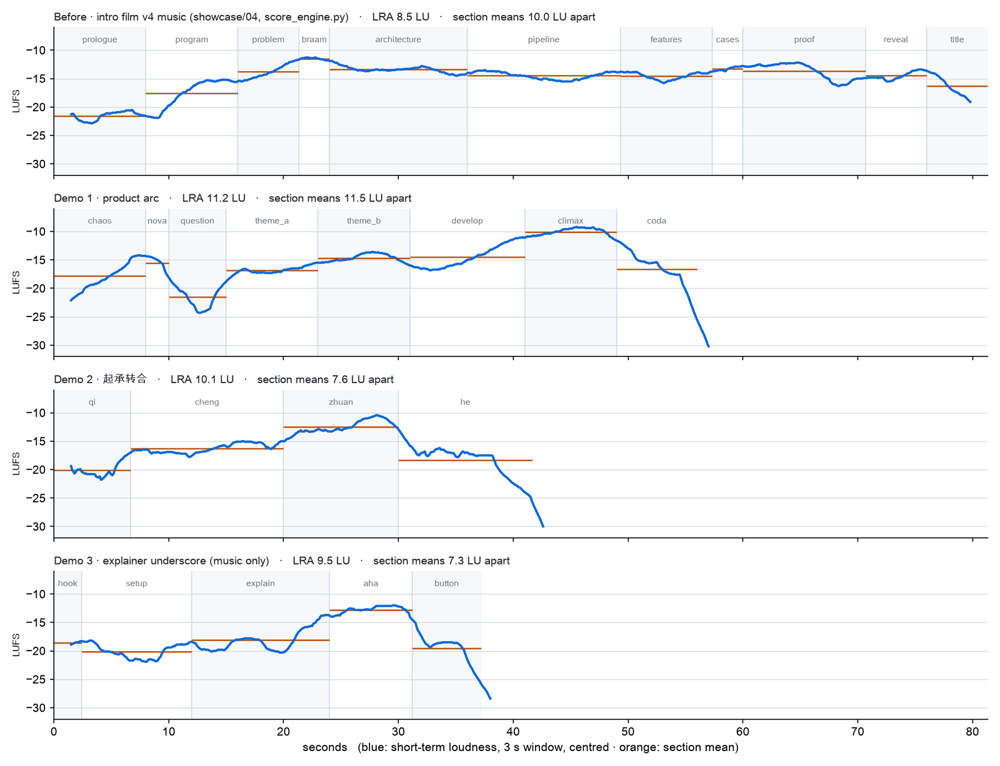
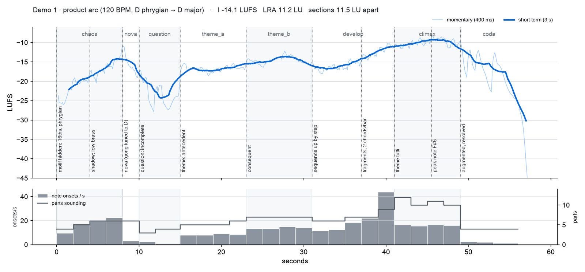

# 05 · Chapters, motif and dynamic arc: measuring music nobody can listen to

*Written 2026-10-01 · Status: the knowledge draft is now [`playbook/11-composition.md`](../../../playbook/11-composition.md) ([#23](https://github.com/ZLHad/OpenVideoHarness/pull/23)) and the engine changes are merged ([#24](https://github.com/ZLHad/OpenVideoHarness/pull/24), [#25](https://github.com/ZLHad/OpenVideoHarness/pull/25)); the full demo scores and the measuring scripts are not in the repo · [中文](../05-music-form.md)*

> **Current state (2026-10-01)**
>
> - **Knowledge draft**: it became [`playbook/11-composition.md`](../../../playbook/11-composition.md) ([#23](https://github.com/ZLHad/OpenVideoHarness/pull/23)). Its section 6 gives a snippet that takes the loudness arc from ffmpeg's `ebur128` and averages it per section of the beat map, and a snippet that takes each part's stem from the engine's `render()` and compares the lead with the accompaniment; the two worked examples in its section 7 are this note's demo 1 and demo 3. Demo 2 (起承转合) and the full scores of the three demos are not in the repo.
> - **Recomputed**: while writing it, #23 recomputed several numbers of this note with the merged engine and got the same values: the intro film's score (LRA 8.5, spread of section means 10.0 LU, loudest section at 28 %), `--example` (7.6 / 6.2), `--example zh` (7.0 / 6.7), the share of energy under 250 Hz (50–91 % in the intro film), bar 20 of demo 1 at about 44 note onsets per second against about 16 in the climax, and 143 hits in the intro film's beat map.
> - **Engine**: the first four gaps and pickups are implemented in [#24](https://github.com/ZLHad/OpenVideoHarness/pull/24) (motif blocks in [`tools/audio/motifs.py`](../../../tools/audio/motifs.py), `"index": "section"`, `dyn` / `cresc` / `dim` / `vel_ramp`, a section `stop`, pickups on negative beats); its description shows demo 1 rewritten with motifs, with identical audio and 54 note-list entries instead of 137. The tempo map and a top-level pickup bar were not built; the description of #24 has a design note for them. `bin/vh music --roll` is in [#25](https://github.com/ZLHad/OpenVideoHarness/pull/25) ([`tools/audio/roll.py`](../../../tools/audio/roll.py)).
> - **Scripts**: the measuring scripts `arc.py`, `stems.py` and `dump_events.py` are not in the repo; the commands below are how they were run.

## Question

The loudness of the current soundtracks is a plateau, with no theme you could hum and little variation in emphasis or dynamics (see the table under Findings). What is actually missing, and when nobody can listen, how do we measure whether a score has chapters, a theme and a dynamic arc?

## Setup

- **Meters** (small read-only scripts, not in the repo; see "Current state" for what is):
  - `arc.py`: short-term (3 s) and momentary (0.4 s) loudness from ffmpeg's `ebur128`, then the mean, minimum and maximum per section of the beat map, and the LRA; `section_contrast` is the largest section mean minus the smallest.
  - `dump_events.py --density`: uses the engine's own parser to print, without rendering, the number of note onsets per bar and the number of parts sounding.
  - `stems.py`: the level of each part's stem, and how far the lead melody sits above the loudest accompaniment. Plus `bin/vh qa` (dropouts, pumping, clicks, cue check).
- **Comparison set**: three baselines, the intro film's current score (81.3 s, 143 hit entries in its beat map), `bin/vh music --example` (an EDM starter) and `--example zh`; and three demos written with the existing engine only: **demo 1**, a product-film arc (120 BPM, 58.5 s, 35 parts), **demo 2**, 起承转合 (72 BPM, 44.2 s, 19 parts), **demo 3**, an underscore for an explainer (100 BPM, 39.7 s, 15 parts).
- **Commands** (how those scripts were run; they are not in the repo):

```bash
uv run --with numpy --with scipy --with matplotlib python arc.py music.wav --beats music.beats.json --score score.json --engine <repo>/tools/audio --out arc.png --json arc.json
uv run --with numpy --with scipy python dump_events.py score.json <repo>/tools/audio --density
```

Sources: the composition knowledge draft (its way of measuring is now in section 6 of [`playbook/11-composition.md`](../../../playbook/11-composition.md)), the headers of the three measuring scripts and the loudness JSON of each demo; the scripts and the JSON are the author's local files and are not in the repo.

## Findings

**1. In loudness the current score is a plateau.** From 16 s to 76 s, eight sections of the intro film's score have mean loudness between −11.5 and −14.5 LUFS; the loudest, the braam, is only 1.8 LU above the second loudest. The three demos have a valley and a single peak.

| piece | LRA (LU) | spread of section means (LU) | loudest section above the second (LU) | sections within 2 LU of the loudest | where the loudest sits (share of the file) |
|---|---|---|---|---|---|
| intro film, current score | 8.5 | 10.0 | 1.8 | 3 / 11 | 28 % |
| `--example` (EDM) | 7.6 | 6.2 | 2.2 | 1 / 4 | 57 % |
| `--example zh` | 7.0 | 6.7 | 1.6 | 2 / 5 | 67 % |
| demo 1, product-film arc | 11.2 | 11.5 | 4.4 | 1 / 8 | 77 % |
| demo 2, 起承转合 | 10.1 | 7.6 | 3.8 | 1 / 4 | 57 % |
| demo 3, explainer underscore | 9.5 | 7.3 | 5.3 | 1 / 5 | 70 % |



*Figure 1 · short-term (3 s) loudness (blue) and section means (orange): the first panel is the intro film's current score, a climb and then a plateau; the other three are demos 1, 2 and 3, each with a valley and a peak.*

As raw numbers the difference is smaller than you would expect: the LRA differs by about 3 LU, and the intro film's "spread of section means" of 10.0 LU even exceeds demos 2 and 3, because it opens very quietly (−21.5 LUFS). What separates them is shape: whether the loudest section is unique and how many sections sit next to it.

**2. There are too many sync points for any one to stand out.** The intro film's beat map records 143 hit entries in 81.3 s (123 onsets and 20 swell peaks), 1.8 per second; the three demos' beat maps have 7, 8 and 17. The demos allow one big hit per chapter and leave the rest to sound effects.

**3. The register never gets lighter.** Split at 250 Hz, every section of the intro film from 8 s on has 50–91 % of its energy below 250 Hz (sub, drone, kick). In demo 1 the shares are: chaos 84 %, nova 92 %, question 21 %, theme 23 % and 15 %, develop 33 %, climax 29 %, coda 12 %. (These shares were recomputed from the WAVs with an FFT per section.)

**4. Density can peak before the climax.** Bar 20 of demo 1 (39 s) has 44.0 note onsets per second (fills, a roll, a scale run); the climax (bars 21–24) has 15.5–17.0 with 10–12 parts sounding, against 9 in bar 20. The climax is louder (−10.1 LUFS, the loudest section) through sustained notes, the full register and more parts, not more notes.



*Figure 2 · demo 1 (120 BPM): top, the loudness curve with the score's own marks (motif entrances, the nova hit, the peak note); bottom, grey bars are note onsets per second and the line is the number of parts sounding.*

**5. The life of one motif (demo 1).**

| chapter · time | what the motif does |
|---|---|
| chaos · 0–8 s | 1-5-4-3 compressed into sixteenth notes, D Phrygian, hidden in a low string ostinato that grows bar by bar |
| question · 10–15 s | half a phrase: D A G, stopping on E over Asus4, unresolved; one felt piano, the quietest section of the piece (−21.6 LUFS) |
| theme · 15–31 s | the complete 8-bar period: the antecedent ends on the dominant, the consequent reaches the highest note F#5 and lands on the tonic |
| develop · 31–41 s | the motif's head sequenced up the scale on I, ii, iii, then only "root → fifth" fragments, harmonic rhythm doubled |
| climax · 41–49 s | the consequent in tutti, brass with octave-up strings |
| coda · 49–56 s | returns at half speed and resolves the question's hanging E to F# |

**6. Synthesis pitfalls found on the way.**
- Piano and strings doubling a melody at the same pitch cancel in phase; `bin/vh qa` reported a 4.6 dB pumping at 27.4 s; moving the piano up an octave removed it.
- Note-type winds (such as `dizi`) give every note its own attack and release, leaving gaps that qa reads as pumping; overlap the notes by about 0.15 beat or use the legato types `flute` and `xiao`.
- A near-sine solo with vibrato and a lot of reverb makes the dry and wet paths cancel periodically, a level ripple near 5 Hz; lowering `send` from 0.35 to 0.18 cleared the report.
- Loud drums eat peak headroom because the whole piece is peak-normalised: in the first version the timpani sat only 0.7 dB under the brass melody; after lowering the drums the melody was 7 dB above the loudest accompaniment and the climax 0.5 LU louder overall.
- `loop` and per-bar `pattern` lists count the part's own bars, not the section's: no error, it just sounds wrong; demo 3's kick needed a hand-rotated list. A cue at t = 0 is detected about 48 ms late.

Sources: the loudness JSON of each piece (the section means come from the short-term means in it; the loudest section's position is its midpoint as a share of the piece, where the piece is the `duration` of the beat map, i.e. the file length, as in the snippet of `playbook/11` section 6: a file rendered by the engine runs about 2.5 s past the end of its last section, and the intro film is a finished cut with no tail); the number of hit entries in the beat maps (the intro film score's beat map is [`showcase/04-intro-film/audio/music.beats.json`](../../../showcase/04-intro-film/audio/music.beats.json): 143 entries, 123 onsets and 20 swell peaks; 81.33 s, 30 bars, 11 sections); the demo scores with `--density`, re-run, for the onsets per bar (point 4); the matching WAVs, for point 3; the knowledge draft's motif table and the drum and pumping details; and §11 of the engine-gap analysis. The demo data are the author's local files and are not in the repo; [#23](https://github.com/ZLHad/OpenVideoHarness/pull/23) recomputed a batch of them with the merged engine (see "Current state"). Figures 1 and 2 are the originals of the lab's plotting scripts, scaled down.

## What we changed because of it

- **A knowledge draft** (now [`playbook/11-composition.md`](../../../playbook/11-composition.md), [#23](https://github.com/ZLHad/OpenVideoHarness/pull/23)) gives a way to pick the number of chapters by duration, an arc, a theme map, and some starting targets: for a film with a climax, section means at least 8 LU apart and the loudest section at least 2 LU above the second; the lead melody more than 3 dB over the loudest accompaniment; under narration, a music bed within 12 dB of the voice's median level. These are starting values, not rules. They were written into playbook/11 later: the first two, with how to measure them, are in its section 6; the 12 dB under narration is in its section 5, written as the dropout rule of `bin/vh qa` (a 0.1 s window 12 dB under the section's median level).
- **Engine gaps** (the analysis document, 12 of them, is not in the repo): the four worth doing first are motif blocks, `loop` and lists counted from the section start, dynamics curves inside a section, and a section-level stopdown. Demo 1 needed 35 parts and 137 note rows, and the theme's two phrases alone were copied five times (82 rows). [#24](https://github.com/ZLHad/OpenVideoHarness/pull/24) implements motif calls and transforms, `pattern_index: "section"`, `dyn` / `cresc` / `dim` / `vel_ramp`, a section `stop` and negative-beat pickups; it contains no tempo map.
- **Tools**: `bin/vh music --roll` (a piano roll plus an energy curve per part) is in [#25](https://github.com/ZLHad/OpenVideoHarness/pull/25).

Sources: the descriptions of PR [#23](https://github.com/ZLHad/OpenVideoHarness/pull/23), [#24](https://github.com/ZLHad/OpenVideoHarness/pull/24) and [#25](https://github.com/ZLHad/OpenVideoHarness/pull/25) (the knowledge draft is now playbook/11; the implementation of the engine gaps and what was not built are in the description of #24, `--roll` is in #25); the engine-gap analysis itself (12 items) is not in the repo.

## Limits and open questions

- **Loudness is only a proxy for "tension".** The draft cites tension models (TenseMusic, Farbood) that give loudness the largest weight; the originals were not read, so it is unknown whether they hold for synthesised instruments and pieces of 5 s to a minute.
- **A small sample, and nobody has listened.** Three baselines and three demos; the starting targets are generalised from those six curves; demo 3 has only a macOS `say` placeholder voice, used to judge whether the music gets out of the way. Every judgement is a meter reading.
- **Synthesised instruments still sound synthetic up close** (a known limit from #13).
- **The numbers do not line up with [note 01](01-mix-hierarchy.md).** The draft says that under narration the music bed should stay within 12 dB of the voice's median level (lower, and `bin/vh qa` reads the pauses as dropouts); the mix prototype sets the explainer's VMR target at 13 LU (range 11–18). They are not the same quantity, and they have not been compared on one film.
- **The metrics are blunt**: LRA and the spread of section means are lifted by a very quiet opening (the intro film's case), so whether the loudest section is unique is checked as well.
- **A confusing name**: the baseline file is called `intro_v4_music`, but it is the score of the 81.3 s film in `showcase/04-intro-film`, which the revision-plan document calls v3; playbook/11 also calls it "the intro film v4 score", meaning the same file.

Sources: the composition knowledge draft; the beat map of the intro film's score (81.33 s, 30 bars), which is [`showcase/04-intro-film/audio/music.beats.json`](../../../showcase/04-intro-film/audio/music.beats.json).
