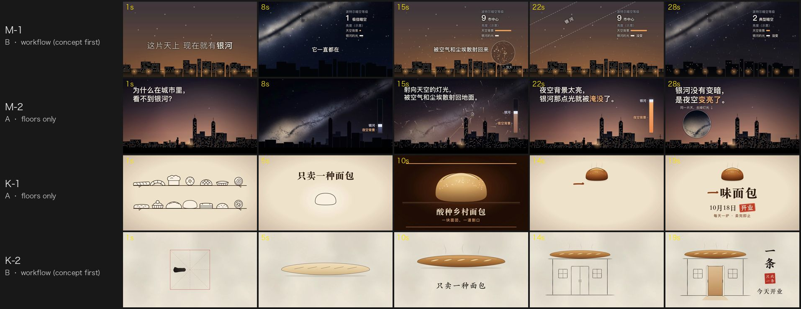

# 06 · Does concept-first pay off? One request, floors only against the workflow

*Written 2026-10-02 · Status: the concept-first workflow is merged ([#44](https://github.com/ZLHad/OpenVideoHarness/pull/44), [#45](https://github.com/ZLHad/OpenVideoHarness/pull/45)); the changes this note led to are in this note's PR; the four films, the two projects and the review are the author's local files, not in the repo · [中文](../06-concept-first-ab.md)*

> **Current state (2026-10-02)**: the text-size question left at the end of "Limitations" was later settled by tiering the floor by where the film is watched ([#47](https://github.com/ZLHad/OpenVideoHarness/pull/47)): the BRIEF gained `Watch on`, with different floors for `phone`, `desktop` and `feed`, and the readability check scales to the target screen. This experiment's reviewer looked at the two landscape films as they appear in a phone feed (360 px wide); for `desktop`, the 44 px labels are enough, for `feed` they would need 80 px.
>
> 2026-10-05: the quick path card moved from CLAUDE.md to `playbook/quick.md` with small wording changes; "CLAUDE.md's quick path card" below is that file.

## Question

[#44](https://github.com/ZLHad/OpenVideoHarness/pull/44) changed the workflow to "concept first, then style" and split the taste rules into floors and defaults a concept may override. It came from the maintainer's worry that the workflow held Opus 5.5-class models too tight (`cases/oneshot-five.md`). Two questions were left unmeasured:

1. Do films made through the workflow (concept first) have more interesting ideas?
2. Against films that keep only the floors and leave the rest to the model, is the craft better or worse?

## Method

- **Requests**: two, both the one-line kind users send, both silent with no music (no sound layer, so only the picture is compared).
  - Milky Way: 「做一支 30 秒的横屏短片：为什么住在城市里看不到银河。静音也要看得懂，不用配乐。」 (a 30 s landscape short: why you can't see the Milky Way from a city; readable with the sound off, no music)
  - Bakery: 「给一家只卖一种面包的小面包店做一支 20 秒的开业短片，横屏。静音也要看得懂，不用配乐。」 (a 20 s landscape opening film for a small bakery that sells only one bread; readable with the sound off, no music)
- **Two arms**, one film per request each, four films in all. Same model (Claude Opus 5.5, as subagents), HyperFrames 0.8.82, 1920×1080, 30 fps, draft quality, about 45 minutes each.
  - **Arm A, floors only**: not allowed to open the repo's workflow docs (CLAUDE.md, type docs, playbooks, style library, recipes, cases, checklists); only the HyperFrames section of `engines/README.md`. Five floors given: every frame a pure function of t, no invented facts, minimum text size and hold, flash rate, the spec.
  - **Arm B, the workflow**: read CLAUDE.md as finalised in #44 and follow the `quick` path card (the user's words: "快速出一版，不用问我", a quick draft, don't ask me), including the concept step and `playbook/12-ideation.md`.
- **Blind review**: a fresh-context reviewer (the same model, briefed as a harsh motion director) got only the four mp4s, a 1 fps contact sheet, a phone-size contact sheet and a frame-by-frame strip of the first 2 s for each, labelled M-1, M-2, K-1, K-2, without knowing which arm made which or that this was an A/B test. It scored the eight dimensions of the scoring layer (1–10; every dimension ≥ 8 means ready to post), compared each pair (more original, better made, which one to post), and rated how similar the two films' core ideas were (0–10).
- **Static stretches**: measured the same way for all four films: 480×270 greyscale, a frame counts as still when its mean difference from the next frame is under 0.3/255, and only runs of 2 s or more count.

Sources: the four subagents' briefs and delivery reports, the two arm-B projects' `DECISIONS.md`, `NOTES.md` and `index.html`, the blind review; all the author's local files, not in the repo. The scoring dimensions are the scoring layer of [`templates/TASTE_CHECKLIST.md`](../../../templates/TASTE_CHECKLIST.md).

## Findings

*Figure 1 · One film per row, five moments each. M-1 and K-2 are arm B (the workflow), M-2 and K-1 arm A (floors only).*

**1. Both times the reviewer found the workflow's film more original, and both times it chose the floors-only film to post.**

| Dimension | Milky Way · B (M-1) | Milky Way · A (M-2) | Bakery · A (K-1) | Bakery · B (K-2) |
|---|---|---|---|---|
| Concept | 7 | 6 | 7 | 8 |
| Hook | 4 | 3 | 5 | 5 |
| Phone readability | 5 | 7 | 7 | 8 |
| Motion | 6 | 6 | 7 | 5 |
| Variety | 4 | 5 | 7 | 4 |
| Composition and finish | 5 | 7 | 7 | 6 |
| Accuracy | 8 | 7 | 8 | 8 |
| Silent clarity | 7 | 8 | 8 | 6 |
| Mean | 5.8 | 6.1 | 7.0 | 6.3 |

None of the four passes: the bar is ≥ 8 on every dimension, and each film has a dimension at 3–5. Both arm-B films score 1 higher on concept. The mean differs by only 0.3 for the Milky Way pair and 0.7 for the bakery pair; one film's scores probably move 1–2 points between runs (not measured), so the means are not a result. What can be read is the reviewer's pairwise choice, the same both times: B newer, A better made, post A.

**2. Where arm B lost: the reviewer gave specific reasons, and "slowness" is not one that holds up.**
- Milky Way B: the permanent HUD (light-pollution level, two brightness bars) is the concept itself, but its labels sit exactly at the 44 px floor (`.hk`, `.bl` and `.src` in the project's `index.html` are all 44 px), about 8 px on a 360 px phone sheet, which the reviewer could not read (phone readability 5, against 7 for A); its composition was also judged weaker than A's.
- Bakery B: the key moment, ink becoming dough, is a dissolve, so "the actual transformation is never seen" (motion 5, against 7 for A); in the middle a baguette floats while a line of text types on, with no new event.
- The reviewer gave both arm-B films 4 on variety, citing static stretches (its own measure was looser and reported longer stretches, such as 18.5–27 s in Milky Way B). Measured again the same way for all four, the two arms are about as still:

| | Milky Way · B | Milky Way · A | Bakery · A | Bakery · B |
|---|---|---|---|---|
| Static stretches ≥ 2 s, total | 12.8 s | 14.3 s | 9.0 s | 10.2 s |
| Longest | 4.0 s (0.2–4.2 s) | 5.0 s (25.0–30.0 s) | 4.3 s (15.7–20.0 s) | 3.6 s (16.4–20.0 s) |

A is stiller in the Milky Way pair and B slightly stiller in the bakery pair, opposite ways. So "the concept chose slowness and that is why B lost" does not hold up. One visible difference is where the stillness falls: both arm-B films go still from the start (Milky Way 0.2 s, bakery 0.5 s), while arm A's first still stretch starts at 2.3 s and 4.0 s, and its longest falls on the end card. The hook scores do not support it as a cause, though: the lowest hook is arm A's Milky Way (3), which also stops for 3.5 s from 2.3 s. It is only an observation.

**3. Without the workflow, the model comes up with much the same idea, at least in one pair.** The Milky Way pair's core ideas rate 8/10 similar: the same city skyline, the lights going off to reveal the Milky Way, a "Milky Way light constant, background rising" bar, and the same paper (Falchi et al., 2016). The bakery pair rates 4/10: both make the character 一 ("one") the core, but arm A goes "a full shelf down to one loaf, whose score line becomes the 一 of the name" and arm B "a written stroke bakes into a baguette, then becomes the shop sign"; in this pair B's idea was judged newer. Concept-first at least did one thing: it made a step the model would take anyway a required one, and left a record (each arm-B film wrote 3 concepts and the reasons for rejecting 2, and 3–6 taste overrides, each with a reason and the cost of reverting).

**4. All four hooks are weak** (3–5). Both arms opened slowly: a static question, an empty practice grid, a full shelf slowly emptying. `quick` makes no hook cards, and nothing checks the "hook" line on the concept card.

**5. The cost is about the same.**

| | Milky Way · A | Milky Way · B | Bakery · A | Bakery · B |
|---|---|---|---|---|
| Time | 19.6 min | 19.5 min | 16.3 min | 13.1 min |
| Tokens (subagent total) | 221k | 239k | 189k | 206k |
| Tool calls | 53 | 53 | 42 | 42 |

**6. Two things the reviewer noticed along the way.** Bakery B named the shop 一条, which the reviewer pointed out is a well-known media and retail brand, so the name needs checking first. Bakery A put an opening date, 10月18日 (18 October), on its end card: against the floor arm A was given (no invented facts) that is debatable, and arm B chose not to write a date; the reviewer gave both films 8 on accuracy, so that dimension does not separate this kind of difference.

**7. Two places in the docs were unclear.** Both arm-B agents spent some reasoning on whether the floor "no digital silence mid-film" applies to a silent film the user asked for (both concluded it does not, but the docs did not say); type 02's prompt block asks for caption weight 800, and the local PingFang's heaviest is 600.

Sources: the blind review (scores, pairs, similarity, the brand name); static stretches recomputed from the four mp4s as described above; the four subagents' delivery reports and usage records (time, tokens, tool calls); the two arm-B projects' `DECISIONS.md`, `NOTES.md` and `index.html` (text sizes); bakery A's `index.html` (the date). Figure 1 is frames taken from the four mp4s.

## What changed because of it

In this note's PR. They fill checks `quick` was missing and clear up the unclear places; none of them limits concepts:

- **Two more self-checks in quick** (CLAUDE.md, the quick card's step 5; the effort note at the top of `playbook/02-verification.md`): a phone-size contact sheet for whether required text reads on a phone (44 px in a landscape film is about 8 px on a 360 px sheet), and a frame-by-frame strip of the first 2 s for whether the opening moves from frame 0 and has something that stops the thumb. `playbook/02` gains the strip command.
- **Readouts on a concept card should not sit at the floor** (`playbook/12-ideation.md` §6): a concept that tells its answer through permanent readouts checks the parts people must read on the phone sheet.
- **Two clarifications**: the digital-silence floor applies to films with sound; a silent film the user asked for, with no audio track, is outside it (CLAUDE.md, `playbook/12` §6, TASTE_CHECKLIST #18); type 02's weight reads "800, or the heaviest the local font has".
- **A fictional brand name is checked against real ones** (type 03's checks).

Sources: the changes in this note's PR.

## Limitations and open questions

- **A tiny sample**: two requests, one film per cell, one run, and the reviewer's scores move too. This shows a direction, not a conclusion.
- **The reviewer is a model too**: the same model briefed as a reviewer, not people. How well its judgement of "original" and "well made" matches a human's is unknown.
- **Only `quick` was compared**: `standard` and `studio` have human gates and a reviewer that should catch finding 2 in the scoring layer, but they were not run.
- **Only the picture was compared**: both requests asked for no sound, so the sound half of the workflow (score, foley, mix) is not in it.
- **Arm A is not "clean"**: the subagents may have had the repo's CLAUDE.md in their context and were only told not to follow it; they read the HyperFrames section of `engines/README.md`, which carries some habits of its own.
- **"Concept" is the thing under test**: the reviewer scored with the scoring layer, whose first dimension, concept, #44 added; part of arm B's edge there may come from writing ideas the way the scoring layer asks for. The pairwise "more original" judgement does not use that dimension and agrees.
- **The size floor and landscape**: `playbook/03` §4 and TASTE_CHECKLIST #6 say "at 1080 wide, headline 84 px / secondary 44 px". At 1080 wide (vertical), 44 px is about 15 px on a phone; at 1920 wide (landscape), about 8 px. Whether the floor should scale with the frame was not settled here; the phone sheet covers it for now.
- **`bin/vh check`'s freeze detection misses this kind of stillness**: it uses `freezedetect=d=3`; Milky Way B's NOTES logged one hit and passed it, and bakery B's check reported no freeze, yet by the measure above both have stretches of over 3 s that barely move. So it was not made a new self-check.

Sources: the two arm-B projects' `NOTES.md`; `check` in [`bin/vh`](../../../bin/vh); [`playbook/03-motion-design.md`](../../../playbook/03-motion-design.md) §4.
