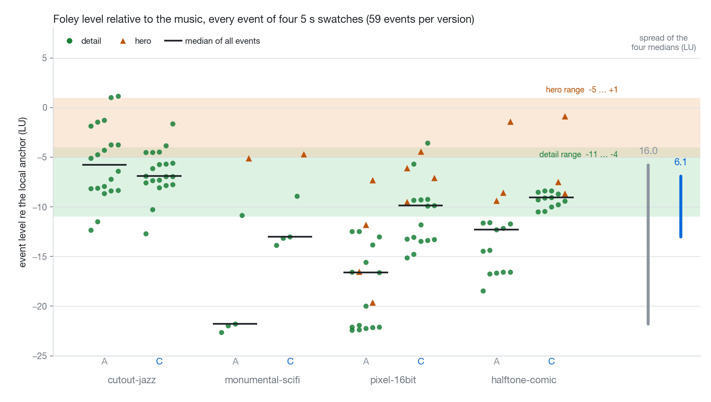

# OpenVideoHarness research notes

Some things we measured while making video with code, and what we changed in the repo afterwards. Each note is a lab entry: one question, how it was measured, the numbers, what changed in the repo because of them, and what is still unclear. Every number has a sources line.

[中文](../README.md)

## Contents

| # | Note | Abstract |
|---|---|---|
| 01 | [Voice, music and SFX levels](01-mix-hierarchy.md) | In narrated films, turning the music down globally fixes only half of it: the narration's own level varies by 5.4 LU from line to line, and the music still surfaces in pauses. With an anchor set on the narration and a duck depth solved per line, film 03's median VMR goes from 8.3 to 13.1 LU and its words at risk from 41 % to 7 %. |
| 02 | [28 soundtracks: measuring "too similar"](02-soundtrack-distance.md) | Seven spectral features put a number on how alike two soundtracks are: the engine with new instruments raised the median distance (2.27 → 3.58), and the re-score moved the closest pair from 0.52 to 1.22; without stereo width, though, the floor's improvement does not hold. |
| 03 | [Same code, different pixels](03-render-determinism.md) | GPU text rasterisation, the capture path and x264 threads each made the output differ, and x264 amplified a few pixels into a different stream. CPU rasterisation plus single-threaded encoding made the swatches byte-identical, at the cost of a one-time picture change and slower renders. |
| 04 | [How long text has to stay on screen](04-readability.md) | Only 5 of the intro film v3's 63 on-screen texts stay long enough, and none of the 24 in the stretch that prompted the review (median readable 0.9 s, 2.7 s required): labels follow the camera, are pushed to half transparency by the safe frame, and decoding eats the reading time. |
| 05 | [Chapters, motif and dynamic arc](05-music-form.md) | The intro film's score is a loudness plateau, its loudest section only 1.8 LU above the second; the three demos have a valley and a peak. With nobody able to listen, loudness curves, note density and parts sounding measure chapters and arc. |
| 06 | [Does concept-first pay off?](06-concept-first-ab.md) | One request, floors only against the workflow, two films each, blind review: both times the reviewer found the workflow's film more original and chose the floors-only film to post (for text unreadable on a phone and a key transformation lost in a dissolve, not slowness: measured the same way, both arms are about as still). In one of the two pairs the model reached much the same idea without the workflow. So `quick` gets a phone sheet and a first-2 s strip. |

## Figures

| | |
|---|---|
|  Figure 1.1 · 01: loudness of voice, music and SFX, and the VMR per line (A as built, B music −3 dB, C layered) |  Figure 1.2 · 01: the level of every SFX event in four swatches, A versus C |
|  Figure 2.1 · 02: 28×28 soundtrack distances, darker means more alike |  Figure 2.2 · 02: nearest-neighbour distance per style, and what the distance is made of |
|  Figure 3.1 · 03: per-frame PSNR of three comparisons |  Figure 3.2 · 03: one file encoded several times, sizes against the cap |
|  Figure 4.1 · 04: 24 texts, readable seconds against required seconds |  Figure 4.2 · 04: four v3 frames: carried off by the camera, pushed to half transparency |
|  Figure 5.1 · 05: the intro film's current score against three demos |  Figure 5.2 · 05: demo 1, loudness, motif entrances and note density |
|  Figure 1.3 · 01: A against C for the Chinese narration |  Figure 2.3 · 02: spectrograms of four re-scored swatches |
|  Figure 3.3 · 03: the same frame on GPU and CPU, and the difference ×8 |  Figure 4.3 · 04: a v4 prototype frame: the loop label moved inside the ring |
|  Figure 6.1 · 06: five frames from each of the four films, A floors only, B the workflow | |

## How to read them

- Every note follows the same order: question, setup, findings, what we changed because of it, limits and open questions. The "Current state" paragraph under the title says what happened in the repo after the note was written: which PR merged, and whether the numbers held. The body is the record as written, with only the links, the status, the sources lines, the notes on commands and a few statements that no longer hold changed. "Current state" is as of main at `bc8aca2` (which includes [#31](https://github.com/ZLHad/OpenVideoHarness/pull/31) and [#32](https://github.com/ZLHad/OpenVideoHarness/pull/32)) on 2026-10-01 and the PR descriptions.
- The sources lines say where the data came from and where the method now lives in the repo (a file or a PR). The raw data, run logs and the figure scripts are on the author's machine and are not in the repo, so these numbers can be partly checked against the PR descriptions and the tools in the repo, but not all recomputed from it.
- The new figures are drawn from the same data in two languages (the `.zh` files have Chinese labels, the others English); reused figures are the originals scaled down and have English labels only.
- The numbers are mostly meter readings. There is no listening or viewing verdict for the A/B/C mixes or the v4 plan of the intro film, and no per-pair listening verdicts were recorded for the re-scored soundtracks; the one listening test behind these numbers is the `duck_ratio` in [#2](https://github.com/ZLHad/OpenVideoHarness/pull/2).
