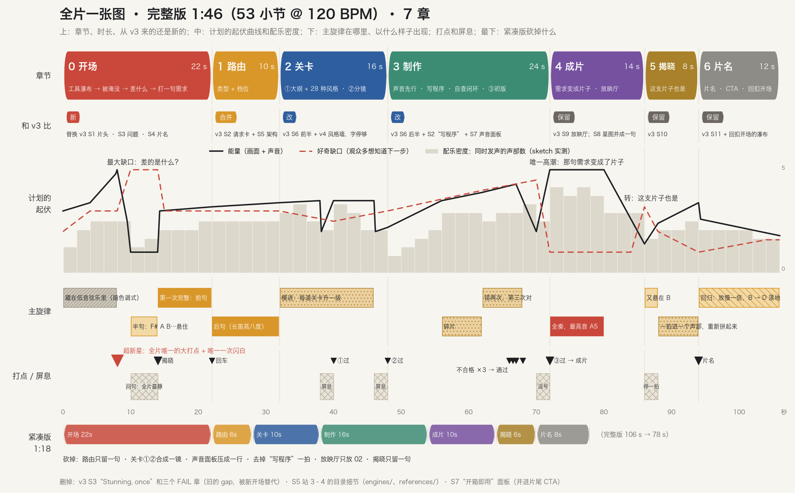
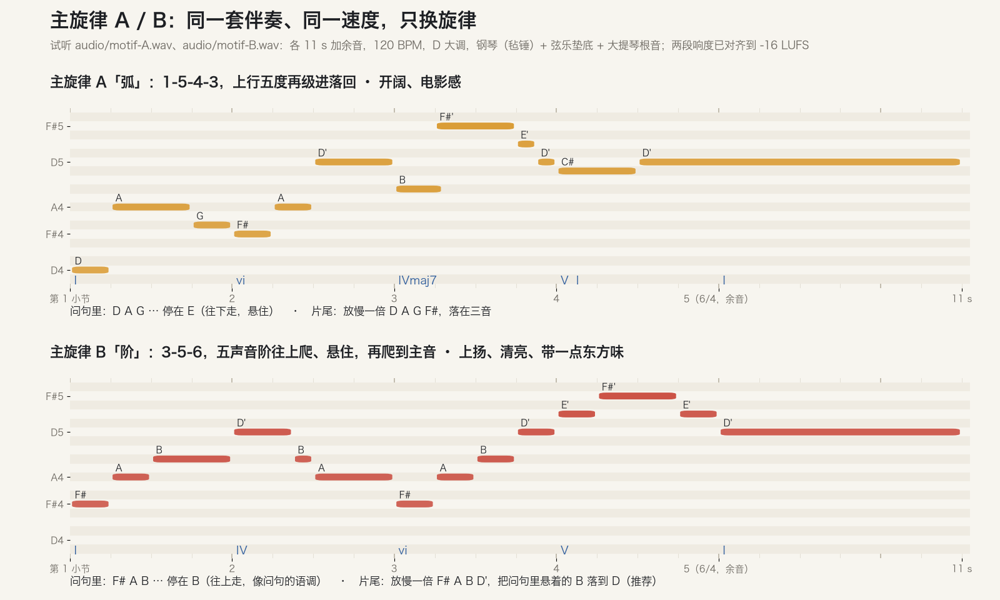
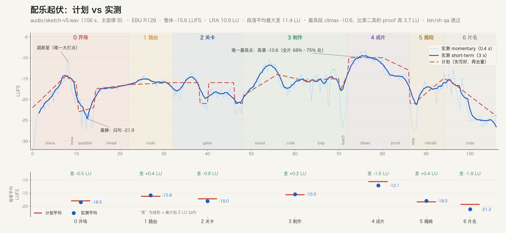

# 关卡 ① 大纲 · 介绍片 v5：新开场、全片结构、配乐

OpenVideoHarness 介绍片 v5 · 16:9 · 完整版 1:46 · studio · 2026-10-01 · 看完这页约 4 分钟

**进度**　① 大纲 **● 审阅中**　② 分镜（一章一页）○　③ 初版 ○
**已经定了**（你 10-01 的话和之前的意见）：开场加 15–20 s：工具瀑布 → 被淹没 → 差的是什么 → Harness → 模拟打一句需求 → 接正文 · 配乐和音效重做，要有旋律、有篇章、有轻有重 · v3 过期的数字和说法全改 · 35–50 s 那段放慢，所有上屏字过 readcheck · 闪白每秒不超过 3 次 · 分镜关卡按阶段分页审 · 讲 harness 不说“规则写死”，也不求面面俱到
**这页之后**：关卡 ②，一章一页（阶段分镜图 + 解释 + 这一段的 animatic）

---

## 这一页只要你定 3 件事

| # | 要定的事 | 我推荐 | 你回复 |
|---|---|---|---|
| 1 | 全片多长 | **完整版 1:46，7 章**：新开场加上“每句字都停够”，算下来就是这么长；紧凑版 1:18 要删 6 处内容 | `完整` / `紧凑` |
| 2 | 开场用哪个方案 | **压平**：瀑布越转越快 → 超新星 → 一道光把碎片压成一张纸 → 纸变成终端。特效本身就是论点，全片只打一次大点 | `压平` / `降临` / `坍缩`，也可以混搭 |
| 3 | 主旋律 | **B**：F# A B 往上走、在问句里悬住，片尾放慢落到 D，像一句问、一句答。先听两段试听再定 | `A` / `B` |

**怎么回**：`1 完整 · 2 压平 · 3 B`，其余默认通过。要改哪一处就写 `答句改：……`。
项目里还有同样内容的网页版 `out/review/gate-1.html`（生成文件，没进仓库）。

**我最没把握的**：① 9.5 s 那一镜“被压成一张纸”，灰盒里读得出“薄片”，还不够“被压扁”；② 答句“不缺工具，缺门道 / Not more tools. Know-how.”；③ 配乐只量过没人听过，B 的五声音阶会不会太“中国风”。

---

## 1. 全片一张图

跟着开场打出的那一句需求走完全片：路由 → 三道关卡 → 声音先行、写程序、自查 → 那句话变成片子 → “这支片子也是”。v3 一闪而过的 35–50 s，现在摊开成 32–72 s 的两章。

## 2. 决定 1：完整还是紧凑

| | 长度 | 砍掉什么 | 适合 |
|---|---|---|---|
| **完整** | 1:46（53 小节） | 只删 v3 的旧 gap（Stunning, once）、目录细节、“开箱即用”面板 | README 链到的完整版、B站；X 也能发 |
| 紧凑 | 1:18 | 路由只留一句 · 关卡 ①② 合成一镜 · 声音面板压成一行 · 去掉“写程序”一拍 · 放映厅只放 02 · 揭晓只留一句 | 只发 X |

每章多长是按 readcheck 的公式从字数倒推的，不是拍脑袋：`review/onscreen-plan.json` 里 26 条计划中的字，中、英都停够。

## 3. 决定 2：开场三个方案

每行是同一个方案的 6 个时刻，都是 `proto/` 里的真代码渲出来的灰盒。三个方案用同一套字、同一段配乐，只换画面。

| | 核心画面 | 好处 | 代价 |
|---|---|---|---|
| **压平** | 眩晕 + 超新星 + 二向箔：乱被压成纸，纸变成终端 | 特效和论点是一回事（3D 的乱 → 2D → 一行字）；不懂《三体》也看得懂“被压扁” | 侧面那一瞥最难做；没有人物 |
| 降临 | 瘫坐 + 大罗金仙：光环从天而降，又缩成他屏幕的边框 | 有人，最好共情 | 人要做得好，否则廉价；光环先压迫后救星，意思可能打架 |
| 坍缩 | 眩晕 + 超新星：只剩一粒余烬，画出时间轴 | 和 v3 的时间轴最连贯，最像大片 | 超新星之后画面空；和很多科幻片头撞车 |

动起来的样子（压平，灰盒 + 配乐草图 + 几个占位音效，0–23 s）：[带声音的 mp4](https://github.com/ZLHad/OpenVideoHarness/releases/download/media/intro-film-gate1-animatic.mp4)（在 GitHub Release 里）

## 4. 决定 3：主旋律

试听：`audio/motif-A.wav`、`audio/motif-B.wav`（各 11 s 加余音，同一套伴奏，响度已对齐）。整片草图用的是 B：`audio/sketch-v5.wav`（106 s）。

- 篇章按章节写，一个主旋律贯穿：藏在低音弦乐里 → 问句里只说半句 → 揭晓时第一次完整 → 关卡里一级级往上 → 自查时错两次、第三次对 → 成片时全奏 → “这支片子也是”又悬住 → 片尾放慢落地。
- 实测：唯一的最高点在全片 68–75 %，比第二高的段高 3.7 LU；问句段最静；15 段里 14 段离计划 2 LU 以内（放映厅段低了 2.7 LU）。`bin/vh qa` 通过，重渲逐字节相同。
- 我听不见，所以这张图只能说明“形状对了”，好不好听要你听。

## 5. 逐项确认（默认全部通过，只写要改的）

| 项 | 默认 | 状态 |
|---|---|---|
| 开场的三句字 | So many AI video tools. / AI 视频工具，多到数不清。→ What’s missing? / 差的是什么？→ OpenVideoHarness · Not more tools. Know-how. / 不缺工具，缺门道。 | ? 答句最没把握 |
| 终端里打的需求 | README 的例子，截到第一句；en 主版打英文、zh 版打中文 | ✓ |
| 开场长度 | 22 s，比你说的多 2 s（问句和片名要停够）；压回 20 s 就去掉第一句 | ? |
| 风格 | 沿用 v3「帧的档案馆」；开场的工具卡片允许杂色，harness 出现后只剩琥珀 | ✓ |
| 工具瀑布 | 只用通用类别名（文生视频、AI 剪辑、数字人…），不放产品名和 logo；要放真名写 `瀑布加真名`（只用纯文字） | ✓ |
| 终端 | 我们自己的样子（发丝线框、琥珀光标），不照抄任何真实 App | ✓ |
| 旁白 | 主版不配，旁白（待定） | ✓ |
| 档位、速度 | studio；120 BPM，一小节 2 s | ✓ |
| 闪白 | 全片 1 次，在超新星那一帧 | ✓ |
| 音效 | 少而准，只给动作：扫光、网格合拢、打字、回车、三道关卡通过、不合格 ×3 | ✓ |

## 6. 上屏的数字（渲染前按当时的 main 再核）

计数还在变（playbook 刚合并成 00–11；新乐器、recipes、导演模式还在路上），所以现在不冻结。

| 数字 | 现在的出处 | 状态 |
|---|---|---|
| 8 类视频、28 种风格、3 道关卡、三档 | README 首段和“它是怎么工作的”；`video-types/`、`styles/` | 渲染前再核 |
| 20 条清单、7 项都到 8 分 | `templates/TASTE_CHECKLIST.md` | 渲染前再核 |
| N 种乐器 | `bin/vh music --instruments` 现在列 88 个（其中 11 个旧音色，v4 写的 77 只算新的） | 口径要你定 |
| “都是 agent 只看本仓库的文档做出来的” | README 第 74 行（v4 用的 reading only these docs 已经过期） | 已对 |

全部要核的数字、v4 过期文字 #1–14 在 v5 的去向

见 `NOTES.md` 的“待核实的事实”：20 条上屏内容逐条写了现在的值和出处，另一张表写 v4 的 14 条各自去哪了（例如 #7 “Taste written down as numbers” 删掉换成风格墙，#14 README 又改了）。

标题备选（B站 / X；默认用 1，封面在关卡 ② 出）

开场的钩子类型你已经定了（先被淹没，再问差的是什么），所以三个方案是同一个钩子的三种画面，不是三种钩子。标题和开场问同一件事：

1. 做视频的 AI 工具这么多，差的到底是什么？
2. 不缺工具，缺门道：让 Claude Code 和 Codex 做视频做得稳
3. 一句话做一支片子，这支介绍片也是这么做的
- X（英文）：So many AI video tools. What's missing? · OpenVideoHarness, the know-how for coding agents that make video.

大纲（节拍表）

| 章 | 时间 | 观众看到什么 | 主旋律 |
|---|---|---|---|
| 0 开场 | 0–22 s | 工具瀑布转晕 → 超新星 → 被压成一张纸 → 差的是什么？→ OpenVideoHarness · 不缺工具，缺门道 → 终端里打一句需求 | 藏 → 半句 → 第一次完整 |
| 1 路由 | 22–32 s | 需求被读懂：8 类里的 02 类 · standard | 后句（长笛） |
| 2 关卡 | 32–48 s | 关卡 ①：大纲 + 两三个风格（28 种风格墙）· 关卡 ②：分镜；每道关卡前屏息，通过时亮 ✓ | 模进，每道关卡升一级 |
| 3 制作 | 48–72 s | 声音先行（面板四行）→ 它不画像素，它写程序 · frame = f(t) → 自查闭环 · 20 条清单 · 7 项都到 8 分，不合格 ×3 → 通过 → 关卡 ③ | 碎片，错两次、第三次对 |
| 4 成片 | 72–86 s | 那句话变成了 02 竖屏科普 → 放映厅：都是 agent 只看本仓库的文档做出来的 | 全奏（唯一高潮） |
| 5 揭晓 | 86–94 s | 这支片子也是 → 连配乐都是代码（一拍进一个声部） | 又悬在 B，再一拍拍拼回来 |
| 6 片名 | 94–106 s | OpenVideoHarness · Video as code, for coding agents. · `bin/vh new` · GitHub；背景是开场的瀑布，慢下来、整齐了 | 放慢一倍，B → D 落地 |

旁白（待定）。完整的节拍表、Spine 和张力曲线在 `STORYBOARD.md`。

字停够没有（readcheck）

- 开场的真实窗口（`review/onscreen-opening.json`）：5/5 通过，中、英都算。最紧的是片名 + 答句，中文要 4.26 s，给了 4.3 s。
- 全片计划（`review/onscreen-plan.json`）：26/26 通过。需求那一行打完要停 7 s，所以它在 Ch1 里一直钉在画面上方。
- 公式：max(2.5 s, 汉字数 ÷ 4.5 + 其他字符 ÷ 15 + 1.5 s)，中英各算各的。

文件和怎么做的

这里列的是做片时项目里的文件；仓库里只收了 `review/` 的图和 JSON。

- `review/`：chapters.png、opening-options.png、opening-animatic.mp4（在 Release 里）、motif-options.png、music-arc.png（+ .json）、onscreen-opening.json、onscreen-plan.json
- `audio/`：motif-A.wav、motif-B.wav、sketch-v5.wav（+ beats.json）；谱子在 `audio/score/`（`make_sketch.py` 生成整片草图）
- `proto/`：开场灰盒，HyperFrames 0.8.82 + Three.js，`proto/switch.sh A|B|C` 选方案；960×540、draft、2 个 worker，一个方案渲 23 s 约 16 s
- `tools/figs/`：出上面这些图的脚本；`BRIEF.md`、`STYLE.md`、`STORYBOARD.md`（节拍表）、`NOTES.md`（事实表、测量、决定）
- 检查：闪白逐帧扫过，全片 1 次；第 0 帧就是完整画面；乱序渲染的帧逐字节相同（一帧 PSNR 103 dB）

